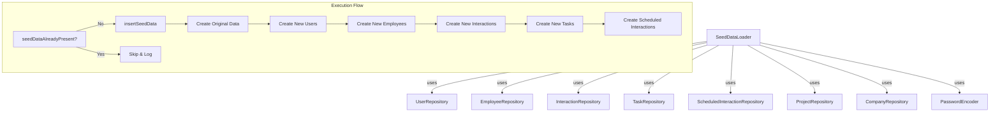

# Design Document: Add Test Seed Data

## Overview

This design expands the existing `SeedDataLoader` component to generate a larger, more realistic dataset for development and testing. The current loader creates a minimal set (3 users, 5 employees, 4 interactions, 3 tasks). The expansion adds 2 more users, 20 more employees, 400 interactions, 25 tasks, and 15 scheduled interactions while preserving the existing idempotency mechanism and transactional guarantees.

The approach keeps all seed logic within the single `SeedDataLoader` class, extending the existing `insertSeedData()` method with new private helper methods that generate data according to the distribution constraints defined in the requirements.

## Architecture

The feature modifies a single component with no architectural changes:



**Key architectural decisions:**
1. **Single class expansion** — All new seed logic lives within `SeedDataLoader.java`. No new classes are introduced since this is test data scaffolding, not production feature code.
2. **Sequential insertion within existing transaction** — New data is appended at the end of `insertSeedData()`, leveraging the existing `@Transactional` annotation for atomicity.
3. **Deterministic-but-varied data** — Data is generated using deterministic patterns (arrays of names, rotating indices) rather than `Random` to ensure reproducibility across runs.

## Components and Interfaces

### Modified Component: `SeedDataLoader`

**New dependency:**
```java
private final ScheduledInteractionRepository scheduledInteractionRepository;
```

**New private methods:**

| Method | Purpose | Returns |
|--------|---------|---------|
| `createNewUsers()` | Creates 2 additional users (Dave, Eve) | `List<User>` |
| `createNewEmployees(List<Employee> existingEmployees)` | Creates 20 employees with varied job titles and manager assignments | `List<Employee>` |
| `createInteractionsForNewEmployees(List<Employee> newEmployees, List<User> allUsers, List<Project> allProjects)` | Creates 20 interactions per new employee (400 total) | `List<Interaction>` |
| `createTasksForEmployees(List<Employee> employees, List<Interaction> interactions, List<User> allUsers)` | Creates 5 tasks per employee (25 total) | `void` |
| `createScheduledInteractions(List<User> allUsers, List<Employee> allEmployees)` | Creates 3 scheduled interactions per user (15 total) | `void` |
| `createScheduledInteraction(User user, Employee employee, InteractionType type, CompletionStatus status, LocalDate date, String notes)` | Factory for a single ScheduledInteraction | `ScheduledInteraction` |

**Modified method:**
- `insertSeedData()` — Extended to call the new methods after existing seed data insertion.

### Data Distribution Strategy

**Interaction type rotation per employee (20 interactions):**
- Cycle through `[CHECK_IN, MENTORING, CATCH_UP, OTHER]` repeatedly (5 of each), ensuring all 4 types represented and none exceeds 10.

**User assignment for `conducted_by` and `logged_by`:**
- Rotate through all 5 users using `users.get(index % 5)`, ensuring at least 3 distinct users per employee's interactions.

**Temporal distribution for interactions:**
- Spread across 12 months: `interaction[i].occurredAt = now - (i * 18 days)`, giving coverage across ~12 months for 20 interactions.

**Task status distribution per employee (5 tasks):**
- Pattern: `[OPEN, OPEN, OPEN, DONE, DONE]` — guarantees ≥2 OPEN and ≥1 DONE per employee.

**Task due dates:**
- First 2 OPEN tasks: future dates (`+7d`, `+14d`)
- Third OPEN task: past date (`-7d`)
- DONE tasks: past dates (`-30d`, `-60d`)

**Scheduled interaction distribution per user (3 scheduled):**
- Type rotation: cycle through `[CHECK_IN, MENTORING, CATCH_UP]` (at least 2 different types per user).
- Status rotation: `[PENDING, COMPLETED, CANCELLED]` (all 3 statuses represented per user).
- Dates: PENDING → future (`+7d` to `+30d`), COMPLETED/CANCELLED → past (`-1d` to `-90d`).

## Data Models

No schema changes are required. The feature uses existing tables and entities:

### Entities Used (No Modifications)

| Entity | Table | Key Fields |
|--------|-------|------------|
| `User` | `users` | id, name, email, password_hash, created_at |
| `Employee` | `employees` | id, name, email, manager_id, job_title, created_at |
| `Interaction` | `interactions` | id, employee_id, conducted_by_user_id, logged_by_user_id, project_id, type, notes, occurred_at, created_at |
| `Task` | `tasks` | id, interaction_id, title, description, status, due_date, employee_id, assigned_user_id, created_at |
| `ScheduledInteraction` | `scheduled_interactions` | id, employee_id, scheduled_by_user_id, scheduled_date, interaction_type, notes, completion_status, created_at |

### Seed Data Volume Summary

| Entity | Existing | New | Total |
|--------|----------|-----|-------|
| Users | 3 | 2 | 5 |
| Employees | 5 | 20 | 25 |
| Companies | 2 | 0 | 2 |
| Projects | 3 | 0 | 3 |
| Interactions | 4 | 400 | 404 |
| Tasks | 3 | 25 | 28 |
| Scheduled Interactions | 0 | 15 | 15 |

### New User Data

| Name | Email |
|------|-------|
| Dave Martinez | dave.martinez@psybergate.com |
| Eve Thompson | eve.thompson@psybergate.com |

### New Employee Job Titles (≥8 distinct)

Software Engineer, Senior Developer, Team Lead, Product Manager, UX Designer, QA Engineer, DevOps Engineer, Business Analyst, Data Analyst, Scrum Master

### Insertion Order (Satisfying FK Dependencies)

1. Users (no dependencies)
2. Companies (no dependencies) — already exist
3. Employees without managers (no self-referencing FK)
4. Employees with managers (self-referencing FK satisfied)
5. Projects (FK → Companies) — already exist
6. Interactions (FK → Employees, Users, Projects)
7. Tasks (FK → Interactions, Employees, Users)
8. Scheduled Interactions (FK → Employees, Users)

## Correctness Properties

*A property is a characteristic or behavior that should hold true across all valid executions of a system — essentially, a formal statement about what the system should do. Properties serve as the bridge between human-readable specifications and machine-verifiable correctness guarantees.*

### Property 1: Interaction type distribution per employee

*For any* new employee in the seeded dataset, the distribution of interaction types across that employee's 20 interactions SHALL include at least 3 of the 4 defined types (CHECK_IN, MENTORING, CATCH_UP, OTHER) and no single type SHALL account for more than 10 interactions.

**Validates: Requirements 3.2**

### Property 2: User assignment distribution per employee

*For any* new employee in the seeded dataset, at least 3 distinct users SHALL appear as `conducted_by_user_id` across that employee's 20 interactions, and at least 3 distinct users SHALL appear as `logged_by_user_id`.

**Validates: Requirements 3.3**

### Property 3: Temporal spread of interactions per employee

*For any* new employee in the seeded dataset, the `occurred_at` timestamps across that employee's 20 interactions SHALL span at least 8 distinct calendar months within the 12 months preceding the seed execution date.

**Validates: Requirements 3.4**

### Property 4: Project assignment coverage per employee

*For any* new employee in the seeded dataset, at least 6 of that employee's 20 interactions SHALL have a non-null project reference.

**Validates: Requirements 3.5**

### Property 5: Interaction notes uniqueness and length

*For any* pair of interactions in the 400 new interaction records, their notes fields SHALL be distinct. Additionally, *for any* single interaction, the notes field SHALL contain between 20 and 200 characters.

**Validates: Requirements 3.6**

### Property 6: Task status distribution per employee

*For any* employee among the 5 employees receiving new tasks, that employee SHALL have at least 2 tasks with status OPEN and at least 1 task with status DONE.

**Validates: Requirements 4.2**

### Property 7: Task due date spread per employee

*For any* employee among the 5 employees receiving new tasks, that employee SHALL have at least 1 task with a due_date before today and at least 1 task with a due_date on or after today.

**Validates: Requirements 4.3**

### Property 8: Referential integrity for all new records

*For any* new record created by the seed loader (Task, Interaction, or ScheduledInteraction), every foreign key field SHALL reference an existing record in the corresponding parent table at the time of verification.

**Validates: Requirements 4.4, 4.5, 7.1**

### Property 9: Task title and description constraints

*For any* pair of tasks in the 25 new task records, their titles SHALL be distinct. Additionally, *for any* single task, the title SHALL be between 1 and 255 characters, and the description SHALL be between 1 and 2000 characters.

**Validates: Requirements 4.6**

### Property 10: Scheduled interaction type diversity per user

*For any* user among the 5 seeded users, the 3 scheduled interactions assigned to that user SHALL include at least 2 different interaction types.

**Validates: Requirements 5.2**

### Property 11: Scheduled interaction status diversity per user

*For any* user among the 5 seeded users, the 3 scheduled interactions assigned to that user SHALL include at least 2 different completion statuses.

**Validates: Requirements 5.3**

### Property 12: Scheduled interaction date-status consistency

*For any* scheduled interaction record, if its completion status is COMPLETED or CANCELLED then its scheduled_date SHALL be in the past (before today), and if its completion status is PENDING then its scheduled_date SHALL be in the future (today or later). No record with a future date and a non-PENDING status SHALL exist.

**Validates: Requirements 5.5, 5.7, 7.3**

### Property 13: Scheduled interaction notes uniqueness and length

*For any* pair of scheduled interactions in the 15 new records, their notes fields SHALL be distinct. Additionally, *for any* single scheduled interaction, the notes field SHALL contain between 10 and 200 characters.

**Validates: Requirements 5.6**

### Property 14: Interaction temporal ordering

*For any* new interaction record, its `occurred_at` timestamp SHALL precede the current time, and its `created_at` timestamp SHALL be equal to or later than its `occurred_at` value.

**Validates: Requirements 7.2**

### Property 15: DONE task due date consistency

*For any* task with status DONE, its `due_date` SHALL be either null or a date in the past (before today).

**Validates: Requirements 7.4**

### Property 16: Seed loader idempotency

*For any* number of consecutive executions of the seed loader on an already-seeded database, the total row counts across all seeded tables SHALL remain unchanged after each execution.

**Validates: Requirements 6.4**

## Error Handling

| Scenario | Behaviour | Requirement |
|----------|-----------|-------------|
| Seed data already present (sentinel email found) | Skip all insertion, log info message, return normally | 6.3 |
| DB constraint violation during insertion | Transaction rolls back (no partial data), exception propagates | 1.4, 7.6 |
| Duplicate employee email (pre-existing conflict) | Skip that employee record, continue with remaining (catch `DataIntegrityViolationException`) | 2.5 |
| Invalid scheduled interaction (future date + non-PENDING) | Do not insert — validation in code prevents creation | 5.7 |

**Implementation notes:**
- The `@Transactional` on `run()` handles atomic rollback for most failures.
- Requirement 2.5 (skip on duplicate employee email) requires a try-catch around individual employee saves. This conflicts with the blanket `@Transactional` rollback in 7.6. Resolution: use `saveAndFlush()` with a try-catch for employee creation only, allowing the transaction to continue for non-fatal duplicates while still rolling back on other constraint violations.
- Requirement 5.7 is enforced at code level — the date/status pairing logic prevents invalid combinations from being constructed.

## Testing Strategy

### Unit Tests (JUnit 5 + Mockito)

Unit tests verify specific examples, edge cases, and deterministic counts:

1. **Count verification tests** — After seeding, verify exact counts: 5 users, 25 employees, 404 interactions, 28 tasks, 15 scheduled interactions.
2. **Existing data preservation** — Verify original 3 users, 5 employees, 4 interactions, 3 tasks remain with unchanged field values.
3. **Idempotency** — Run loader twice, verify no new records on second run and log message emitted.
4. **Duplicate employee skip** — Pre-insert conflicting email, verify loader continues and remaining employees are created.
5. **Transactional rollback** — Force a constraint violation mid-insertion, verify no records committed.

### Property-Based Tests (jqwik)

Property tests verify universal distribution and consistency constraints using **jqwik** (the standard PBT library for JUnit 5 / Java).

Each property test runs against the seeded database state after a fresh seed execution. The properties validate that invariants hold across all records in a category (all employees, all interactions, etc.).

**Configuration:**
- Minimum 100 iterations per property where data generation applies
- For tests over a fixed seeded dataset (no randomized generation), a single execution verifying the property across all records is sufficient
- Tag format: `@Tag("Feature: add-test-seed-data, Property N: <text>")`

**Property test approach:**
Since the seed data is deterministic (not randomly generated at test time), the property tests operate as universal quantifications over the fixed dataset — iterating over every employee/user/record and asserting the constraint holds for each. This is effectively a "for all records in the set" assertion rather than randomized generation.

**Properties to implement:**
- Properties 1–5: Distribution constraints on interactions per employee
- Properties 6–7: Task status and date distribution per employee
- Property 8: FK integrity across all new records
- Property 9: Task title/description constraints
- Properties 10–13: Scheduled interaction distribution and consistency
- Properties 14–15: Temporal ordering and DONE task date consistency
- Property 16: Idempotency (run twice, counts unchanged)

### Integration Tests (Spring Boot Test + Testcontainers)

Integration tests verify the loader against a real PostgreSQL instance:

1. **Full seed execution** — Start with empty DB, run loader, verify all records created with correct FK relationships.
2. **Rollback on failure** — Corrupt a required reference, verify no partial data persists.
3. **Profile activation** — Verify loader only runs on `local` and `dev` profiles.

