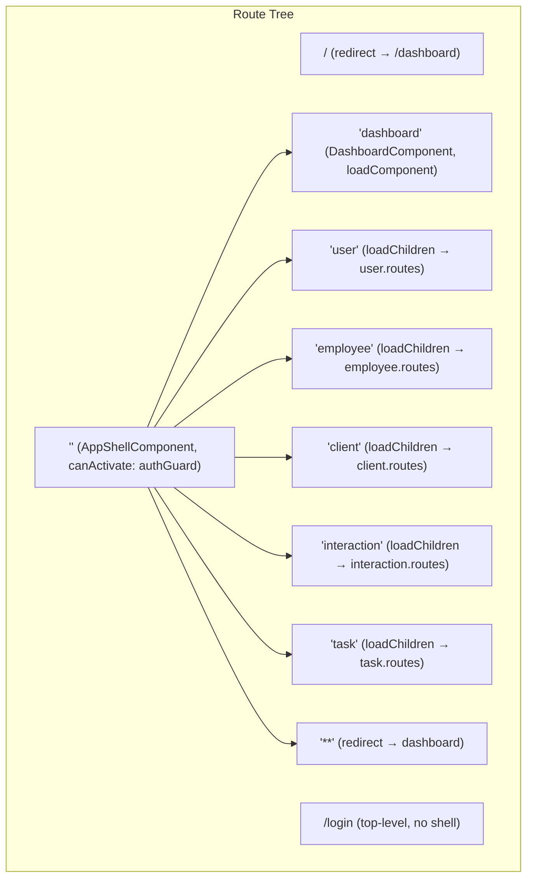
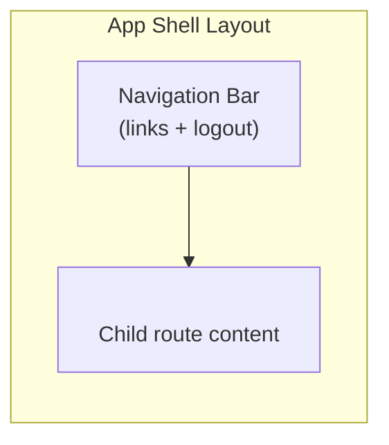

# Design Document: App Shell & Dashboard

## Overview

This design introduces two standalone Angular components — an **App Shell** (layout frame) and a **Dashboard** (landing page) — and restructures the route configuration so the shell acts as a parent layout route for all authenticated content.

The App Shell renders a persistent navigation bar and logout control, wrapping a `<router-outlet>` that hosts child routes. The Dashboard renders skeleton placeholder cards and replaces the previous `'' → /user` redirect as the default landing page. Authentication is enforced once at the shell's parent route via the existing `authGuard`, removing per-route guard declarations.

### Key Design Decisions

| Decision | Rationale |
|----------|-----------|
| Shell as layout route (not a wrapper component) | Angular's child-route model naturally re-renders only the outlet content on navigation, keeping the shell persistent without manual state management |
| Single `canActivate` on parent route | Guards on child routes were redundant since accessing any child requires passing through the parent first |
| `routerLinkActive` with `routerLinkActiveOptions` | Angular's built-in directive handles CSS class toggling on active links, including partial-match for child routes — no custom logic needed |
| Skeleton cards as dumb presentational elements | Cards have no data dependencies; they are pure CSS shimmer placeholders, making the Dashboard trivially testable |
| Lazy-loaded dashboard via `loadComponent` | Keeps initial bundle small; the dashboard is a leaf component with no child routes |

---

## Architecture





The `AppComponent` (`app-root`) remains a thin host containing only `<router-outlet>`. When the user is authenticated, the router activates the shell route, rendering `AppShellComponent` which provides its own nested `<router-outlet>` for child content.

---

## Components and Interfaces

### AppShellComponent

| Property | Value |
|----------|-------|
| Selector | `app-shell` |
| Location | `src/app/shell/shell.component.ts` |
| Template | `src/app/shell/shell.component.html` |
| Styles | `src/app/shell/shell.component.css` |
| Standalone | Yes |
| Imports | `RouterOutlet`, `RouterLink`, `RouterLinkActive` |

**Template structure:**

```html
<nav class="app-nav" data-testid="app-nav">
  <a routerLink="/user"
     routerLinkActive="active"
     data-testid="nav-link-user">User</a>
  <a routerLink="/employee"
     routerLinkActive="active"
     data-testid="nav-link-employee">Employee</a>
  <a routerLink="/client"
     routerLinkActive="active"
     data-testid="nav-link-client">Client</a>
  <a routerLink="/interaction"
     routerLinkActive="active"
     data-testid="nav-link-interaction">Interaction</a>
  <a routerLink="/task"
     routerLinkActive="active"
     data-testid="nav-link-task">Task</a>
  <button (click)="logout()"
          data-testid="logout-button">Logout</button>
</nav>
<main class="app-content">
  <router-outlet />
</main>
```

**Component class:**

```typescript
@Component({
  selector: 'app-shell',
  standalone: true,
  imports: [RouterOutlet, RouterLink, RouterLinkActive],
  templateUrl: './shell.component.html',
  styleUrl: './shell.component.css',
})
export class ShellComponent {
  private readonly authService = inject(AuthService);

  logout(): void {
    this.authService.logout();
  }
}
```

**Design notes:**
- `routerLinkActive="active"` automatically adds/removes the `active` CSS class. Because module area routes are defined as `/user`, `/employee`, etc., and `routerLinkActive` defaults to subset matching, navigating to `/user/profile` will still mark the `/user` link as active. This satisfies Requirement 5.3.
- The `data-testid` attributes support both unit tests and acceptance tests.

---

### DashboardComponent

| Property | Value |
|----------|-------|
| Selector | `app-dashboard` |
| Location | `src/app/dashboard/dashboard.component.ts` |
| Template | `src/app/dashboard/dashboard.component.html` |
| Styles | `src/app/dashboard/dashboard.component.css` |
| Standalone | Yes |
| Imports | None |

**Template structure:**

```html
<section class="dashboard" data-testid="dashboard">
  <h1>Dashboard</h1>
  <div class="dashboard-cards" data-testid="dashboard-cards">
    @for (card of skeletonCards; track $index) {
      <div class="skeleton-card" data-testid="skeleton-card"></div>
    }
  </div>
</section>
```

**Component class:**

```typescript
@Component({
  selector: 'app-dashboard',
  standalone: true,
  templateUrl: './dashboard.component.html',
  styleUrl: './dashboard.component.css',
})
export class DashboardComponent {
  readonly skeletonCards = Array.from({ length: 4 });
}
```

**CSS (shimmer animation):**

```css
.skeleton-card {
  width: 100%;
  height: 120px;
  border-radius: 8px;
  background: linear-gradient(90deg, #f0f0f0 25%, #e0e0e0 50%, #f0f0f0 75%);
  background-size: 200% 100%;
  animation: shimmer 1.5s infinite;
}

@keyframes shimmer {
  0% { background-position: 200% 0; }
  100% { background-position: -200% 0; }
}

.dashboard-cards {
  display: grid;
  grid-template-columns: repeat(auto-fill, minmax(280px, 1fr));
  gap: 16px;
  padding: 24px;
}
```

**Design notes:**
- 4 skeleton cards satisfies the "at least 3, no more than 6" constraint (Requirement 2.3).
- Cards are pure CSS with no data dependencies, making the component trivially testable.
- The `@for` block syntax (Angular 21 control flow) is used instead of `*ngFor`.

---

## Data Models

No new data models are introduced. The feature relies on:

- **`AuthService.isAuthenticated: Signal<boolean>`** — drives the `authGuard` decision
- **`AuthService.logout(): void`** — invoked by the shell's logout button
- **Route configuration** — declarative; no runtime data model needed

The skeleton cards are presentational-only and require no backing data structure.

---

## Error Handling

| Scenario | Handling |
|----------|----------|
| Unauthenticated access to shell routes | `authGuard` redirects to `/login?returnUrl=<attempted-path>` (existing behaviour, unchanged) |
| Logout network failure | `AuthService.logout()` already handles errors by clearing state and redirecting to `/login` regardless of HTTP result |
| Unknown route (wildcard) | Redirected to `/dashboard` within the shell; if unauthenticated, the shell guard fires first and redirects to `/login` |
| Navigation to `/login` while authenticated | No shell renders; the login route is outside the shell hierarchy. The login component can optionally redirect authenticated users away (out of scope for this feature). |

No new error states are introduced. The existing `errorInterceptor` and `AuthService` error handling remain sufficient.

---

## Testing Strategy

### Why Property-Based Testing Does Not Apply

This feature consists of:
- **UI component rendering** (navigation bar, skeleton cards) — visual layout verification
- **Route configuration** (declarative Angular Routes array) — structural wiring
- **CSS class toggling** (routerLinkActive) — DOM attribute presence

None of these involve pure functions with large input spaces or universal properties that benefit from randomized iteration. Example-based unit tests and integration/acceptance tests are the appropriate strategies.

### Unit Tests (Vitest + Angular TestBed)

**ShellComponent tests** (`src/app/shell/shell.component.spec.ts`):

1. Renders navigation links for all 5 module areas with correct `routerLink` values
2. Renders a logout button that calls `AuthService.logout()` when clicked
3. Contains a `<router-outlet>` for child content
4. All navigation links have `data-testid` attributes

**DashboardComponent tests** (`src/app/dashboard/dashboard.component.spec.ts`):

1. Renders exactly 4 skeleton cards
2. Each skeleton card has the `skeleton-card` CSS class
3. Dashboard container has `data-testid="dashboard"`

**Route configuration tests** (`src/app/app.routes.spec.ts`):

1. Login route is defined at top level, outside any parent wrapper
2. Shell route has `canActivate: [authGuard]`
3. Shell route contains child routes for dashboard, user, employee, client, interaction, task, and wildcard
4. No child route has its own `canActivate` guard
5. Empty path redirects to `dashboard` (within shell children)
6. Wildcard path redirects to `dashboard` (within shell children)

### Acceptance Smoke Test (Cucumber + Playwright, four-layer architecture)

**Feature file:** `src/test/resources/features/shell/app_shell_dashboard.feature`

```gherkin
@story:KSE-XX
Feature: App Shell and Dashboard

  Scenario: Authenticated user sees dashboard within the app shell
    Given the user navigates to the login page
    When the user logs in with email "admin@psybergate.co.za" and password "Password1"
    Then the user should see the dashboard
    And the navigation bar should be visible with links to all module areas
```

**Four-layer implementation:**

| Layer | Artefact | Responsibility |
|-------|----------|----------------|
| Feature file | `app_shell_dashboard.feature` | Business-readable scenario |
| Step definitions | `AppShellStepDefinitions.java` | Maps Gherkin to domain actors/assertions |
| Domain | `DashboardActor.java`, `DashboardAssertions.java` | High-level actions and verification |
| Page objects | `DashboardPage.java`, `AppShellPage.java` | Playwright locator encapsulation |

**Page objects use `data-testid` selectors:**
- `DashboardPage`: locates `[data-testid="dashboard"]`, `[data-testid="skeleton-card"]`
- `AppShellPage`: locates `[data-testid="app-nav"]`, `[data-testid="nav-link-user"]`, etc.

**Timeout constraint:** The acceptance scenario must complete within 30 seconds (Requirement 6.3), enforced via Playwright's default navigation timeout configuration.

---

## Route Configuration (Final State)

```typescript
// app.routes.ts
import { Routes } from '@angular/router';
import { authGuard } from './core/guards/auth.guard';
import { ShellComponent } from './shell/shell.component';

export const routes: Routes = [
  {
    path: 'login',
    loadComponent: () =>
      import('./auth/login/login.component').then((m) => m.LoginComponent),
  },
  {
    path: '',
    component: ShellComponent,
    canActivate: [authGuard],
    children: [
      { path: '', redirectTo: 'dashboard', pathMatch: 'full' },
      {
        path: 'dashboard',
        loadComponent: () =>
          import('./dashboard/dashboard.component').then((m) => m.DashboardComponent),
      },
      {
        path: 'user',
        loadChildren: () => import('./user/user.routes').then((m) => m.routes),
      },
      {
        path: 'employee',
        loadChildren: () => import('./employee/employee.routes').then((m) => m.routes),
      },
      {
        path: 'client',
        loadChildren: () => import('./client/client.routes').then((m) => m.routes),
      },
      {
        path: 'interaction',
        loadChildren: () => import('./interaction/interaction.routes').then((m) => m.routes),
      },
      {
        path: 'task',
        loadChildren: () => import('./task/task.routes').then((m) => m.routes),
      },
      { path: '**', redirectTo: 'dashboard' },
    ],
  },
];
```

**Key changes from current state:**
1. All module routes become children of the shell route (no individual `canActivate`)
2. `'' → 'user'` redirect becomes `'' → 'dashboard'`
3. Wildcard `'**'` moves inside the shell as a child, redirecting to `dashboard`
4. Shell component is eagerly loaded (small footprint); child routes remain lazy-loaded
