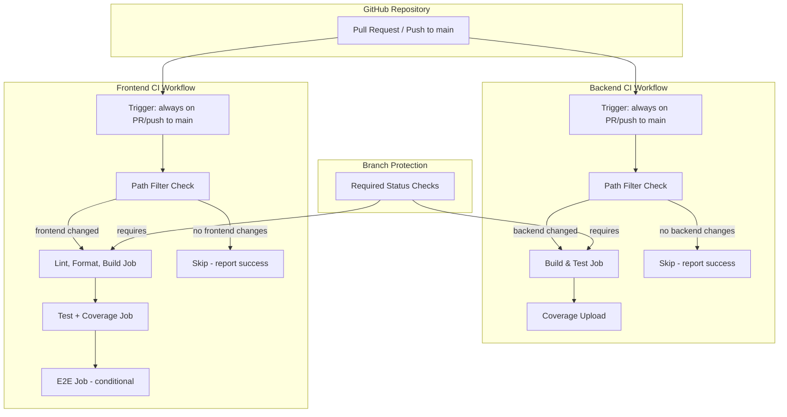

# Design Document: CI Pipelines

## Overview

This design establishes two independent GitHub Actions workflow files — `backend-ci.yml` and `frontend-ci.yml` — that validate the Staff Engagement monorepo on every pull request and push to `main`. The workflows use path filtering to run only when relevant code changes, dependency caching to minimise build times, conditional steps to accommodate future tooling (JaCoCo, Cucumber, Spring Modulith, Playwright), and artifact uploads for coverage reports.

A critical design decision addresses the tension between path-filtered workflows and required status checks: workflows always trigger but use job-level path detection (via `dorny/paths-filter`) to skip work while still reporting a green status to branch protection.

## Architecture



## Components and Interfaces

### 1. Backend CI Workflow (`.github/workflows/backend-ci.yml`)

**Trigger Strategy:**
- Triggers on `pull_request` (opened, synchronize, reopened) targeting `main` — no path filter at workflow level.
- Triggers on `push` to `main` — no path filter at workflow level.
- Uses a `changes` job with `dorny/paths-filter@v3` to detect if `staff-engagement-backend/**` or `.github/workflows/backend-ci.yml` changed.
- The main `build` job has `needs: changes` and `if: needs.changes.outputs.backend == 'true'`.

**Job: `changes`**
- Runs `dorny/paths-filter@v3` to determine affected paths.
- Outputs: `backend: 'true' | 'false'`.

**Job: `build`**
- Condition: `if: needs.changes.outputs.backend == 'true'`
- Runner: `ubuntu-latest`
- Steps:
  1. `actions/checkout@v4`
  2. `actions/setup-java@v4` with `java-version: '21'`, `distribution: 'temurin'`, `cache: 'maven'`
  3. `./mvnw package -B` (working-directory: `staff-engagement-backend`)
  4. Conditional JaCoCo report upload (`actions/upload-artifact@v4`, retention 14 days)
  5. Conditional coverage summary step (writes to `$GITHUB_STEP_SUMMARY`)

**Conditional Steps (future-proofing):**
- JaCoCo: checks if `jacoco-maven-plugin` is declared in `pom.xml`; if so, the `mvnw package` goal already generates the report (via a `verify` or `test` bound execution). Upload the `target/site/jacoco/` directory.
- Cucumber: no special step needed — if Cucumber dependencies are in `pom.xml`, the Surefire/Failsafe plugin picks up Cucumber runners during the test phase.
- Spring Modulith: same as above — if declared, the modulith verification test runs as part of the test phase.

### 2. Frontend CI Workflow (`.github/workflows/frontend-ci.yml`)

**Trigger Strategy:**
- Triggers on `pull_request` targeting `main` (opened, synchronize, reopened) — no path filter at workflow level.
- Triggers on `push` to `main` — no path filter at workflow level.
- Triggers on `workflow_dispatch` (manual).
- Uses a `changes` job with `dorny/paths-filter@v3` to detect if `staff-engagement-frontend/**` or `.github/workflows/frontend-ci.yml` changed.
- The main `lint-build` job has `needs: changes` and `if: needs.changes.outputs.frontend == 'true'`.

**Job: `changes`**
- Outputs: `frontend: 'true' | 'false'`.

**Job: `lint-build`**
- Condition: `if: needs.changes.outputs.frontend == 'true'`
- Runner: `ubuntu-latest`
- Steps:
  1. `actions/checkout@v4`
  2. `actions/setup-node@v4` with `node-version: 'lts/*'`, `cache: 'npm'`, `cache-dependency-path: 'staff-engagement-frontend/package-lock.json'`
  3. `npm ci` (working-directory: `staff-engagement-frontend`)
  4. `npm run lint`
  5. `npm run format:check`
  6. `npm run build`

**Job: `test`**
- Condition: `if: needs.changes.outputs.frontend == 'true'`
- Needs: `lint-build` (ensures lint/build pass first)
- Steps:
  1. `actions/checkout@v4`
  2. `actions/setup-node@v4` (same config, cached)
  3. `npm ci`
  4. `npx vitest --run --coverage` (working-directory: `staff-engagement-frontend`)
  5. Upload coverage artifact (`actions/upload-artifact@v4`, retention 14 days)
  6. Coverage summary step (writes to `$GITHUB_STEP_SUMMARY`)
  7. Uses `if: always()` on the upload step so partial coverage is captured even on test failure.

**Job: `e2e` (conditional)**
- Condition: `if: needs.changes.outputs.frontend == 'true'`
- Needs: `lint-build`
- Steps:
  1. Check if `@playwright/test` exists in `package.json` (using `jq` or grep).
  2. If present: install Playwright browsers, run e2e tests, upload report artifact.
  3. If absent: skip with informational message, exit 0.

### 3. Path Filter Strategy (Branch Protection Compatibility)

**Problem:** GitHub's `paths:` workflow-level filter causes the workflow to not run at all when files outside the filter change. This means the required status check never reports, leaving the PR blocked in "Pending" state.

**Solution:** Remove `paths:` from the workflow-level trigger. Instead, always trigger the workflow and use `dorny/paths-filter@v3` in a lightweight `changes` job. Downstream jobs conditionally execute based on the output. When skipped via `if: false`, GitHub Actions reports the job as "skipped" which satisfies branch protection required checks.

**Rationale:**
- A skipped job (due to `if` condition evaluating false) reports as "success" to required status checks when using the job name as the required context.
- This approach avoids the "pending forever" issue that workflow-level `paths:` creates.
- The `changes` job is lightweight (runs in ~5s) so overhead is negligible.

### 4. GitHub Actions Versions (Pinned)

| Action | Version | Purpose |
|--------|---------|---------|
| `actions/checkout` | `v4` | Repository checkout |
| `actions/setup-java` | `v4` | Java 21 + Maven cache |
| `actions/setup-node` | `v4` | Node LTS + npm cache |
| `actions/upload-artifact` | `v4` | Coverage/report uploads |
| `dorny/paths-filter` | `v3` | Path-based job gating |

### 5. Branch Protection Configuration

Instructions for repository settings:
- Require status checks to pass before merging.
- Required checks: `build` (from backend-ci.yml), `lint-build` (from frontend-ci.yml).
- Require branches to be up to date before merging.
- The `test` and `e2e` jobs are informational — not required — to avoid blocking when optional tooling isn't present.

## Data Models

This feature produces YAML configuration files rather than runtime data structures. The key data shapes are:

### Workflow Trigger Configuration

```yaml
on:
  pull_request:
    branches: [main]
    types: [opened, synchronize, reopened]
  push:
    branches: [main]
```

### Path Filter Output

```yaml
# dorny/paths-filter outputs
changes:
  outputs:
    backend: "true" | "false"
    # or
    frontend: "true" | "false"
```

### Artifact Upload Configuration

```yaml
artifact:
  name: string          # e.g., "backend-coverage-report"
  path: string          # e.g., "staff-engagement-backend/target/site/jacoco/"
  retention-days: 14
  if-no-files-found: ignore
```

## Error Handling

| Scenario | Behaviour |
|----------|-----------|
| Compilation failure (backend) | Maven exits non-zero; job fails; status check reports failure. No test execution occurs. |
| Test failure (backend) | Maven `package` goal fails; job fails; status check reports failure. |
| Lint failure (frontend) | `npm run lint` exits non-zero; job fails immediately. Build and test jobs don't start (dependency chain). |
| Format check failure (frontend) | Same as lint — fails early, blocks downstream. |
| Build failure (frontend) | `npm run build` exits non-zero; job fails. Test job doesn't start. |
| Test failure (frontend) | `vitest --run` exits non-zero; job fails. Coverage upload still runs (`if: always()`). |
| Coverage generation failure (frontend) | Tests pass but coverage plugin fails: job succeeds; warning logged via `echo "::warning::"`. |
| JaCoCo not configured (backend) | Conditional step checks for plugin in pom.xml; if absent, skips upload gracefully. |
| Playwright not present (frontend) | Conditional check finds no `@playwright/test` dependency; step exits with `echo` and success. |
| Docker unavailable (backend) | Testcontainers fails; tests fail; job reports failure. Ubuntu-latest runners have Docker pre-installed, so this is unlikely. |
| Network issues during dependency download | Cached dependencies mitigate this. On cache miss with network failure, the job fails. GitHub's infrastructure makes this rare. |

## Testing Strategy

### Testing Approach

This feature produces declarative YAML workflow files — not runtime application code. Property-based testing is **not applicable** here because:
- GitHub Actions workflows are declarative configuration, not functions with inputs/outputs.
- The workflows interact with external infrastructure (GitHub's runner environment, Docker, npm registry, Maven Central).
- Correctness is verified through integration (actually running the workflows) and structural validation.

### Validation Methods

1. **Structural validation:** Use `actionlint` (locally or in a meta-CI step) to validate workflow YAML syntax and action input/output correctness.
2. **Dry-run on scaffold:** Push both workflow files to a branch, open a PR, and verify:
   - Backend workflow passes (mvnw package succeeds on current scaffold).
   - Frontend workflow passes (lint, format:check, build, test all pass on current scaffold).
3. **Path filter verification:** Open a PR with changes only in one sub-project and verify the other workflow's job reports as "skipped" (not pending).
4. **Branch protection verification:** After workflows run successfully at least once, configure branch protection with required checks and verify a PR with failing tests cannot merge.
5. **Artifact upload verification:** After a successful run, verify coverage artifacts appear in the workflow run's artifact section.

### Unit Tests (Example-Based)

| Test | Method |
|------|--------|
| Workflow YAML is valid | `actionlint` static analysis |
| All action versions are pinned to major tags | grep/regex check on workflow files |
| Working directories point to correct sub-projects | Manual review + first run |
| Cache keys use correct dependency file paths | Manual review |

### Integration Tests

| Test | Method |
|------|--------|
| Backend CI passes on scaffold | Push workflow + trigger PR |
| Frontend CI passes on scaffold | Push workflow + trigger PR |
| Path filter correctly skips unrelated changes | PR with only docs changes |
| Coverage artifacts are uploaded | Check workflow run artifacts |
| Branch protection blocks failing PR | Intentionally break a test |
