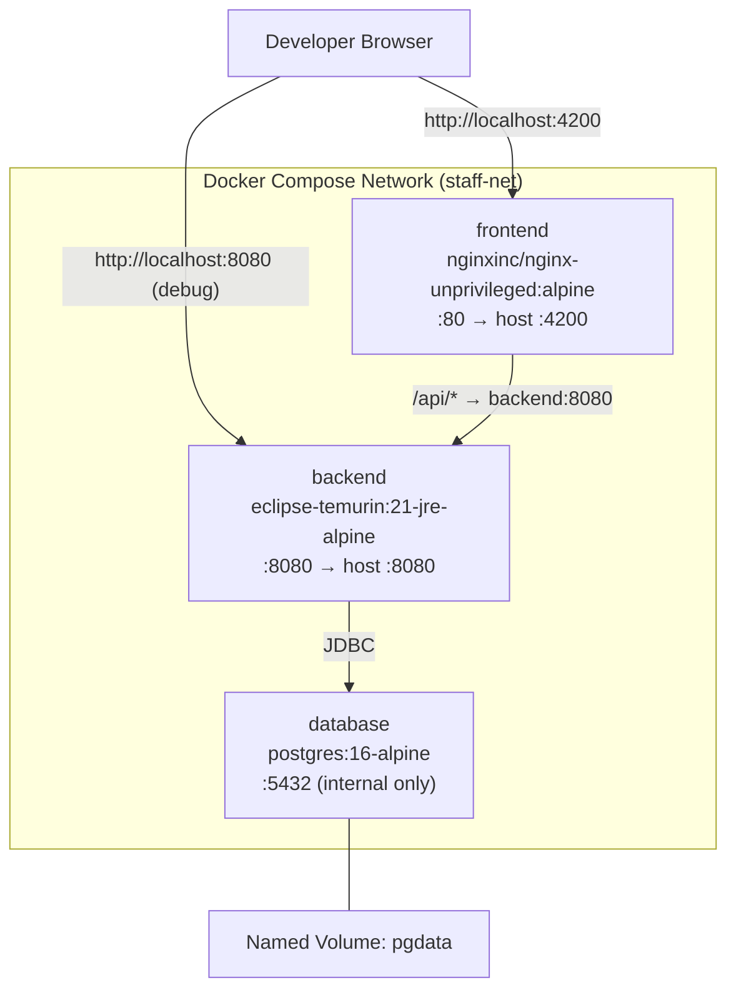

# Design Document: Containerization

## Overview

This design containerizes the Staff Engagement monorepo into production-ready Docker images and provides a Docker Compose stack for single-command local development. The backend (Spring Boot 3.5 / Java 21) and frontend (Angular 21 / nginx) each get a multi-stage Dockerfile optimized for layer caching and minimal image size. A `docker-compose.yml` at the repository root orchestrates backend, frontend, and PostgreSQL services with correct networking, health checks, and volume persistence.

### Design Goals

- **Fast rebuilds**: Layer ordering ensures dependency-only layers are cached when only source code changes.
- **Small images**: Runtime stages contain no build tools, source code, or intermediate artifacts.
- **Security**: All containers run as non-root users.
- **Developer ergonomics**: `docker compose up` is the only command needed to start the full stack.

## Architecture



### File Layout

```
kiro-staff-engagement/
├── docker-compose.yml                        # Compose orchestration
├── staff-engagement-backend/
│   ├── Dockerfile                            # Multi-stage backend build
│   └── .dockerignore                         # Excludes build artifacts
└── staff-engagement-frontend/
    ├── Dockerfile                            # Multi-stage frontend build
    ├── .dockerignore                         # Excludes node_modules etc.
    └── nginx/
        └── default.conf                      # nginx server config with SPA fallback + /api proxy
```

## Components and Interfaces

### Backend Dockerfile (`staff-engagement-backend/Dockerfile`)

**Build stage** (`builder`):
- Base: `eclipse-temurin:21-jdk-alpine`
- Copies `pom.xml`, `.mvn/`, `mvnw` first (dependency layer)
- Runs `chmod +x mvnw` then `./mvnw dependency:go-offline -B` to cache dependencies
- Copies `src/` and runs `./mvnw package -DskipTests -B`
- Result: fat JAR in `target/*.jar`

**Runtime stage**:
- Base: `eclipse-temurin:21-jre-alpine`
- Creates a non-root system user `appuser` (UID 1000)
- Copies only the JAR from the builder stage
- Exposes port 8080
- ENTRYPOINT: `java -jar /app/app.jar`
- Runs as `appuser`

**Layer caching strategy**:
```
COPY pom.xml .mvn/ mvnw ./        ← changes rarely
RUN ./mvnw dependency:go-offline  ← cached when pom.xml unchanged
COPY src/ ./src/                   ← changes frequently
RUN ./mvnw package -DskipTests    ← rebuilds only when src changes
```

### Frontend Dockerfile (`staff-engagement-frontend/Dockerfile`)

**Build stage** (`builder`):
- Base: `node:20-alpine`
- Copies `package.json` and `package-lock.json` first (dependency layer)
- Runs `npm ci` to install dependencies deterministically
- Copies remaining source and runs `npx ng build --configuration production`
- Output: `dist/staff-engagement/browser/` (Angular 21 `@angular/build:application` builder outputs to `browser/` subdirectory)

**Runtime stage**:
- Base: `nginxinc/nginx-unprivileged:alpine` (runs as UID 101 by default — non-root)
- Copies compiled assets from `builder` stage into `/usr/share/nginx/html/`
- Copies custom `nginx/default.conf` into `/etc/nginx/conf.d/`
- Exposes port 80 (nginx-unprivileged listens on 8080 internally, but we remap via Compose; see note below)

**Note on nginx-unprivileged**: The `nginxinc/nginx-unprivileged` image listens on port 8080 by default (not 80) since non-root cannot bind to privileged ports. The custom `default.conf` will configure `listen 8080;`. Docker Compose maps host port 4200 to container port 8080.

**Layer caching strategy**:
```
COPY package.json package-lock.json ./   ← changes rarely
RUN npm ci                                ← cached when lockfile unchanged
COPY . .                                  ← changes frequently
RUN npx ng build --configuration production
```

### Nginx Configuration (`staff-engagement-frontend/nginx/default.conf`)

```nginx
server {
    listen 8080;
    server_name _;

    root /usr/share/nginx/html;
    index index.html;

    # SPA fallback: return index.html for any path not matching a file
    location / {
        try_files $uri $uri/ /index.html;
    }

    # Proxy API requests to backend service
    location /api/ {
        proxy_pass http://backend:8080/api/;
        proxy_set_header Host $host;
        proxy_set_header X-Real-IP $remote_addr;
        proxy_set_header X-Forwarded-For $proxy_add_x_forwarded_for;
        proxy_set_header X-Forwarded-Proto $scheme;
    }
}
```

### Docker Compose (`docker-compose.yml`)

```yaml
services:
  database:
    image: postgres:16-alpine
    environment:
      POSTGRES_DB: staff_engagement
      POSTGRES_USER: postgres
      POSTGRES_PASSWORD: admin
    volumes:
      - pgdata:/var/lib/postgresql/data
    healthcheck:
      test: ["CMD-SHELL", "pg_isready -U postgres -d staff_engagement"]
      interval: 5s
      timeout: 3s
      retries: 10

  backend:
    build:
      context: ./staff-engagement-backend
      dockerfile: Dockerfile
    ports:
      - "8080:8080"
    environment:
      SPRING_PROFILES_ACTIVE: dev
      DB_HOST: database
      DB_PORT: "5432"
      DB_NAME: staff_engagement
      DB_USERNAME: postgres
      DB_PASSWORD: admin
    depends_on:
      database:
        condition: service_healthy
    healthcheck:
      test: ["CMD-SHELL", "wget --quiet --tries=1 --spider http://localhost:8080/actuator/health || exit 1"]
      interval: 10s
      timeout: 5s
      retries: 6
      start_period: 30s

  frontend:
    build:
      context: ./staff-engagement-frontend
      dockerfile: Dockerfile
    ports:
      - "4200:8080"
    depends_on:
      backend:
        condition: service_healthy

volumes:
  pgdata:
```

**Key decisions**:
- `depends_on` with `condition: service_healthy` ensures startup ordering (database → backend → frontend).
- The backend uses the existing `application-dev.properties` which reads `DB_HOST`, `DB_PORT`, `DB_NAME`, `DB_USERNAME`, `DB_PASSWORD` from environment variables — no code changes needed.
- `SPRING_PROFILES_ACTIVE=dev` activates the dev profile that wires up the env-var-based datasource config.
- The backend health check uses `wget` (available on Alpine) against the Actuator health endpoint.
- Frontend port mapping: host 4200 → container 8080 (nginx-unprivileged default port).

### .dockerignore Files

**Backend** (`staff-engagement-backend/.dockerignore`):
```
target/
.git/
.idea/
.vscode/
*.iml
*.log
.gitignore
HELP.md
```

**Frontend** (`staff-engagement-frontend/.dockerignore`):
```
node_modules/
dist/
.git/
.idea/
.vscode/
.angular/
*.log
.gitignore
```

## Data Models

No new data models are introduced. The existing PostgreSQL schema is managed by Flyway migrations and remains unchanged. The `pgdata` Docker volume provides persistence for the database container.

### Configuration Data Flow

| Service | Config Source | Profile |
|---------|-------------|---------|
| Backend | `application.properties` → `application-dev.properties` | `dev` (set via `SPRING_PROFILES_ACTIVE`) |
| Backend DB connection | Environment variables (`DB_HOST`, `DB_PORT`, `DB_NAME`, `DB_USERNAME`, `DB_PASSWORD`) | Resolved by Spring Boot from env |
| Frontend | Static build (no runtime config) | `production` build configuration |
| Database | `POSTGRES_DB`, `POSTGRES_USER`, `POSTGRES_PASSWORD` env vars | N/A |

## Error Handling

| Scenario | Handling |
|----------|----------|
| Database not ready when backend starts | `depends_on: condition: service_healthy` ensures Compose waits for PostgreSQL health check to pass. Spring Boot's connection pool retries internally. |
| Backend not ready when frontend starts | `depends_on: condition: service_healthy` on the backend health check ensures frontend only starts after backend is healthy. |
| Backend fails Flyway migration | Container exits with non-zero code; `docker compose logs backend` shows the error. Developer fixes migration and re-runs `docker compose up`. |
| Frontend nginx can't reach backend | Returns HTTP 502 to the client. The `/api/` proxy_pass uses the Docker DNS service name `backend` which resolves within the Compose network. |
| Port conflict on host | Docker reports bind error. Developer stops conflicting process or changes port mapping in `docker-compose.yml`. |
| Volume data corruption | `docker compose down -v` removes the named volume; `docker compose up` recreates a fresh database. |

## Testing Strategy

### Why Property-Based Testing Does Not Apply

This feature produces infrastructure configuration files (Dockerfiles, nginx config, docker-compose.yml). These are declarative artifacts — not functions with varied inputs and outputs. There are no pure functions to exercise with random inputs, no serialization round-trips, and no business logic to verify universally. Therefore, property-based testing is not appropriate for this feature.

### Recommended Testing Approach

**1. Build Verification (Smoke Tests)**
- `docker compose build` completes without errors
- Backend image size ≤ 300 MB (`docker image inspect`)
- Frontend image size ≤ 50 MB (`docker image inspect`)

**2. Integration Tests**
- `docker compose up -d` starts all three services
- Frontend responds on `http://localhost:4200` with HTTP 200 and serves `index.html`
- Backend health endpoint responds on `http://localhost:8080/actuator/health` with `{"status":"UP"}`
- Frontend proxies `/api/` requests to backend (e.g., `curl http://localhost:4200/api/actuator/health` returns backend health)
- Angular client-side routing: requesting a non-file path like `http://localhost:4200/some/route` returns `index.html` (HTTP 200)
- Database persistence: create data, run `docker compose down && docker compose up -d`, verify data persists

**3. Security Checks**
- Backend container runs as non-root: `docker compose exec backend whoami` → `appuser`
- Frontend container runs as non-root: `docker compose exec frontend whoami` → `nginx` (UID 101)

**4. Layer Caching Validation**
- Modify only a Java source file, rebuild — verify Maven dependency download layer is cached (check build output for "CACHED" on dependency layer)
- Modify only a TypeScript source file, rebuild — verify `npm ci` layer is cached

**5. .dockerignore Verification**
- Backend image does not contain `target/`, `.git/`, or IDE files
- Frontend image does not contain `node_modules/`, `.angular/`, or `dist/`

All tests are manual or scripted shell checks suitable for CI pipelines. No unit test framework is needed for infrastructure verification.
