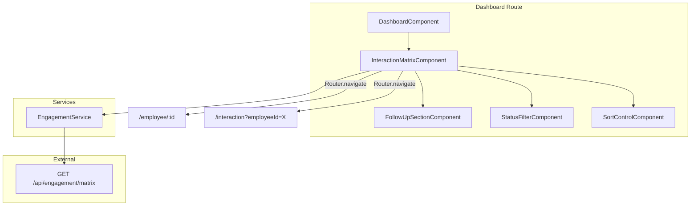
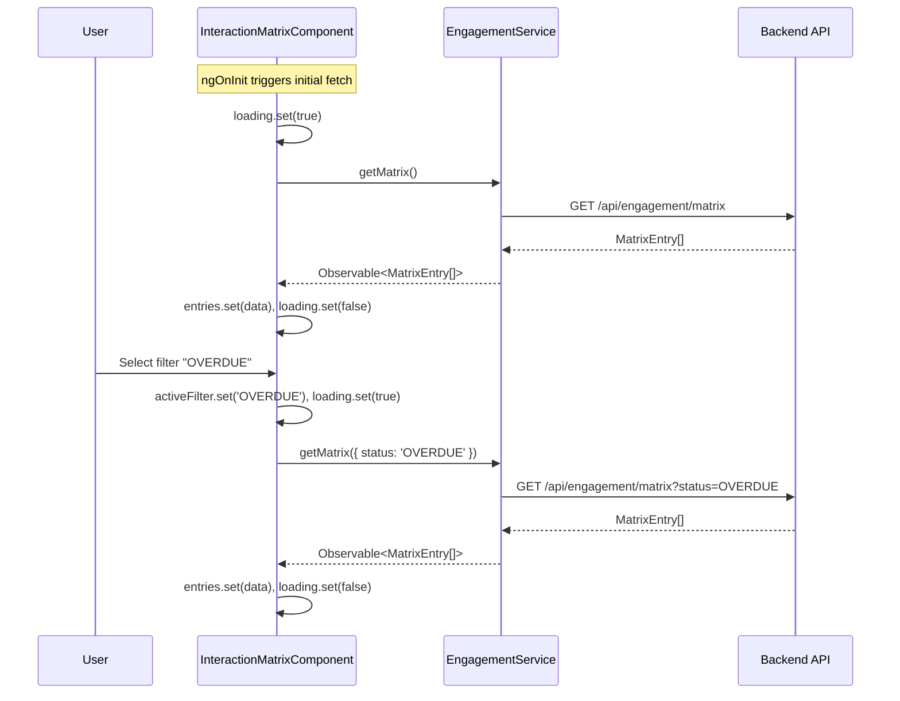

# Design Document: Dashboard Interaction Matrix

## Overview

This feature replaces the placeholder skeleton cards on the Angular dashboard with a fully functional engagement interaction matrix. The matrix displays employee engagement data fetched from the existing backend API (`GET /api/engagement/matrix`), provides status filtering and sort controls, highlights employees needing follow-up, and offers drill-through navigation to the Employee 360 view and log-interaction form.

The implementation follows the project's established Angular 21 patterns: standalone components with signals for reactive state, `inject()`-based dependency injection, component-scoped CSS, and Vitest for unit testing.

## Architecture



The architecture is a parent-child component tree embedded within the existing `DashboardComponent`. The `InteractionMatrixComponent` is the orchestrating component that owns state (loading, error, data, active filters/sort) and delegates rendering concerns to child components.

**Design Decisions:**

1. **Single orchestrating component with inline children** — The filter, sort, and follow-up section are lightweight enough to be child components within the same feature directory rather than separate shared modules.
2. **Signal-based state** — Aligns with the project's Angular 21 signal patterns (see `Employee360Component`). Signals provide fine-grained reactivity without RxJS subscriptions for template state.
3. **API-side filtering/sorting** — The backend already supports `status` and `sort` query parameters. We delegate filtering and sorting to the server to avoid duplicating business logic and to handle large datasets.
4. **Feature-local service** — `EngagementService` lives in the dashboard feature directory since it's purpose-built for this view, following the same pattern as `InteractionService` in the interaction feature.

## Components and Interfaces

### Component Hierarchy

| Component | Responsibility | Selector |
|-----------|---------------|----------|
| `DashboardComponent` (existing) | Host page, renders `InteractionMatrixComponent` | `app-dashboard` |
| `InteractionMatrixComponent` | Orchestrates data fetching, state, and layout | `app-interaction-matrix` |
| `StatusFilterComponent` | Renders filter buttons, emits selection | `app-status-filter` |
| `SortControlComponent` | Renders sort toggle, emits selection | `app-sort-control` |
| `FollowUpSectionComponent` | Renders follow-up entries panel | `app-follow-up-section` |

### Component Contracts

**InteractionMatrixComponent**
- Inputs: None (fetches its own data)
- Internal signals: `entries: Signal<MatrixEntry[]>`, `loading: Signal<boolean>`, `error: Signal<string | null>`, `activeFilter: Signal<EngagementStatus | null>`, `activeSort: Signal<SortOption>`
- Emits: Nothing (uses Router for navigation)

**StatusFilterComponent**
- Inputs: `activeFilter: InputSignal<EngagementStatus | null>`
- Outputs: `filterChange: OutputEmitterRef<EngagementStatus | null>`

**SortControlComponent**
- Inputs: `activeSort: InputSignal<SortOption>`
- Outputs: `sortChange: OutputEmitterRef<SortOption>`

**FollowUpSectionComponent**
- Inputs: `entries: InputSignal<MatrixEntry[]>` (pre-filtered to `followUpRequired === true`)

### Service Interface

```typescript
@Injectable({ providedIn: 'root' })
export class EngagementService {
  private http = inject(HttpClient);

  getMatrix(params?: { status?: EngagementStatus; sort?: SortOption }): Observable<MatrixEntry[]>;
}
```

The service constructs query parameters conditionally:
- No params → `GET /api/engagement/matrix`
- Status only → `GET /api/engagement/matrix?status=OVERDUE`
- Sort only → `GET /api/engagement/matrix?sort=recency`
- Both → `GET /api/engagement/matrix?status=OVERDUE&sort=recency`

## Data Models

### TypeScript Interfaces

```typescript
// src/app/dashboard/models/engagement.model.ts

export type EngagementStatus = 'OVERDUE' | 'AT_RISK' | 'ON_TRACK';

export type SortOption = 'name' | 'recency';

export interface MatrixEntry {
  employeeId: number;
  employeeName: string;
  employeeEmail: string;
  recency: number | null;
  frequency: number;
  lastInteractionDate: string | null;
  engagementStatus: EngagementStatus;
  followUpRequired: boolean;
}
```

### File/Folder Structure

```
src/app/dashboard/
├── dashboard.component.ts          (modified - imports InteractionMatrixComponent)
├── dashboard.component.html        (modified - replaces skeleton with <app-interaction-matrix>)
├── dashboard.component.css         (existing)
├── models/
│   └── engagement.model.ts         (new)
├── services/
│   └── engagement.service.ts       (new)
├── interaction-matrix/
│   ├── interaction-matrix.component.ts    (new)
│   ├── interaction-matrix.component.html  (new)
│   ├── interaction-matrix.component.css   (new)
│   └── interaction-matrix.component.spec.ts (new)
├── status-filter/
│   ├── status-filter.component.ts         (new)
│   ├── status-filter.component.html       (new)
│   └── status-filter.component.css        (new)
├── sort-control/
│   ├── sort-control.component.ts          (new)
│   ├── sort-control.component.html        (new)
│   └── sort-control.component.css         (new)
└── follow-up-section/
    ├── follow-up-section.component.ts     (new)
    ├── follow-up-section.component.html   (new)
    └── follow-up-section.component.css    (new)
```

### CSS Strategy

Status colours use CSS custom properties with WCAG AA contrast ratios:

```css
/* Status badge colours (text on colored background) */
--status-overdue-bg: #dc2626;       /* Red 600 */
--status-overdue-text: #ffffff;     /* White — contrast 4.53:1 */
--status-at-risk-bg: #d97706;       /* Amber 600 */
--status-at-risk-text: #000000;    /* Black — contrast 5.14:1 */
--status-on-track-bg: #16a34a;      /* Green 600 */
--status-on-track-text: #ffffff;   /* White — contrast 4.52:1 */
```

Responsive breakpoint at 768px: below this width the table switches to a stacked card layout using CSS Grid, maintaining readability on mobile.

### Signal-Based State Flow



## Correctness Properties

*A property is a characteristic or behavior that should hold true across all valid executions of a system — essentially, a formal statement about what the system should do. Properties serve as the bridge between human-readable specifications and machine-verifiable correctness guarantees.*

### Property 1: Service URL construction

*For any* combination of optional `status` (one of `OVERDUE`, `AT_RISK`, `ON_TRACK`, or absent) and optional `sort` (one of `name`, `recency`, or absent), the `EngagementService.getMatrix()` method SHALL construct a request URL equal to `/api/engagement/matrix` with only the provided parameters appended as query string key-value pairs, and no parameters when both are absent.

**Validates: Requirements 1.2, 1.3, 1.4, 6.5**

### Property 2: Follow-up filtering correctness

*For any* array of `MatrixEntry` items with arbitrary `followUpRequired` boolean values, the computed follow-up list SHALL contain exactly the subset of entries where `followUpRequired === true`, preserving order and excluding all entries where it is `false`.

**Validates: Requirements 2.4, 4.1**

### Property 3: Status indicator mapping

*For any* `EngagementStatus` value, the status rendering logic SHALL produce both the correct CSS class (`status-overdue` for `OVERDUE`, `status-at-risk` for `AT_RISK`, `status-on-track` for `ON_TRACK`) AND the correct `aria-label` containing the human-readable status name (e.g., "Status: Overdue").

**Validates: Requirements 2.3, 7.3, 8.5**

### Property 4: Drill-through link correctness

*For any* `MatrixEntry` with a positive integer `employeeId`, the Employee 360 link SHALL produce the route path `/employee/{employeeId}` and the log-interaction link SHALL produce the route path `/interaction` with query parameter `employeeId={employeeId}`, regardless of where the entry is rendered (main table or follow-up section).

**Validates: Requirements 3.1, 3.2, 3.3, 3.4, 4.3**

### Property 5: Recency and date display formatting

*For any* `MatrixEntry`, when `recency` is `null` the displayed recency text SHALL be "No interactions", and when `recency` is a non-negative number it SHALL be displayed as `"{n} days"`. When `lastInteractionDate` is `null` the displayed date text SHALL be "Never", and when it is a non-null ISO date string it SHALL be formatted as a human-readable date.

**Validates: Requirements 2.2**

## Error Handling

| Scenario | Behaviour |
|----------|-----------|
| HTTP error from API | `error` signal set with user-friendly message; loading indicator hidden; retry button rendered |
| Network timeout | Same as HTTP error (Angular HttpClient emits error on timeout) |
| Empty matrix (no employees) | Render the table with an "empty state" row: "No engagement data available" |
| Follow-up list empty | Render message: "No follow-ups needed at this time" (Req 4.4) |
| Invalid route params on drill-through | N/A — links are constructed from known data, not user input |

Error messages follow the pattern established in `Employee360Component`:
- Network/timeout: "Request timed out. Please try again."
- Server errors (5xx): "An error occurred while loading data. Please try again."
- Generic fallback: "Unable to load the engagement matrix. Please try again."

The retry action re-invokes `fetchMatrix()` with the current filter/sort state.

## Testing Strategy

### Unit Tests (Vitest + jsdom)

All tests run with `npx vitest --run` using the existing `vitest.config.ts` setup with the Angular resource inliner plugin.

**EngagementService tests** — Verify HTTP calls are made to correct URLs:
- No params → `GET /api/engagement/matrix`
- Status filter → `GET /api/engagement/matrix?status=OVERDUE`
- Sort → `GET /api/engagement/matrix?sort=recency`
- Both → `GET /api/engagement/matrix?status=AT_RISK&sort=recency`

**InteractionMatrixComponent tests:**
- Rows rendered per entry count
- Loading indicator shown while fetching, hidden once data arrives
- Error message + retry button on HTTP error
- Correct CSS class per status value
- Drill-through links contain correct router paths with employee ID
- Follow-up section shows only `followUpRequired: true` entries
- "No follow-ups needed" message when all entries have `followUpRequired: false`
- Filter selection triggers new API call with correct query parameter
- Sort selection triggers new API call with correct query parameter
- Semantic HTML structure (table, thead, tbody)
- aria-busy or aria-live region present during loading

### Property-Based Tests (fast-check)

The project already has `fast-check ^4.8.0` as a dev dependency. Property tests complement unit tests by verifying universal invariants across many random inputs. Each property test must run a minimum of 100 iterations.

**Tag format:** `// Feature: dashboard-interaction-matrix, Property {N}: {title}`

**Properties to implement:**

1. **Service URL construction** (Property 1)
   - Generator: `fc.record({ status: fc.constantFrom('OVERDUE', 'AT_RISK', 'ON_TRACK', undefined), sort: fc.constantFrom('name', 'recency', undefined) })`
   - Assertion: Constructed URL matches expected pattern with only non-undefined params as query params.

2. **Follow-up filtering correctness** (Property 2)
   - Generator: `fc.array(arbitraryMatrixEntry())` where `followUpRequired` is `fc.boolean()`
   - Assertion: Filtered array equals `entries.filter(e => e.followUpRequired)` — same length, same items, same order.

3. **Status indicator mapping** (Property 3)
   - Generator: `fc.constantFrom('OVERDUE', 'AT_RISK', 'ON_TRACK')`
   - Assertion: Mapping function returns correct CSS class AND aria-label for every status value.

4. **Drill-through link correctness** (Property 4)
   - Generator: `fc.nat({ min: 1 })` for employeeId
   - Assertion: Employee 360 link path is `/employee/{id}`, log-interaction link path is `/interaction` with `employeeId={id}` query param.

5. **Recency and date display formatting** (Property 5)
   - Generator: `fc.record({ recency: fc.option(fc.nat(), { nil: null }), lastInteractionDate: fc.option(fc.date().map(d => d.toISOString()), { nil: null }) })`
   - Assertion: null recency → "No interactions", number → "{n} days"; null date → "Never", non-null → formatted date string.

### Test File Locations

```
src/app/dashboard/services/engagement.service.spec.ts
src/app/dashboard/interaction-matrix/interaction-matrix.component.spec.ts
```
