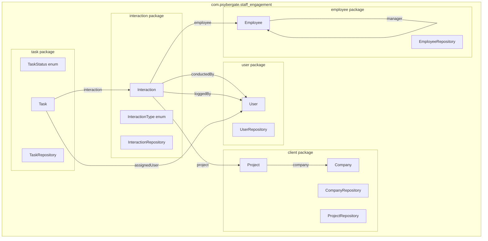
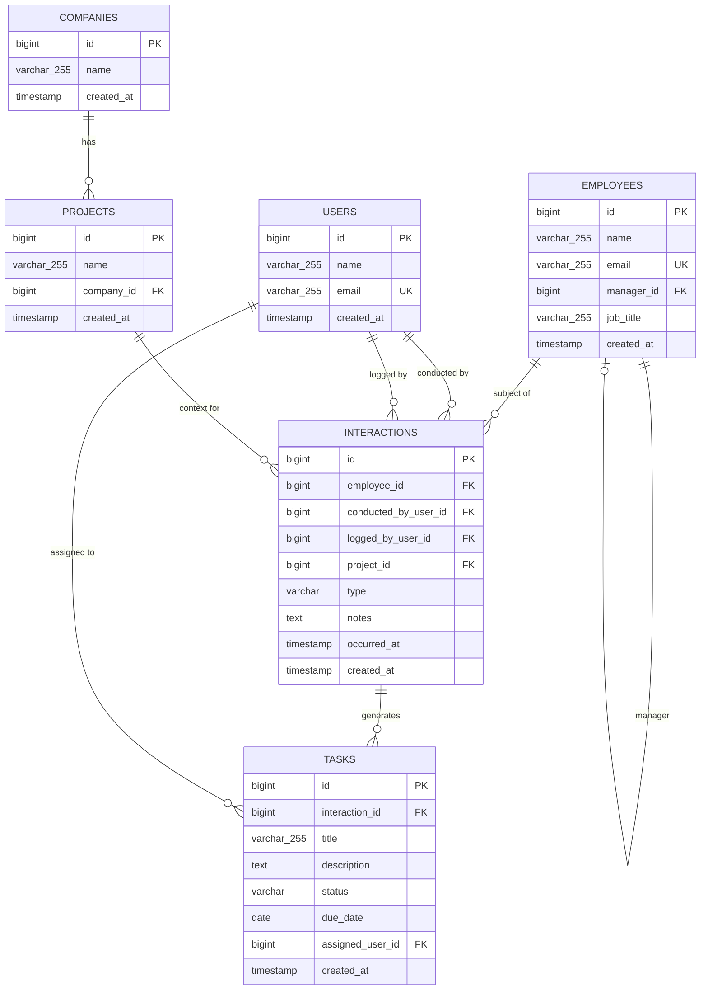

# Design Document: Domain Model ERD

## Overview

This design establishes the persistence layer for the Staff Engagement platform. It covers six JPA entities (User, Employee, Company, Project, Interaction, Task), two enumerations (InteractionType, TaskStatus), a Flyway V2 migration script creating all tables, and six Spring Data JPA repositories. The architecture follows a modular monolith approach where entities reside in their respective module packages but reference each other directly via unidirectional `@ManyToOne` associations with `FetchType.LAZY`.

### Design Decisions

| Decision | Rationale |
|----------|-----------|
| IDENTITY generation strategy | PostgreSQL BIGSERIAL provides simple auto-increment without sequence management overhead for this scale |
| Unidirectional @ManyToOne only | Avoids bidirectional mapping complexity; inverse collections can be added later via repository queries |
| No cascade operations cross-module | Prevents accidental cascading deletes across bounded contexts; lifecycle managed explicitly |
| FetchType.LAZY everywhere | Prevents N+1 issues and unnecessary joins; callers explicitly fetch associations when needed |
| @Enumerated(EnumType.STRING) | Human-readable in DB; safe for enum reordering; CHECK constraints enforce valid values at DB level |
| @PrePersist for created_at | Consistent audit timestamps without relying on DB defaults; testable in Java |
| Indexes on all FK columns | PostgreSQL does not auto-index FK columns; explicit indexes prevent full table scans on joins |

## Architecture



### Entity Relationship Diagram



## Components and Interfaces

### Package Structure

```
com.psybergate.staff_engagement/
├── user/
│   ├── User.java                 # JPA entity
│   └── UserRepository.java       # Spring Data JPA repository
├── employee/
│   ├── Employee.java             # JPA entity (self-referencing manager)
│   └── EmployeeRepository.java   # Spring Data JPA repository
├── client/
│   ├── Company.java              # JPA entity
│   ├── Project.java              # JPA entity (references Company)
│   ├── CompanyRepository.java    # Spring Data JPA repository
│   └── ProjectRepository.java   # Spring Data JPA repository
├── interaction/
│   ├── InteractionType.java      # Enum: CHECK_IN, MENTORING, CATCH_UP, OTHER
│   ├── Interaction.java          # JPA entity (references User, Employee, Project)
│   └── InteractionRepository.java # Spring Data JPA repository
└── task/
    ├── TaskStatus.java           # Enum: OPEN, DONE
    ├── Task.java                 # JPA entity (references Interaction, User)
    └── TaskRepository.java       # Spring Data JPA repository
```

### Entity Class Designs

#### User Entity

```java
package com.psybergate.staff_engagement.user;

import jakarta.persistence.*;
import lombok.Getter;
import lombok.NoArgsConstructor;
import lombok.Setter;
import java.time.Instant;

@Entity
@Table(name = "users")
@Getter
@Setter
@NoArgsConstructor
public class User {

    @Id
    @GeneratedValue(strategy = GenerationType.IDENTITY)
    private Long id;

    @Column(nullable = false, length = 255)
    private String name;

    @Column(nullable = false, unique = true, length = 255)
    private String email;

    @Column(name = "created_at", nullable = false, updatable = false)
    private Instant createdAt;

    @PrePersist
    protected void onCreate() {
        if (createdAt == null) {
            createdAt = Instant.now();
        }
    }
}
```

#### Employee Entity

```java
package com.psybergate.staff_engagement.employee;

import jakarta.persistence.*;
import lombok.Getter;
import lombok.NoArgsConstructor;
import lombok.Setter;
import java.time.Instant;

@Entity
@Table(name = "employees")
@Getter
@Setter
@NoArgsConstructor
public class Employee {

    @Id
    @GeneratedValue(strategy = GenerationType.IDENTITY)
    private Long id;

    @Column(nullable = false, length = 255)
    private String name;

    @Column(nullable = false, unique = true, length = 255)
    private String email;

    @ManyToOne(fetch = FetchType.LAZY)
    @JoinColumn(name = "manager_id")
    private Employee manager;

    @Column(name = "job_title", length = 255)
    private String jobTitle;

    @Column(name = "created_at", nullable = false, updatable = false)
    private Instant createdAt;

    @PrePersist
    protected void onCreate() {
        if (createdAt == null) {
            createdAt = Instant.now();
        }
    }
}
```

#### Company Entity

```java
package com.psybergate.staff_engagement.client;

import jakarta.persistence.*;
import lombok.Getter;
import lombok.NoArgsConstructor;
import lombok.Setter;
import java.time.Instant;

@Entity
@Table(name = "companies")
@Getter
@Setter
@NoArgsConstructor
public class Company {

    @Id
    @GeneratedValue(strategy = GenerationType.IDENTITY)
    private Long id;

    @Column(nullable = false, length = 255)
    private String name;

    @Column(name = "created_at", nullable = false, updatable = false)
    private Instant createdAt;

    @PrePersist
    protected void onCreate() {
        if (createdAt == null) {
            createdAt = Instant.now();
        }
    }
}
```

#### Project Entity

```java
package com.psybergate.staff_engagement.client;

import jakarta.persistence.*;
import lombok.Getter;
import lombok.NoArgsConstructor;
import lombok.Setter;
import java.time.Instant;

@Entity
@Table(name = "projects")
@Getter
@Setter
@NoArgsConstructor
public class Project {

    @Id
    @GeneratedValue(strategy = GenerationType.IDENTITY)
    private Long id;

    @Column(nullable = false, length = 255)
    private String name;

    @ManyToOne(fetch = FetchType.LAZY, optional = false)
    @JoinColumn(name = "company_id", nullable = false)
    private Company company;

    @Column(name = "created_at", nullable = false, updatable = false)
    private Instant createdAt;

    @PrePersist
    protected void onCreate() {
        if (createdAt == null) {
            createdAt = Instant.now();
        }
    }
}
```

#### InteractionType Enum

```java
package com.psybergate.staff_engagement.interaction;

public enum InteractionType {
    CHECK_IN,
    MENTORING,
    CATCH_UP,
    OTHER
}
```

#### Interaction Entity

```java
package com.psybergate.staff_engagement.interaction;

import com.psybergate.staff_engagement.client.Project;
import com.psybergate.staff_engagement.employee.Employee;
import com.psybergate.staff_engagement.user.User;
import jakarta.persistence.*;
import lombok.Getter;
import lombok.NoArgsConstructor;
import lombok.Setter;
import java.time.Instant;

@Entity
@Table(name = "interactions")
@Getter
@Setter
@NoArgsConstructor
public class Interaction {

    @Id
    @GeneratedValue(strategy = GenerationType.IDENTITY)
    private Long id;

    @ManyToOne(fetch = FetchType.LAZY, optional = false)
    @JoinColumn(name = "employee_id", nullable = false)
    private Employee employee;

    @ManyToOne(fetch = FetchType.LAZY, optional = false)
    @JoinColumn(name = "conducted_by_user_id", nullable = false)
    private User conductedBy;

    @ManyToOne(fetch = FetchType.LAZY, optional = false)
    @JoinColumn(name = "logged_by_user_id", nullable = false)
    private User loggedBy;

    @ManyToOne(fetch = FetchType.LAZY)
    @JoinColumn(name = "project_id")
    private Project project;

    @Enumerated(EnumType.STRING)
    @Column(nullable = false)
    private InteractionType type;

    @Column(nullable = false, columnDefinition = "TEXT")
    private String notes;

    @Column(name = "occurred_at", nullable = false)
    private Instant occurredAt;

    @Column(name = "created_at", nullable = false, updatable = false)
    private Instant createdAt;

    @PrePersist
    protected void onCreate() {
        if (createdAt == null) {
            createdAt = Instant.now();
        }
    }
}
```

#### TaskStatus Enum

```java
package com.psybergate.staff_engagement.task;

public enum TaskStatus {
    OPEN,
    DONE
}
```

#### Task Entity

```java
package com.psybergate.staff_engagement.task;

import com.psybergate.staff_engagement.interaction.Interaction;
import com.psybergate.staff_engagement.user.User;
import jakarta.persistence.*;
import lombok.Getter;
import lombok.NoArgsConstructor;
import lombok.Setter;
import java.time.Instant;
import java.time.LocalDate;

@Entity
@Table(name = "tasks")
@Getter
@Setter
@NoArgsConstructor
public class Task {

    @Id
    @GeneratedValue(strategy = GenerationType.IDENTITY)
    private Long id;

    @ManyToOne(fetch = FetchType.LAZY)
    @JoinColumn(name = "interaction_id")
    private Interaction interaction;

    @Column(nullable = false, length = 255)
    private String title;

    @Column(length = 2000)
    private String description;

    @Enumerated(EnumType.STRING)
    @Column(nullable = false)
    private TaskStatus status = TaskStatus.OPEN;

    @Column(name = "due_date")
    private LocalDate dueDate;

    @ManyToOne(fetch = FetchType.LAZY)
    @JoinColumn(name = "assigned_user_id")
    private User assignedUser;

    @Column(name = "created_at", nullable = false, updatable = false)
    private Instant createdAt;

    @PrePersist
    protected void onCreate() {
        if (createdAt == null) {
            createdAt = Instant.now();
        }
    }
}
```

### Repository Interfaces

```java
// com.psybergate.staff_engagement.user.UserRepository
package com.psybergate.staff_engagement.user;

import org.springframework.data.jpa.repository.JpaRepository;

public interface UserRepository extends JpaRepository<User, Long> {
}
```

```java
// com.psybergate.staff_engagement.employee.EmployeeRepository
package com.psybergate.staff_engagement.employee;

import org.springframework.data.jpa.repository.JpaRepository;

public interface EmployeeRepository extends JpaRepository<Employee, Long> {
}
```

```java
// com.psybergate.staff_engagement.client.CompanyRepository
package com.psybergate.staff_engagement.client;

import org.springframework.data.jpa.repository.JpaRepository;

public interface CompanyRepository extends JpaRepository<Company, Long> {
}
```

```java
// com.psybergate.staff_engagement.client.ProjectRepository
package com.psybergate.staff_engagement.client;

import org.springframework.data.jpa.repository.JpaRepository;

public interface ProjectRepository extends JpaRepository<Project, Long> {
}
```

```java
// com.psybergate.staff_engagement.interaction.InteractionRepository
package com.psybergate.staff_engagement.interaction;

import org.springframework.data.jpa.repository.JpaRepository;

public interface InteractionRepository extends JpaRepository<Interaction, Long> {
}
```

```java
// com.psybergate.staff_engagement.task.TaskRepository
package com.psybergate.staff_engagement.task;

import org.springframework.data.jpa.repository.JpaRepository;

public interface TaskRepository extends JpaRepository<Task, Long> {
}
```

## Data Models

### Flyway Migration: V2__create_domain_tables.sql

```sql
-- V2__create_domain_tables.sql
-- Creates all domain tables for the Staff Engagement platform.

-- 1. Users table
CREATE TABLE users (
    id          BIGSERIAL PRIMARY KEY,
    name        VARCHAR(255) NOT NULL,
    email       VARCHAR(255) NOT NULL UNIQUE,
    created_at  TIMESTAMP NOT NULL
);

-- 2. Employees table (self-referencing manager)
CREATE TABLE employees (
    id          BIGSERIAL PRIMARY KEY,
    name        VARCHAR(255) NOT NULL,
    email       VARCHAR(255) NOT NULL UNIQUE,
    manager_id  BIGINT REFERENCES employees(id),
    job_title   VARCHAR(255),
    created_at  TIMESTAMP NOT NULL
);

CREATE INDEX idx_employees_manager_id ON employees(manager_id);

-- 3. Companies table
CREATE TABLE companies (
    id          BIGSERIAL PRIMARY KEY,
    name        VARCHAR(255) NOT NULL,
    created_at  TIMESTAMP NOT NULL
);

-- 4. Projects table
CREATE TABLE projects (
    id          BIGSERIAL PRIMARY KEY,
    name        VARCHAR(255) NOT NULL,
    company_id  BIGINT NOT NULL REFERENCES companies(id),
    created_at  TIMESTAMP NOT NULL
);

CREATE INDEX idx_projects_company_id ON projects(company_id);

-- 5. Interactions table
CREATE TABLE interactions (
    id                      BIGSERIAL PRIMARY KEY,
    employee_id             BIGINT NOT NULL REFERENCES employees(id),
    conducted_by_user_id    BIGINT NOT NULL REFERENCES users(id),
    logged_by_user_id       BIGINT NOT NULL REFERENCES users(id),
    project_id              BIGINT REFERENCES projects(id),
    type                    VARCHAR(50) NOT NULL,
    notes                   TEXT NOT NULL,
    occurred_at             TIMESTAMP NOT NULL,
    created_at              TIMESTAMP NOT NULL,
    CONSTRAINT chk_interaction_type CHECK (type IN ('CHECK_IN', 'MENTORING', 'CATCH_UP', 'OTHER'))
);

CREATE INDEX idx_interactions_employee_id ON interactions(employee_id);
CREATE INDEX idx_interactions_conducted_by_user_id ON interactions(conducted_by_user_id);
CREATE INDEX idx_interactions_logged_by_user_id ON interactions(logged_by_user_id);
CREATE INDEX idx_interactions_project_id ON interactions(project_id);

-- 6. Tasks table
CREATE TABLE tasks (
    id               BIGSERIAL PRIMARY KEY,
    interaction_id   BIGINT REFERENCES interactions(id),
    title            VARCHAR(255) NOT NULL,
    description      TEXT,
    status           VARCHAR(50) NOT NULL DEFAULT 'OPEN',
    due_date         DATE,
    assigned_user_id BIGINT REFERENCES users(id),
    created_at       TIMESTAMP NOT NULL,
    CONSTRAINT chk_task_status CHECK (status IN ('OPEN', 'DONE'))
);

CREATE INDEX idx_tasks_interaction_id ON tasks(interaction_id);
CREATE INDEX idx_tasks_assigned_user_id ON tasks(assigned_user_id);
```

### Cross-Module Reference Strategy

All cross-module references follow these rules:

1. **Direction**: Unidirectional `@ManyToOne` from the owning entity to the referenced entity
2. **Fetch type**: Always `FetchType.LAZY`
3. **Cascade**: None — no cascade operations defined on cross-module associations
4. **Imports**: Direct Java imports across package boundaries (no intermediate abstractions)

| Owning Entity | Field | Referenced Entity | Nullable |
|---------------|-------|-------------------|----------|
| Employee | manager | Employee | Yes |
| Project | company | Company | No |
| Interaction | employee | Employee | No |
| Interaction | conductedBy | User | No |
| Interaction | loggedBy | User | No |
| Interaction | project | Project | Yes |
| Task | interaction | Interaction | Yes |
| Task | assignedUser | User | Yes |

## Correctness Properties

*A property is a characteristic or behavior that should hold true across all valid executions of a system — essentially, a formal statement about what the system should do. Properties serve as the bridge between human-readable specifications and machine-verifiable correctness guarantees.*

### Property 1: Entity Persistence Round-Trip

*For any* valid entity instance (User, Employee, Company, Project, Interaction, Task) with all required fields populated, saving via its JpaRepository and then retrieving by the returned ID SHALL produce an entity with identical field values to what was persisted.

**Validates: Requirements 12.1, 1.3, 3.3, 10.1, 10.2**

### Property 2: @PrePersist Auto-Populates created_at

*For any* entity (User, Employee, Company, Project, Interaction, Task) persisted with a null `created_at` field, the `@PrePersist` callback SHALL set `created_at` to a non-null timestamp that is approximately the current time (within a reasonable tolerance).

**Validates: Requirements 1.4, 4.5, 5.6, 6.6**

### Property 3: Enum Field Serialization Round-Trip

*For any* valid `InteractionType` enum value and *for any* valid `TaskStatus` enum value, persisting an entity with that enum value, flushing and clearing the persistence context, then reloading the entity by ID SHALL return the exact same enum value — confirming `@Enumerated(EnumType.STRING)` maps correctly and the database CHECK constraint accepts all defined enum values.

**Validates: Requirements 5.5, 6.5, 7.2, 8.2, 8.4, 12.5**

### Property 4: Association Resolution After Flush and Clear

*For any* entity with `@ManyToOne` associations (both required and optional), persisting the entity with valid referenced entities, flushing and clearing the persistence context, then reloading the entity by ID SHALL correctly resolve all non-null associations to the originally persisted referenced entities, and all null optional associations SHALL remain null.

**Validates: Requirements 2.3, 4.3, 5.3, 5.4, 6.3, 6.4, 11.2, 12.2, 12.3, 12.4**

### Property 5: No Cascade on Cross-Module Delete

*For any* entity that holds a cross-module `@ManyToOne` reference (e.g., Task referencing User, Interaction referencing Employee), deleting the referencing entity SHALL NOT cause deletion of the referenced entity — the referenced entity SHALL remain retrievable by its ID after the referencing entity is removed.

**Validates: Requirements 11.4**

## Error Handling

### Constraint Violations

| Scenario | Expected Behavior |
|----------|-------------------|
| Persist entity with field exceeding VARCHAR(255) | `DataIntegrityViolationException` wrapping a constraint violation |
| Persist entity with duplicate unique email | `DataIntegrityViolationException` wrapping unique constraint violation |
| Persist entity with FK referencing non-existent row | `DataIntegrityViolationException` wrapping FK constraint violation |
| Persist Interaction with invalid type string (via native SQL) | Database CHECK constraint rejects with error |
| Persist Task with invalid status string (via native SQL) | Database CHECK constraint rejects with error |
| Persist Project with null Company | `ConstraintViolationException` or `DataIntegrityViolationException` depending on whether JPA validates before flush |

### @PrePersist Edge Cases

- If `created_at` is explicitly set before persist, the `@PrePersist` callback preserves the explicit value (only sets if null)
- All `@PrePersist` callbacks use `Instant.now()` for timezone-neutral UTC timestamps

### Lazy Loading Considerations

- Accessing a LAZY association outside of a transaction/session throws `LazyInitializationException`
- Service layer methods that need association data must run within a `@Transactional` context or use explicit fetch joins

## Testing Strategy

### Test Framework

- **JUnit 5** — test runner
- **Spring Boot Test** (`@SpringBootTest`) — full context integration tests
- **Testcontainers** — PostgreSQL container for realistic database testing
- **jqwik** — property-based testing library for Java

### Test Categories

#### 1. Integration Tests (Testcontainers + PostgreSQL)

These tests verify the full stack from JPA entity through Flyway migration to actual PostgreSQL behavior.

**DomainModelIntegrationTest** — single test class covering:
- Context loads with all repositories injectable
- Full entity graph persistence and retrieval
- Nullable FK handling (null project on Interaction, null interaction/assignedUser on Task)
- Enum mapping correctness (all InteractionType and TaskStatus values)
- Unique constraint enforcement (duplicate emails)
- FK constraint enforcement (orphan references)
- CHECK constraint enforcement (invalid enum strings via native SQL)
- Self-referencing Employee manager relationship

**Configuration**: Reuses existing `TestcontainersConfiguration` class with `@ServiceConnection` PostgreSQL container.

#### 2. Property-Based Tests (jqwik + Testcontainers)

Each correctness property maps to a property-based test with minimum 100 iterations:

| Property | Test Class | Iterations |
|----------|-----------|------------|
| Property 1: Persistence round-trip | `EntityPersistencePropertyTest` | 100 |
| Property 2: @PrePersist created_at | `EntityPersistencePropertyTest` | 100 |
| Property 3: Enum serialization round-trip | `EnumMappingPropertyTest` | 100 |
| Property 4: Association resolution | `AssociationResolutionPropertyTest` | 100 |
| Property 5: No cascade on delete | `NoCascadePropertyTest` | 100 |

**Tag format**: `// Feature: domain-model-erd, Property {N}: {description}`

#### 3. Migration Smoke Test

- Verify `V2__create_domain_tables.sql` applies cleanly after `V1__baseline.sql`
- Verify all expected tables exist
- Verify all expected indexes exist (query `pg_indexes`)
- Uses existing `FlywayMigrationIntegrationTest` pattern

### Test Data Generation (for Property Tests)

Generators produce random valid entity instances:
- `UserGenerator`: random name (1-255 chars), unique email, null created_at
- `EmployeeGenerator`: random name, unique email, optional manager, optional job_title
- `CompanyGenerator`: random name
- `ProjectGenerator`: random name, valid Company reference
- `InteractionGenerator`: random InteractionType, random notes, valid Employee/User/Project references
- `TaskGenerator`: random TaskStatus, random title, optional description, optional dueDate, optional references

### Dependency for Property-Based Testing

Add to `pom.xml`:
```xml
<dependency>
    <groupId>net.jqwik</groupId>
    <artifactId>jqwik</artifactId>
    <version>1.9.2</version>
    <scope>test</scope>
</dependency>
```

