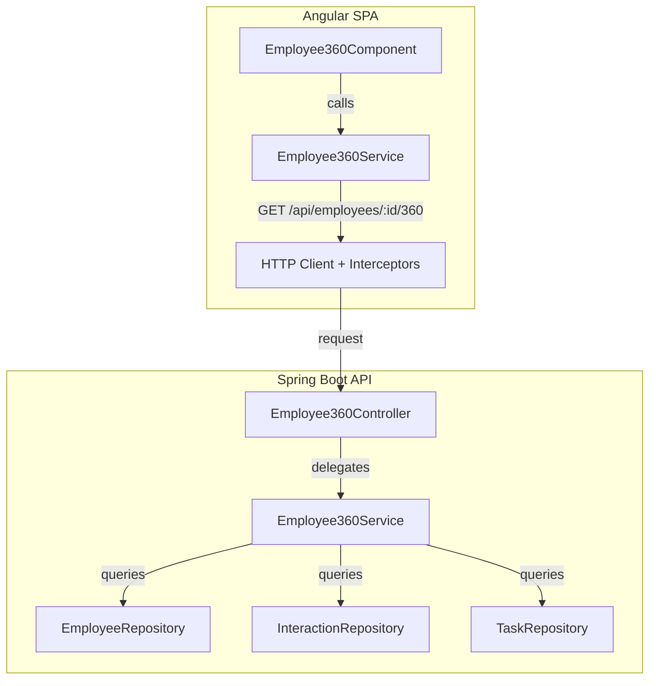
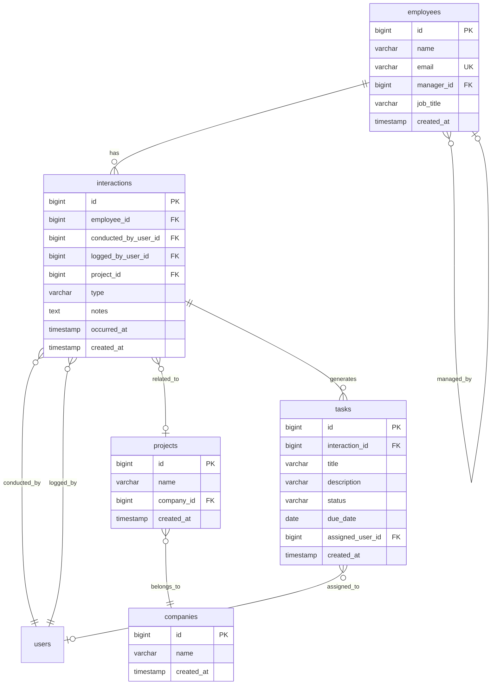

# Design Document: Employee 360 View

## Overview

The Employee 360 View delivers a full-stack vertical slice that aggregates an employee's profile, interaction history, open tasks, and project context into a single screen. The backend exposes one aggregate read endpoint (`GET /api/employees/{id}/360`) that performs three queries and assembles the result into a flat DTO. The Angular frontend renders the aggregate response with a profile header, interaction timeline, and open-task list.

### Key Design Decisions

| Decision | Rationale |
|----------|-----------|
| Single aggregate endpoint rather than multiple calls | Reduces network round-trips for the frontend; keeps the 360 view atomic |
| Service-layer DTO assembly (not DB view) | Simpler to maintain; keeps business logic (ordering, filtering) in Java |
| New `employee360` package in the backend | Keeps aggregate logic separate from the existing entity-per-package CRUD packages |
| Standalone Angular component with signals | Consistent with project conventions (no NgModules, signal-based state) |
| Vitest for frontend unit tests | Matches existing test runner configuration |

## Architecture



### Request Flow

1. User navigates to `/employee/:id` (Angular route with `authGuard`)
2. `Employee360Component` initializes, extracts `:id` from route params
3. `Employee360Service.getEmployee360(id)` issues `GET /api/employees/{id}/360`
4. Backend `Employee360Controller` delegates to `Employee360Service`
5. Service fetches Employee, Interactions (ordered), and Tasks (filtered OPEN)
6. Service assembles `Employee360Response` DTO and returns it
7. Frontend renders profile summary, interaction list, and task list

## Components and Interfaces

### Backend

#### Package: `com.psybergate.staff_engagement.employee360`

| Class | Role |
|-------|------|
| `Employee360Controller` | REST controller, `@GetMapping("/api/employees/{id}/360")` |
| `Employee360Service` | Orchestrates queries and DTO assembly |
| `Employee360Response` | Top-level response record |
| `ProfileDto` | Employee profile fields |
| `InteractionDto` | Interaction entry with project context |
| `ProjectContextDto` | Project name + company name |
| `TaskDto` | Open task fields |

#### Controller

```java
@RestController
@RequiredArgsConstructor
public class Employee360Controller {

    private final Employee360Service employee360Service;

    @GetMapping("/api/employees/{id}/360")
    public ResponseEntity<Employee360Response> getEmployee360(
            @PathVariable("id") Long id) {
        return ResponseEntity.ok(employee360Service.getEmployee360(id));
    }
}
```

Spring's default type conversion will produce HTTP 400 if `{id}` is not a valid `Long`.

#### Service

```java
@Service
@RequiredArgsConstructor
public class Employee360Service {

    private final EmployeeRepository employeeRepository;
    private final InteractionRepository interactionRepository;
    private final TaskRepository taskRepository;

    @Transactional(readOnly = true)
    public Employee360Response getEmployee360(Long employeeId) {
        Employee employee = employeeRepository.findById(employeeId)
            .orElseThrow(() -> new Employee360NotFoundException(employeeId));

        List<Interaction> interactions = interactionRepository
            .findByEmployeeIdOrderByOccurredAtDesc(employeeId);

        List<Long> interactionIds = interactions.stream()
            .map(Interaction::getId).toList();

        List<Task> openTasks = interactionIds.isEmpty()
            ? List.of()
            : taskRepository.findByInteractionIdInAndStatus(interactionIds, TaskStatus.OPEN);

        return buildResponse(employee, interactions, openTasks);
    }
}
```

#### Response DTOs (Java records)

```java
public record Employee360Response(
    ProfileDto profile,
    List<InteractionDto> interactions,
    List<TaskDto> openTasks
) {}

public record ProfileDto(
    Long id,
    String name,
    String email,
    String jobTitle,
    String managerName
) {}

public record InteractionDto(
    Long id,
    String type,
    Instant occurredAt,
    String conductedByName,
    String notes,
    ProjectContextDto projectContext
) {}

public record ProjectContextDto(
    String projectName,
    String companyName
) {}

public record TaskDto(
    Long id,
    String title,
    LocalDate dueDate,
    String assignedUserName
) {}
```

#### Repository Additions

```java
// InteractionRepository (add method)
List<Interaction> findByEmployeeIdOrderByOccurredAtDesc(Long employeeId);

// TaskRepository (add method)
List<Task> findByInteractionIdInAndStatus(List<Long> interactionIds, TaskStatus status);
```

#### Exception Handling

```java
@ResponseStatus(HttpStatus.NOT_FOUND)
public class Employee360NotFoundException extends RuntimeException {
    public Employee360NotFoundException(Long id) {
        super("Employee not found with id: " + id);
    }
}
```

### Frontend

#### Component Tree

```
employee/
├── employee-360/
│   ├── employee-360.component.ts    # Standalone component (signal-based)
│   ├── employee-360.component.html  # Template
│   ├── employee-360.component.css   # Scoped styles
│   └── employee-360.component.spec.ts
├── services/
│   └── employee-360.service.ts      # HttpClient wrapper
├── models/
│   └── employee-360.model.ts        # TypeScript interfaces
└── employee.routes.ts               # Updated with :id route
```

#### Route Registration

```typescript
// employee.routes.ts (updated)
export const routes: Routes = [
  { path: '', component: Employee },
  { path: ':id', component: Employee360Component },
];
```

#### Service

```typescript
@Injectable({ providedIn: 'root' })
export class Employee360Service {
  private readonly http = inject(HttpClient);

  getEmployee360(id: number): Observable<Employee360Response> {
    return this.http.get<Employee360Response>(`/api/employees/${id}/360`);
  }
}
```

#### Component (Signal-based)

```typescript
@Component({
  selector: 'app-employee-360',
  standalone: true,
  imports: [CommonModule],
  templateUrl: './employee-360.component.html',
  styleUrl: './employee-360.component.css',
})
export class Employee360Component implements OnInit {
  private readonly route = inject(ActivatedRoute);
  private readonly employee360Service = inject(Employee360Service);

  readonly loading = signal(true);
  readonly error = signal<string | null>(null);
  readonly data = signal<Employee360Response | null>(null);

  ngOnInit(): void {
    this.fetchData();
  }

  fetchData(): void {
    const id = Number(this.route.snapshot.paramMap.get('id'));
    this.loading.set(true);
    this.error.set(null);

    this.employee360Service.getEmployee360(id).subscribe({
      next: (response) => {
        this.data.set(response);
        this.loading.set(false);
      },
      error: (err) => {
        this.error.set(this.mapError(err));
        this.loading.set(false);
      },
    });
  }

  retry(): void {
    this.fetchData();
  }

  isOverdue(dueDate: string | null): boolean {
    if (!dueDate) return false;
    return new Date(dueDate) < new Date(new Date().toDateString());
  }

  truncateNotes(notes: string, maxLength = 200): string {
    if (notes.length <= maxLength) return notes;
    return notes.substring(0, maxLength) + '…';
  }
}
```

#### TypeScript Models

```typescript
export interface Employee360Response {
  profile: ProfileDto;
  interactions: InteractionDto[];
  openTasks: TaskDto[];
}

export interface ProfileDto {
  id: number;
  name: string;
  email: string;
  jobTitle: string;
  managerName: string | null;
}

export interface InteractionDto {
  id: number;
  type: string;
  occurredAt: string;
  conductedByName: string;
  notes: string;
  projectContext: ProjectContextDto | null;
}

export interface ProjectContextDto {
  projectName: string;
  companyName: string;
}

export interface TaskDto {
  id: number;
  title: string;
  dueDate: string | null;
  assignedUserName: string;
}
```

### Acceptance Tests

#### Four-Layer Architecture Extension

| Layer | New Artifacts |
|-------|--------------|
| **Domain (actors/assertions)** | `Employee360Actor`, `Employee360Assertions` |
| **Page objects** | `Employee360Page` |
| **Step definitions** | `Employee360StepDefinitions` |
| **Feature file** | `employee_360_view.feature` |

#### Page Object

```java
@Component
@ScenarioScope
public class Employee360Page extends BasePage {

    public Employee360Page(Page page, EnvironmentConfig env) {
        super(page, env);
    }

    public void open(Long employeeId) {
        navigateTo("/employee/" + employeeId);
    }

    public boolean isProfileSummaryVisible() {
        return isVisible("[data-testid='profile-summary']");
    }

    public String getEmployeeName() {
        return textContent("[data-testid='employee-name']");
    }

    public boolean isInteractionHistoryVisible() {
        return isVisible("[data-testid='interaction-history']");
    }

    public boolean isOpenTasksVisible() {
        return isVisible("[data-testid='open-tasks']");
    }

    public boolean isEmptyInteractionsMessageVisible() {
        return isVisible("[data-testid='empty-interactions']");
    }

    public boolean isEmptyTasksMessageVisible() {
        return isVisible("[data-testid='empty-tasks']");
    }

    public boolean hasOverdueTaskStyling() {
        return isVisible("[data-testid='task-row'].overdue");
    }
}
```

#### Domain Actor

```java
@Component
@ScenarioScope
public class Employee360Actor {

    private final Employee360Page page;
    private final TestWorld testWorld;

    public Employee360Actor(Employee360Page page, TestWorld testWorld) {
        this.page = page;
        this.testWorld = testWorld;
    }

    public void navigateToEmployee360(Long employeeId) {
        page.open(employeeId);
        testWorld.set("currentEmployeeId", employeeId);
    }
}
```

## Data Models

### Database Schema (existing — no migrations needed)



### Aggregate Response Shape (JSON)

```json
{
  "profile": {
    "id": 1,
    "name": "John Doe",
    "email": "john@example.com",
    "jobTitle": "Software Engineer",
    "managerName": "Jane Smith"
  },
  "interactions": [
    {
      "id": 10,
      "type": "CHECK_IN",
      "occurredAt": "2024-12-15T10:00:00Z",
      "conductedByName": "Jane Smith",
      "notes": "Discussed project progress...",
      "projectContext": {
        "projectName": "Alpha Platform",
        "companyName": "Acme Corp"
      }
    }
  ],
  "openTasks": [
    {
      "id": 20,
      "title": "Update documentation",
      "dueDate": "2025-01-20",
      "assignedUserName": "John Doe"
    }
  ]
}
```

## Correctness Properties

*A property is a characteristic or behavior that should hold true across all valid executions of a system — essentially, a formal statement about what the system should do. Properties serve as the bridge between human-readable specifications and machine-verifiable correctness guarantees.*

### Property 1: Profile mapping preserves all employee fields

*For any* Employee entity with non-null required fields, the assembled `ProfileDto` SHALL contain the same id, name, email, jobTitle, and the manager's name (or null if no manager exists).

**Validates: Requirements 1.1**

### Property 2: Interaction ordering is descending by occurredAt

*For any* list of interactions belonging to an employee, the `Employee360Service` SHALL return them ordered such that for every consecutive pair (i, i+1), `interactions[i].occurredAt >= interactions[i+1].occurredAt`.

**Validates: Requirements 1.2, 2.2**

### Property 3: Only OPEN tasks are included

*For any* set of tasks linked to an employee's interactions, the response SHALL include only those tasks where `status == OPEN`. No task with status `DONE` shall appear in the `openTasks` list.

**Validates: Requirements 1.3**

### Property 4: Project context is present if and only if the interaction has a project

*For any* interaction in the response, `projectContext` SHALL be non-null if and only if the source Interaction entity has a non-null Project reference. When present, `projectName` and `companyName` SHALL match the source Project and Company entity names.

**Validates: Requirements 1.4, 2.3**

### Property 5: Notes truncation preserves short strings and clips long ones

*For any* string of length ≤ 200, the `truncateNotes` function SHALL return the string unchanged. *For any* string of length > 200, the function SHALL return a string of exactly 201 characters (200 chars + ellipsis character) where the first 200 characters match the original prefix.

**Validates: Requirements 2.1**

### Property 6: Tasks are ordered by due date ascending with nulls last

*For any* list of open tasks, the rendered order SHALL satisfy: all tasks with non-null due dates appear before tasks with null due dates, and among tasks with non-null due dates, each task's dueDate is ≤ the next task's dueDate.

**Validates: Requirements 3.1**

### Property 7: Overdue classification correctness

*For any* task, `isOverdue(task.dueDate)` SHALL return `true` if and only if `dueDate` is non-null AND `dueDate < today`. If `dueDate` is null, the function SHALL return `false`.

**Validates: Requirements 3.3, 3.4**

## Error Handling

### Backend

| Condition | HTTP Status | Response Body |
|-----------|-------------|---------------|
| Employee not found | 404 | `{ "error": "Employee not found with id: {id}" }` |
| Invalid ID format (non-numeric) | 400 | `{ "error": "Invalid employee ID format" }` (Spring default type mismatch) |
| Unauthenticated request | 401 | `{ "error": "Authentication required" }` |
| Unexpected server error | 500 | `{ "error": "Internal server error" }` |

Implementation uses `@ResponseStatus` on the custom exception and relies on Spring's `MethodArgumentTypeMismatchException` handler for invalid path variable types.

### Frontend

| Condition | Behavior |
|-----------|----------|
| API returns 404 | Display "Employee not found" message, hide loading indicator |
| API returns 401 | Redirect to `/login?returnUrl=<current-url>` (handled by existing `errorInterceptor`) |
| API returns 5xx | Display generic error message with retry button |
| API timeout (30s) | Display timeout error message with retry button |
| Network failure | Display error message with retry button |

The `HttpClient` request will use RxJS `timeout(30000)` operator to enforce the 30-second timeout requirement.

## Testing Strategy

### Backend Unit Tests (JUnit 5 + Mockito)

- **Service layer**: Mock repositories, test DTO assembly logic
- **Controller layer**: Use `@WebMvcTest` to verify HTTP semantics (200, 404, 400, 401)
- **Edge cases**: Empty interactions, null manager, null project, null due dates

### Backend Property Tests (jqwik)

Property-based testing is appropriate here because the service layer performs data transformation (entity → DTO mapping, filtering, and ordering) with clear input/output behavior that varies meaningfully across inputs.

- **Library**: [jqwik](https://jqwik.net/) — idiomatic PBT for JUnit 5 on the JVM
- **Minimum iterations**: 100 per property
- **Tag format**: `@Tag("Feature: employee-360-view, Property N: <property_text>")`

Properties to implement:
1. Profile mapping round-trip (entities → DTO preserves fields)
2. Interaction ordering invariant (descending occurredAt)
3. Open task filtering (only OPEN status tasks pass through)
4. Project context conditional presence
5. Task ordering with nulls-last

### Frontend Unit Tests (Vitest)

- **Component tests**: Verify rendering of profile, interactions, tasks, empty states, loading, error
- **Service tests**: Mock HttpClient, verify correct URL and response mapping
- **Edge cases**: Null manager, overdue tasks, no due date, notes > 200 chars

### Frontend Property Tests (fast-check)

- **Library**: [fast-check](https://github.com/dubzzz/fast-check) — PBT for TypeScript/JavaScript
- **Minimum iterations**: 100 per property
- **Tag format**: Comment `// Feature: employee-360-view, Property N: <property_text>`

Properties to implement:
5. Notes truncation (string length invariant)
6. Task ordering (due date ascending, nulls last) — if sorting is done frontend-side
7. Overdue classification (date comparison correctness)

### Acceptance Tests (Cucumber + Playwright + Spring)

Scenarios covering end-to-end flows through the UI:
1. Authenticated user views employee 360 with full data (profile + interactions + tasks)
2. Employee with no interactions shows empty-state messages
3. Overdue tasks are visually distinguished
4. Unauthenticated user is redirected to login

Uses existing infrastructure:
- `LoginActor` for authentication
- `SeedDataApiDriver` for test data setup
- `TestWorld` for scenario-scoped state
- `BasePage` for page object inheritance
- `data-testid` attributes for stable selectors
