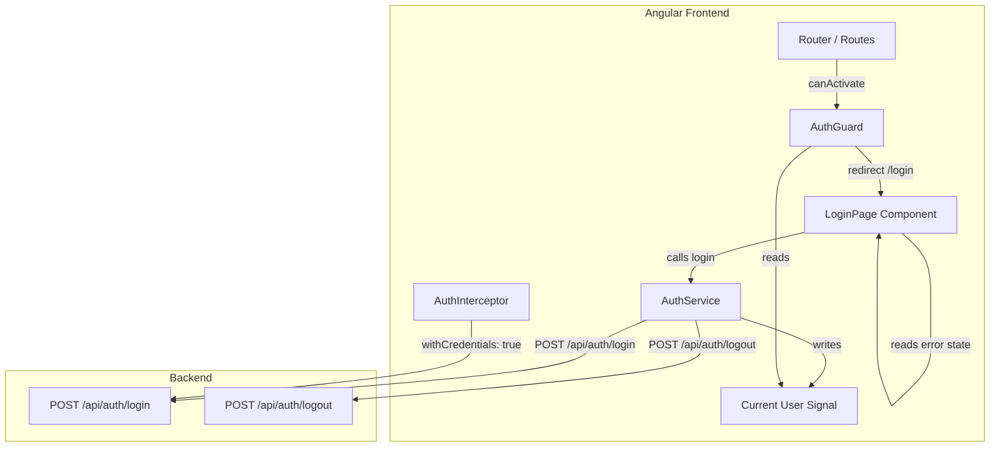

# Design Document: Frontend Login & Auth Guard

## Overview

This feature adds a complete authentication layer to the Angular frontend: a login page with reactive form validation, a signal-based authentication service, an HTTP interceptor for session credential propagation, and a route guard that redirects unauthenticated users. The design leverages Angular 21 standalone components, signals for reactive state, and integrates with the existing session-based backend auth API.

The backend already handles session management via cookies — the frontend's job is to present the login UI, call the login/logout endpoints, track the authenticated user via a signal, and protect routes. The acceptance test architecture follows the existing four-layer Cucumber + Playwright + Spring harness.

## Architecture



**Data flow:**
1. User navigates to a protected route → AuthGuard reads `currentUser()` signal → if null, redirect to `/login?returnUrl=...`
2. User fills in login form → LoginPage validates → calls `AuthService.login(email, password)`
3. AuthService POSTs to `/api/auth/login` → backend sets session cookie → returns user object → AuthService writes to `currentUser` signal
4. LoginPage reads successful response → navigates to `returnUrl` or `/user`
5. Subsequent HTTP requests → AuthInterceptor clones with `withCredentials: true` → browser attaches session cookie automatically

**Interceptor ordering in `provideHttpClient`:**
```
baseUrlInterceptor → authInterceptor → errorInterceptor
```

## Components and Interfaces

### 1. AuthService (`src/app/core/services/auth.service.ts`)

```typescript
interface User {
  id: number;
  name: string;
  email: string;
}

@Injectable({ providedIn: 'root' })
class AuthService {
  // State
  readonly currentUser: WritableSignal<User | null>;
  readonly isAuthenticated: Signal<boolean>;

  // Methods
  login(email: string, password: string): Observable<User>;
  logout(): void;
}
```

**Design decisions:**
- `providedIn: 'root'` makes it a singleton — no need to register in providers arrays.
- `login()` returns an `Observable<User>` so the LoginPage can handle success/error in the subscription.
- `logout()` is void and handles navigation internally (always navigates to `/login` regardless of success/failure).
- 10-second timeout on logout request via RxJS `timeout` operator.
- If `currentUser()` is already null when `logout()` is called, skip the HTTP request and navigate directly.

### 2. LoginPage Component (`src/app/auth/login/login.component.ts`)

```typescript
@Component({
  selector: 'app-login',
  standalone: true,
  imports: [ReactiveFormsModule, RouterModule],
  templateUrl: './login.component.html',
  styleUrl: './login.component.css'
})
class LoginComponent implements OnInit {
  loginForm: FormGroup;
  errorMessage: Signal<string | null>;
  isLoading: Signal<boolean>;

  // Template data-testid attributes:
  // - login-email-input
  // - login-password-input
  // - login-submit-button
  // - login-error-message
}
```

**Reactive form setup:**
- `email`: Validators.required, Validators.email (Angular built-in validates `@` + domain with `.`)
- `password`: Validators.required, Validators.minLength(6), Validators.maxLength(128)

**Behavior:**
- Submit button disabled when form invalid OR loading in progress.
- On submit: set loading=true, call `authService.login(email, password)`.
- On success: navigate to decoded `returnUrl` (validated) or `/user`.
- On error: set loading=false, set appropriate error message, preserve email value.
- When user modifies email or password after error: clear error message via `valueChanges` subscription.
- Authenticated user visiting `/login`: redirect to `/user` in `OnInit`.

### 3. AuthInterceptor (`src/app/core/interceptors/auth.interceptor.ts`)

```typescript
export const authInterceptor: HttpInterceptorFn = (req, next) => {
  const cloned = req.clone({ withCredentials: true });
  return next(cloned);
};
```

**Design decisions:**
- Follows same functional pattern as existing `baseUrlInterceptor` and `errorInterceptor`.
- Placed between `baseUrlInterceptor` and `errorInterceptor` in the interceptor chain.
- Simple and stateless — no conditional logic needed since session cookies should always be sent.

### 4. AuthGuard (`src/app/core/guards/auth.guard.ts`)

```typescript
export const authGuard: CanActivateFn = (route, state) => {
  const authService = inject(AuthService);
  const router = inject(Router);

  if (authService.isAuthenticated()) {
    return true;
  }

  const returnUrl = state.url.substring(0, 2048);
  return router.createUrlTree(['/login'], {
    queryParams: { returnUrl }
  });
};
```

**Design decisions:**
- Functional guard (Angular 21 preferred pattern, no class needed).
- Returns `true` or `UrlTree` — Angular handles the redirect natively.
- Truncates returnUrl to 2048 characters for safety.
- Applied to all routes except `/login` via the route configuration.

### 5. Route Configuration Updates (`src/app/app.routes.ts`)

```typescript
export const routes: Routes = [
  {
    path: 'login',
    loadComponent: () => import('./auth/login/login.component').then(m => m.LoginComponent)
  },
  { path: '', redirectTo: 'user', pathMatch: 'full' },
  {
    path: 'user',
    loadChildren: () => import('./user/user.routes').then(m => m.routes),
    canActivate: [authGuard]
  },
  // ... other protected routes with canActivate: [authGuard]
  { path: '**', redirectTo: 'user' }
];
```

**Design decisions:**
- `/login` route listed first, without any guard.
- All existing routes get `canActivate: [authGuard]`.
- Wildcard route also guarded (redirect to `user` which is guarded).
- Login component lazy-loaded via `loadComponent`.

## Data Models

### User Model

```typescript
// src/app/core/models/user.model.ts
export interface User {
  id: number;
  name: string;
  email: string;
}
```

### Login Request/Response

```typescript
// Request body for POST /api/auth/login
interface LoginRequest {
  email: string;
  password: string;
}

// Response body (HTTP 200) — matches User interface
interface LoginResponse {
  id: number;
  name: string;
  email: string;
}
```

### Error Response Mapping

| HTTP Status | Error Message Displayed |
|-------------|------------------------|
| 401         | "Invalid email or password" |
| 400         | "Required fields are missing or malformed" |
| Other / timeout | "Login failed. Please try again later." |

### Form Validation Rules

| Field | Validator | Error Key | Message |
|-------|-----------|-----------|---------|
| email | required | `required` | "Email is required" |
| email | email | `email` | "Please enter a valid email address" |
| password | required | `required` | "Password is required" |
| password | minLength(6) | `minlength` | "Password must be at least 6 characters" |
| password | maxLength(128) | `maxlength` | "Password must not exceed 128 characters" |

### Signal State

```typescript
// In AuthService
currentUser: WritableSignal<User | null> = signal(null);
isAuthenticated: Signal<boolean> = computed(() => this.currentUser() !== null);
```


## Correctness Properties

*A property is a characteristic or behavior that should hold true across all valid executions of a system — essentially, a formal statement about what the system should do. Properties serve as the bridge between human-readable specifications and machine-verifiable correctness guarantees.*

### Property 1: Email validation rejects invalid formats

*For any* string that does not contain exactly one "@" symbol followed by a domain with at least one "." separator, the login form email control SHALL be marked invalid.

**Validates: Requirements 1.2, 1.3**

### Property 2: Password length validation

*For any* string with length less than 6 or greater than 128, the login form password control SHALL be marked invalid; and *for any* string with length between 6 and 128 (inclusive), the password control SHALL be marked valid (given no other constraints).

**Validates: Requirements 1.4, 1.5**

### Property 3: Unexpected HTTP errors produce generic message

*For any* HTTP error status code that is not 200, 400, or 401, the login page SHALL display the message "Login failed. Please try again later."

**Validates: Requirements 2.3**

### Property 4: Login request body correctness

*For any* email and password string pair, when `AuthService.login(email, password)` is called, the service SHALL send a POST request to `/api/auth/login` with a JSON body containing exactly those `email` and `password` values.

**Validates: Requirements 3.3**

### Property 5: Successful login updates currentUser signal

*For any* valid User object returned by the backend (HTTP 200), the `currentUser` signal SHALL be updated to hold an object with the same `id`, `name`, and `email` values.

**Validates: Requirements 3.4**

### Property 6: Error responses preserve signal state

*For any* HTTP error response from the login endpoint, the `currentUser` signal SHALL remain unchanged (null if it was null before the call) and the error SHALL be propagated to the Observable subscriber.

**Validates: Requirements 3.5, 3.7**

### Property 7: isAuthenticated is derived from currentUser

*For any* value of the `currentUser` signal, `isAuthenticated()` SHALL return `true` if and only if `currentUser()` is non-null.

**Validates: Requirements 3.6**

### Property 8: Auth interceptor adds withCredentials without mutating other properties

*For any* outgoing HTTP request (any method, any URL, any headers, any body), the auth interceptor SHALL produce a cloned request with `withCredentials` set to `true` and all other request properties (method, url, headers, body, params) unchanged.

**Validates: Requirements 5.1**

### Property 9: Auth guard redirects unauthenticated users with returnUrl

*For any* route path accessed by an unauthenticated user (currentUser is null), the auth guard SHALL return a UrlTree pointing to `/login` with a `returnUrl` query parameter containing the original path truncated to at most 2048 characters.

**Validates: Requirements 6.1, 6.4**

### Property 10: Auth guard allows authenticated users

*For any* non-null User value in the currentUser signal and *for any* protected route path, the auth guard SHALL return `true` (allowing navigation to proceed).

**Validates: Requirements 6.2**

### Property 11: Valid returnUrl navigation preserves full path

*For any* valid relative path (starting with `/`, not starting with `//`, at most 2048 characters) that may include query parameters and fragment identifiers, after successful login the Login_Page SHALL navigate to that exact URL preserving path, query parameters, and fragment.

**Validates: Requirements 7.1, 7.5**

### Property 12: Invalid returnUrl falls back to default route

*For any* string that does not start with `/`, or starts with `//` (protocol-relative), or exceeds 2048 characters, the Login_Page SHALL discard the returnUrl and navigate to `/user`.

**Validates: Requirements 7.3, 7.4**

## Error Handling

### Login Errors

| Scenario | AuthService Behavior | LoginPage Behavior |
|----------|---------------------|-------------------|
| HTTP 401 | Propagates error Observable | Displays "Invalid email or password" |
| HTTP 400 | Propagates error Observable | Displays "Required fields are missing or malformed" |
| HTTP 5xx / unknown | Propagates error Observable | Displays "Login failed. Please try again later." |
| Network timeout | Propagates error Observable | Displays "Login failed. Please try again later." |

**Error state management:**
- Error message stored as a signal (`errorMessage: WritableSignal<string | null>`).
- Cleared automatically when either form field value changes (via `valueChanges` subscription).
- At most one error message displayed at a time (single signal, single template binding).
- Submit button re-enabled on error so user can retry.
- Email value preserved on error (only password field could optionally be cleared, but per requirements the email is explicitly preserved).

### Logout Errors

| Scenario | Behavior |
|----------|----------|
| HTTP 200 | Set currentUser → null, navigate to `/login` |
| HTTP error | Set currentUser → null, navigate to `/login` |
| Network timeout (10s) | Set currentUser → null, navigate to `/login` |
| Already logged out | Navigate to `/login` (no HTTP request) |

**Rationale:** Logout always succeeds from the user's perspective — even if the backend can't invalidate the session, the frontend clears local state and sends the user to the login page. This prevents users from being "stuck" in an authenticated state.

### Guard and Interceptor Errors

- **AuthGuard**: No error state — it reads a synchronous signal and returns immediately.
- **AuthInterceptor**: No error handling — it simply clones the request. Any HTTP errors are handled by the downstream `errorInterceptor`.

### ReturnUrl Validation

- Must start with `/` (relative path).
- Must not start with `//` (prevents protocol-relative URL attacks like `//evil.com`).
- Must not exceed 2048 characters (prevents URL-based DoS).
- Invalid values silently discarded → default navigation to `/user`.

## Testing Strategy

### Unit Tests (Vitest + jsdom)

Unit tests verify specific examples, edge cases, and component integration points:

**LoginComponent tests** (`src/app/auth/login/login.component.spec.ts`):
- Form renders with email and password controls
- Submit button disabled when form invalid
- Submit button disabled while loading
- Correct error messages displayed for each validation state (touched + invalid)
- Calls AuthService.login() on valid form submission
- Shows loading indicator during login request
- Displays error message for 401, 400, and generic errors
- Clears error message when user modifies fields
- Preserves email on error
- Re-enables submit button on error
- Navigates to returnUrl on success
- Navigates to /user when no returnUrl
- Redirects authenticated user to /user

**AuthService tests** (`src/app/core/services/auth.service.spec.ts`):
- Initializes currentUser to null
- Sends POST to /api/auth/login with correct body
- Updates currentUser signal on success
- Propagates errors without modifying signal
- logout sends POST to /api/auth/logout
- logout sets currentUser to null and navigates
- logout handles errors gracefully
- logout skips HTTP when already null
- logout times out after 10 seconds

**AuthGuard tests** (`src/app/core/guards/auth.guard.spec.ts`):
- Returns true when authenticated
- Returns UrlTree to /login when unauthenticated
- Includes returnUrl query parameter
- Truncates returnUrl to 2048 characters

**AuthInterceptor tests** (`src/app/core/interceptors/auth.interceptor.spec.ts`):
- Adds withCredentials: true to request
- Preserves all other request properties

### Property-Based Tests (Vitest + fast-check)

Property-based tests verify universal properties across randomized inputs. The project already has `fast-check@^4.8.0` as a dev dependency.

**Configuration:**
- Minimum 100 iterations per property test
- Each test tagged with: `Feature: frontend-login-auth-guard, Property {N}: {title}`

**Property test files:**
- `src/app/auth/login/login-form.property.spec.ts` — Properties 1, 2
- `src/app/core/services/auth.service.property.spec.ts` — Properties 4, 5, 6, 7
- `src/app/core/interceptors/auth.interceptor.property.spec.ts` — Property 8
- `src/app/core/guards/auth.guard.property.spec.ts` — Properties 9, 10
- `src/app/auth/login/login-redirect.property.spec.ts` — Properties 3, 11, 12

### Acceptance Tests (Cucumber + Playwright + Spring)

End-to-end tests validating the full login flow through the real UI against a running backend.

**Feature file:** `acceptance-tests/src/test/resources/features/auth/login.feature`
- Tagged `@story:KSE-47`
- Uses `Scenario Outline` with `Examples` tables
- Scenarios: successful login, failed login with invalid credentials

**Four-layer architecture:**

```
features/auth/login.feature          ← Gherkin (business language)
    ↓
stepdefs/auth/LoginStepDefinitions   ← Step definitions (delegate only)
    ↓
domain/auth/LoginActor               ← Domain actor (orchestrates actions)
domain/auth/LoginAssertions          ← Domain assertions (verifies outcomes)
    ↓
drivers/ui/pages/LoginPage           ← Page object (Playwright locators)
```

**LoginPage page object** (`drivers/ui/pages/LoginPage.java`):
- Extends `BasePage`
- `@Component @ScenarioScope`
- Uses `getByTestId()` locators:
  - `[data-testid="login-email-input"]`
  - `[data-testid="login-password-input"]`
  - `[data-testid="login-submit-button"]`
  - `[data-testid="login-error-message"]`
- Methods: `open()`, `fillEmail(String)`, `fillPassword(String)`, `submit()`, `getErrorMessage()`, `isOnLoginPage()`, `getCurrentUrl()`

**LoginActor** (`domain/auth/LoginActor.java`):
- `@Component @ScenarioScope`
- Injects `LoginPage` and `TestWorld`
- Methods: `loginAs(String email, String password)`, `navigateToLogin()`

**LoginAssertions** (`domain/auth/LoginAssertions.java`):
- `@Component @ScenarioScope`
- Injects `LoginPage` and `TestWorld`
- Methods: `assertRedirectedToHome()`, `assertOnLoginPage()`, `assertErrorMessageVisible(String)`

**Step definitions** (`stepdefs/auth/LoginStepDefinitions.java`):
- Injects `LoginActor`, `LoginAssertions`, `TestWorld`
- No Playwright or HTTP calls directly
- Maps Gherkin steps to domain actions/assertions

**TestWorld usage:**
- Store current user email: `testWorld.set("currentUserEmail", email)`
- Store expected outcome: `testWorld.set("expectedRoute", route)`

**Frontend data-testid attributes** required on the Angular component template:
- `data-testid="login-email-input"` on the email `<input>`
- `data-testid="login-password-input"` on the password `<input>`
- `data-testid="login-submit-button"` on the submit `<button>`
- `data-testid="login-error-message"` on the error message container element
