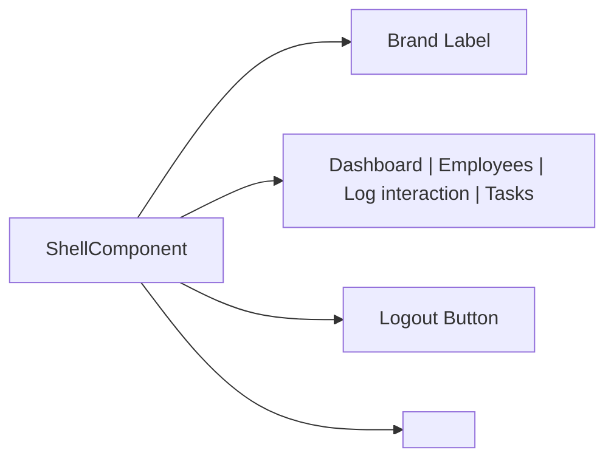
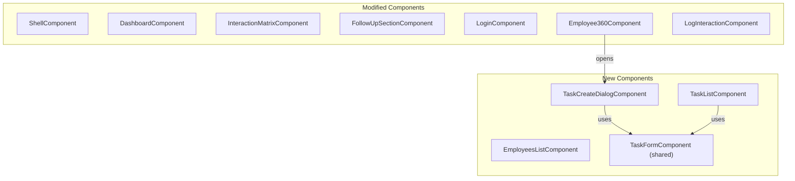

# Design Document: Frontend Redesign & Engagement Workflow UI

## Overview

This design covers the complete visual and structural overhaul of the Staff Engagement Angular 21 frontend. The work spans three phases:

1. **Foundation** — A CSS custom property (design token) system in `src/styles.css` plus shared utility classes that every component can consume without duplication.
2. **Restyle Existing Screens** — Shell navigation redesign, Login page refinement, Dashboard triage stats and matrix styling, Log Interaction form styling (including `<optgroup>` project picker), Employee 360 styling and label-helper integration.
3. **New Pages** — A fully functional Employees List page (replacing the stub), a Task List page with filtering and completion toggle, and an accessible Task Create Dialog reusable from Employee 360 and the Task List.

The application uses Angular 21 standalone components with signals, Vitest for testing, and plain CSS (component-scoped + global `styles.css`). No CSS pre-processors or third-party component libraries are introduced.

---

## Architecture

### Styling Architecture

```
src/styles.css (global)
├── CSS Reset
├── :root custom properties (design tokens)
├── Base element styles (h1–h3, a, button, input, select, textarea, table)
├── Focus-visible outline rule
├── Shared utility classes (.page, .card, .btn, .badge, .form-field)
└── Responsive breakpoints via @media queries
```

Component-scoped CSS files consume tokens via `var(--token-name)` and add component-specific layout. No token values are duplicated in component files.

### Navigation Architecture



The shell navigation is reduced from 5 entity-centric links to 4 workflow-centric links. Existing routes for `/user` and `/client` remain accessible programmatically but are removed from the visible nav bar.

### Component Architecture (New/Modified)



---

## Components and Interfaces

### 1. Design Token System (`src/styles.css`)

**Tokens defined as CSS custom properties on `:root`:**

| Category | Tokens |
|----------|--------|
| Color | `--color-bg`, `--color-surface`, `--color-text`, `--color-muted`, `--color-border`, `--color-primary`, `--color-primary-hover`, `--color-danger`, `--color-warning`, `--color-success`, `--color-danger-soft`, `--color-warning-soft`, `--color-success-soft` |
| Typography | `--font-sans`, `--fs-xs` (0.75rem), `--fs-sm` (0.875rem), `--fs-base` (1rem), `--fs-lg` (1.125rem), `--fs-xl` (1.25rem), `--fs-2xl` (1.5rem), `--fw-normal` (400), `--fw-medium` (500) |
| Spacing | `--space-1` (4px) through `--space-8` (64px), doubling |
| Radius | `--radius-control` (4px), `--radius-card` (8px) |
| Shadow | `--shadow-sm`, `--shadow-default` |

**CSS Reset:**
```css
*, *::before, *::after { box-sizing: border-box; }
body { margin: 0; }
```

**Base element styles** consume tokens for consistent defaults.

**Shared classes:** `.page`, `.card`, `.btn`, `.btn-primary`, `.btn-secondary`, `.form-field`, `.badge`, `.badge-danger`, `.badge-warning`, `.badge-success`.

### 2. Shell Navigation Redesign

**Current:** User | Employee | Client | Interaction | Task | [Logout]

**New:** [Brand] Dashboard | Employees | Log interaction | Tasks [Logout]

- Brand label: text "Staff Engagement" linked to `/dashboard`
- Links map: Dashboard → `/dashboard`, Employees → `/employee`, Log interaction → `/interaction`, Tasks → `/task`
- `routerLinkActive="active"` retained for highlighting
- All existing `data-testid` attributes preserved
- Responsive: at ≤768px, reduce padding and font size; at ≤375px, wrap links to avoid overflow

### 3. Label Helper Functions

**New: `formatEngagementStatusLabel`** in `dashboard/models/engagement.model.ts`:

```typescript
export function formatEngagementStatusLabel(status: EngagementStatus): string {
  switch (status) {
    case 'OVERDUE': return 'Overdue';
    case 'AT_RISK': return 'At risk';
    case 'ON_TRACK': return 'On track';
    default: return formatEnumLabel(status);
  }
}
```

**New: `formatTaskStatusLabel`** in `task/models/task.model.ts`:

```typescript
export function formatTaskStatusLabel(status: string): string {
  switch (status) {
    case 'OPEN': return 'Open';
    case 'DONE': return 'Done';
    default: return formatEnumLabel(status);
  }
}
```

**New shared utility: `formatEnumLabel`** in `shared/utils/format-enum-label.ts`:

```typescript
export function formatEnumLabel(value: string): string {
  return value
    .split('_')
    .map(word => word.charAt(0).toUpperCase() + word.slice(1).toLowerCase())
    .join(' ');
}
```

This fallback handles unknown enum values per Requirement 5.5.

### 4. Dashboard Triage Stats

A new computed signal in `InteractionMatrixComponent` or `DashboardComponent` calculates counts:

```typescript
readonly triageStats = computed(() => {
  const all = this.entries();
  return {
    overdue: all.filter(e => e.engagementStatus === 'OVERDUE').length,
    atRisk: all.filter(e => e.engagementStatus === 'AT_RISK').length,
    onTrack: all.filter(e => e.engagementStatus === 'ON_TRACK').length,
  };
});
```

Rendered as a row of three stat cards above the table.

### 5. Log Interaction Form — Project `<optgroup>`

The project model needs a `companyName` field. The `Project` interface becomes:

```typescript
export interface Project {
  id: number;
  name: string;
  companyName: string;
}
```

A computed signal groups projects by company:

```typescript
readonly projectsByCompany = computed(() => {
  const groups = new Map<string, Project[]>();
  for (const p of this.projects()) {
    const list = groups.get(p.companyName) ?? [];
    list.push(p);
    groups.set(p.companyName, list);
  }
  return groups;
});
```

Template renders with `<optgroup label="CompanyName">` per group.

### 6. Employees List Page

**Replaces:** stub `employee.html` / `employee.ts`

**Data:** Fetches from `GET /api/employees` and `GET /api/engagement/matrix`, joins on `employeeId`.

**Signals:**
- `employees` — raw employee array
- `matrixEntries` — engagement data
- `searchTerm` — search input
- `statusFilter` — selected status or null
- `filteredEmployees` — computed combining search + filter + join

**Template columns:** Initials avatar, Name, Job title, Manager, Status badge, Last seen.

**Interactions:** Row click navigates to `/employee/:id`.

### 7. Task List Page

**Replaces:** stub `task.html` / `task.ts`

**New service methods on `TaskService`:**

```typescript
getAll(params?: { status?: string }): Observable<TaskResponse[]> {
  return this.http.get<TaskResponse[]>('/api/tasks', { params });
}

updateStatus(taskId: number, status: string): Observable<TaskResponse> {
  return this.http.patch<TaskResponse>(`/api/tasks/${taskId}/status`, { status });
}
```

**Task model additions:**

```typescript
export interface TaskResponse {
  // existing fields ...
  employeeName: string | null;  // added by backend
  employeeId: number | null;    // from backend ticket
}

export interface CreateTaskRequest {
  // existing fields ...
  employeeId: number;  // now required
}
```

**Status filter:** Open | Done | All (default: Open)

**Completion toggle:** Checkbox or button calls `updateStatus` → OPEN↔DONE.

**Overdue highlighting:** If `status === 'OPEN'` and `dueDate < today`, apply danger styling.

### 8. Task Form Component (Shared)

A standalone `TaskFormComponent` encapsulating the task creation form fields, used by both the Task List page and the Task Create Dialog.

**Inputs:**
- `employeeId: InputSignal<number | null>` — when non-null, pre-fills and disables the employee picker
- `defaultAssigneeId: InputSignal<number | null>` — pre-fills assignee
- `interactions: InputSignal<{ id: number; label: string }[]>` — for "Link to interaction" dropdown

**Outputs:**
- `submitted: OutputEmitterRef<CreateTaskRequest>` — emits validated form payload
- `cancelled: OutputEmitterRef<void>` — emits on cancel

### 9. Task Create Dialog

An accessible modal component wrapping `TaskFormComponent`.

**Accessibility:**
- `role="dialog"`, `aria-modal="true"`, `aria-labelledby` pointing to dialog title
- Focus trap: on open, focus moves to first focusable element; Tab cycles within dialog; Shift+Tab wraps
- Escape key closes without saving
- On close, focus returns to trigger element

**Implementation approach:** A dedicated `TaskCreateDialogComponent` with an overlay backdrop, rendered conditionally via `@if (dialogOpen())` in the parent template. Focus trapping implemented with a `FocusTrapDirective` or inline logic using `document.querySelectorAll` for focusable elements.

---

## Data Models

### Extended Project Model

```typescript
// shared/models/project.model.ts
export interface Project {
  id: number;
  name: string;
  companyName: string;  // NEW — from backend GET /api/projects
}
```

### Extended Task Models

```typescript
// task/models/task.model.ts
export interface CreateTaskRequest {
  title: string;
  description?: string | null;
  interactionId?: number | null;
  dueDate?: string | null;
  assignedUserId?: number | null;
  employeeId: number;  // NEW — required
}

export interface TaskResponse {
  id: number;
  title: string;
  description: string | null;
  status: string;
  dueDate: string | null;
  assignedUser: { id: number; name: string } | null;
  interaction: { id: number } | null;
  employeeId: number | null;    // NEW
  employeeName: string | null;  // NEW
  createdAt: string;
}
```

### Employees List View Model

```typescript
// employee/models/employee-list.model.ts
export interface EmployeeListEntry {
  id: number;
  name: string;
  email: string;
  jobTitle: string;
  managerName: string | null;
  engagementStatus: EngagementStatus | null;
  lastInteractionDate: string | null;
}
```

---

## Correctness Properties

*A property is a characteristic or behavior that should hold true across all valid executions of a system — essentially, a formal statement about what the system should do. Properties serve as the bridge between human-readable specifications and machine-verifiable correctness guarantees.*

### Property 1: Engagement status label round-trip consistency

*For any* valid `EngagementStatus` enum value, `formatEngagementStatusLabel` SHALL return a non-empty string that does not equal the raw enum value (i.e., it transforms the value).

**Validates: Requirements 5.1, 5.2, 5.3**

### Property 2: Task status label round-trip consistency

*For any* valid task status string (`'OPEN'` or `'DONE'`), `formatTaskStatusLabel` SHALL return a non-empty string that does not equal the raw enum value.

**Validates: Requirements 5.4**

### Property 3: Unknown enum fallback produces title case

*For any* string composed of uppercase letters and underscores, `formatEnumLabel` SHALL return a string where underscores are replaced by spaces and each word is title-cased, and the result does not contain underscores.

**Validates: Requirements 5.5**

### Property 4: Project grouping preserves all items

*For any* list of projects with `companyName` fields, grouping by company and then flattening all groups SHALL produce a collection with the same length and the same set of project IDs as the original list.

**Validates: Requirements 7.2**

### Property 5: Employee list filtering is monotonic

*For any* list of employees and any search term, the filtered result SHALL be a subset of (or equal to) the unfiltered list — i.e., `filteredEmployees.length <= allEmployees.length`.

**Validates: Requirements 9.3, 9.4**

### Property 6: Task status toggle is involutory

*For any* task, toggling status from OPEN to DONE and then back to OPEN SHALL return the task to OPEN status (and vice versa). The toggle operation is its own inverse.

**Validates: Requirements 10.5**

### Property 7: Overdue detection correctness

*For any* task with status `'OPEN'` and a `dueDate` before today, `isOverdue` SHALL return `true`. *For any* task with status `'DONE'` or `dueDate` on or after today or `dueDate` null, `isOverdue` SHALL return `false`.

**Validates: Requirements 10.4, 8.4**

---

## Error Handling

### Global Patterns

All pages follow a consistent tri-state rendering pattern:

1. **Loading** — Show a spinner/skeleton with `aria-live="polite"` announcement
2. **Error** — Show a styled error card with retry button
3. **Success/Empty** — Show content or an empty-state message

### Specific Error Scenarios

| Scenario | Handling |
|----------|----------|
| Employee list fetch fails | Error state with retry; table hidden |
| Matrix fetch fails | Error state with retry; triage stats show 0 |
| Task list fetch fails | Error state with retry |
| Task status toggle fails | Revert optimistic UI change; show inline error toast |
| Task create fails | Show field-level validation errors or generic error |
| Dialog open while data loading | Show loading state within dialog |

### Form Validation

- Client-side validation runs on blur and submit
- Server-side 400 errors map to field-level messages via `serverFieldErrors` signal pattern (already established in `LogInteractionComponent`)
- Submit button disabled while form is invalid or submitting

---

## Testing Strategy

### Unit Tests (Vitest)

**Label helpers:**
- Test each known enum value maps correctly
- Test unknown values produce title-cased output
- Test empty string edge case

**Computed signals:**
- Triage stats computed from mock matrix data
- Project grouping computed from mock projects
- Employee filtering computed from mock data with search terms

**Components:**
- Verify templates render with mock data
- Verify `data-testid` attributes preserved
- Verify label helpers integrated (assertions use readable labels, not raw enums)

### Property-Based Tests (fast-check)

Property-based tests use `fast-check` with a minimum of 100 iterations per property. Each test references a design property.

- **Property 1 & 2:** Generate random valid enum values, assert transformation produces expected format
- **Property 3:** Generate random `UPPER_SNAKE_CASE` strings, assert output is title-cased with spaces
- **Property 4:** Generate random project lists with company names, assert grouping preserves count and IDs
- **Property 5:** Generate random employee lists and search strings, assert filtered ⊆ unfiltered
- **Property 6:** Assert toggle(toggle(status)) === status for generated statuses
- **Property 7:** Generate random dates and statuses, assert isOverdue matches expected boolean

### Test Updates Required

Existing tests that assert on raw enum text (`"OVERDUE"`, `"AT_RISK"`, `"ON_TRACK"`) must be updated to assert on the formatted label (`"Overdue"`, `"At risk"`, `"On track"`).

### Accessibility Testing

- Manual testing with keyboard navigation (Tab, Shift+Tab, Escape)
- Verify focus trapping in Task Create Dialog
- Verify WCAG AA contrast ratios for all badge/text combinations against chosen token colors
- Verify `aria-*` attributes present via unit test assertions

---

## Responsive Strategy

| Breakpoint | Behavior |
|-----------|----------|
| ≥1280px | Content constrained by `.page` max-width (1100px) |
| 768px–1279px | Full-width with padding |
| ≤768px | Tables convert to stacked card layout; nav reduces spacing |
| ≤375px | Single column; nav wraps; no horizontal scroll |

---

## Implementation Phases

1. **Phase 1 (Foundation):** Design tokens, CSS reset, shared classes, label helpers — blocks everything else.
2. **Phase 2 (Restyle):** Shell nav, Login, Dashboard (triage stats + matrix + follow-up), Log Interaction (optgroup), Employee 360 styling + label fixes — depends on Phase 1.
3. **Phase 3 (New Pages):** Employees List, Task List (with service methods), Task Form (shared), Task Create Dialog — depends on Phase 1 and some Phase 2 components.
