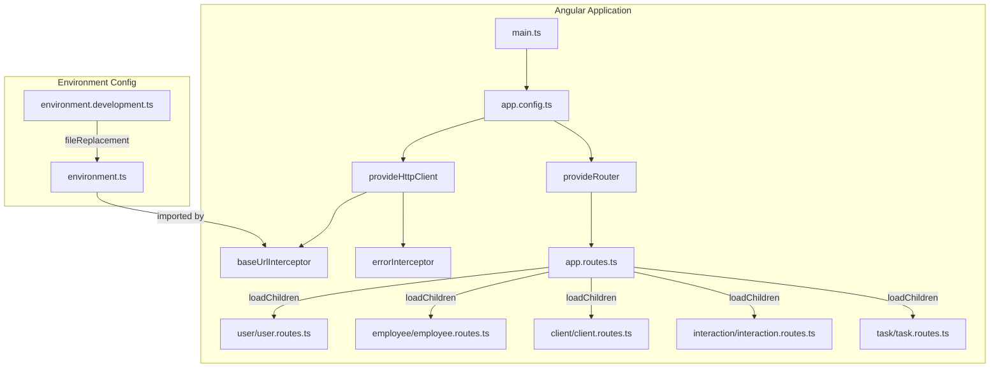
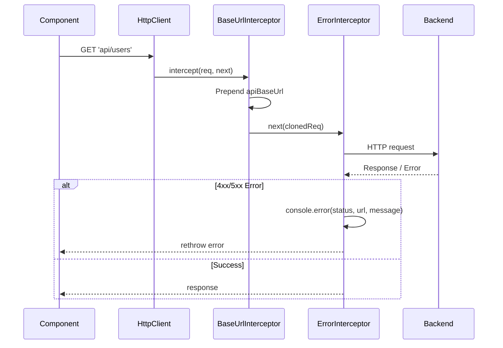

# Design Document: Frontend Scaffold

## Overview

This design establishes the Angular 21 frontend scaffold for the Staff Engagement application. It creates five feature folders mirroring the backend domain modules, configures lazy-loaded routing, environment-based API connectivity via HTTP interceptors, and enforces code quality through ESLint and Prettier integration.

The scaffold delivers a clean, buildable, lintable, and testable foundation. Developers can then implement vertical feature slices (from Angular component to Spring Boot endpoint) without modifying shared infrastructure.

### Key Design Decisions

| Decision | Choice | Rationale |
|----------|--------|-----------|
| Routing strategy | `loadChildren` with feature routes files | Enables lazy loading per feature; keeps `app.routes.ts` as a lightweight manifest |
| Interceptor style | Functional interceptors (`HttpInterceptorFn`) | Angular 21 standalone pattern; no class boilerplate needed |
| Environment swap | `fileReplacements` in angular.json | Standard Angular mechanism; no runtime cost; works with any builder |
| ESLint config format | Flat config (`eslint.config.js`) | Angular-eslint v19+ requires flat config; ESLint deprecated `.eslintrc` |
| Prettier conflict resolution | `eslint-config-prettier` as last config | Disables conflicting ESLint rules; Prettier handles all formatting |

## Architecture



### Request Flow



## Components and Interfaces

### Feature Folder Structure

Each of the 5 feature folders follows an identical layout:

```
src/app/{module-name}/
├── {module-name}.ts            # Standalone index route component
├── {module-name}.html          # Component template
├── {module-name}.css           # Component styles (scoped)
├── {module-name}.routes.ts     # Feature routes array
└── {module-name}.spec.ts       # Component unit test (at least one feature)
```

Modules: `user`, `employee`, `client`, `interaction`, `task`

### Component Convention

Each index route component follows this pattern:

```typescript
import { Component } from '@angular/core';

@Component({
  selector: 'app-{module-name}',
  templateUrl: './{module-name}.html',
  styleUrl: './{module-name}.css',
})
export class {PascalName} {}
```

- Standalone by default (Angular 21 does not require `standalone: true` — it's the default)
- No `imports` array unless the component uses directives/pipes
- Selector prefix: `app`

### Feature Routes Convention

```typescript
import { Routes } from '@angular/router';
import { ModuleName } from './{module-name}';

export const routes: Routes = [
  { path: '', component: ModuleName },
];
```

### Top-Level Routes (`app.routes.ts`)

```typescript
import { Routes } from '@angular/router';

export const routes: Routes = [
  { path: '', redirectTo: 'user', pathMatch: 'full' },
  { path: 'user', loadChildren: () => import('./user/user.routes').then(m => m.routes) },
  { path: 'employee', loadChildren: () => import('./employee/employee.routes').then(m => m.routes) },
  { path: 'client', loadChildren: () => import('./client/client.routes').then(m => m.routes) },
  { path: 'interaction', loadChildren: () => import('./interaction/interaction.routes').then(m => m.routes) },
  { path: 'task', loadChildren: () => import('./task/task.routes').then(m => m.routes) },
  { path: '**', redirectTo: 'user' },
];
```

### HTTP Interceptors

#### `src/app/core/interceptors/base-url.interceptor.ts`

```typescript
import { HttpInterceptorFn } from '@angular/common/http';
import { environment } from '../../../environments/environment';

export const baseUrlInterceptor: HttpInterceptorFn = (req, next) => {
  if (req.url.startsWith('http://') || req.url.startsWith('https://')) {
    return next(req);
  }

  const base = environment.apiBaseUrl.replace(/\/+$/, '');
  const path = req.url.replace(/^\/+/, '');
  const cloned = req.clone({ url: `${base}/${path}` });

  return next(cloned);
};
```

**Logic:**
- Absolute URLs (starting with `http://` or `https://`) pass through unchanged.
- Relative URLs: strip trailing slashes from base, strip leading slashes from path, join with exactly one `/`.

#### `src/app/core/interceptors/error.interceptor.ts`

```typescript
import { HttpInterceptorFn } from '@angular/common/http';
import { catchError, throwError } from 'rxjs';

export const errorInterceptor: HttpInterceptorFn = (req, next) => {
  return next(req).pipe(
    catchError((error) => {
      console.error(
        `HTTP Error ${error.status} on ${req.url}: ${error.message}`,
      );
      return throwError(() => error);
    }),
  );
};
```

### Application Configuration (`app.config.ts`)

```typescript
import { ApplicationConfig, provideBrowserGlobalErrorListeners } from '@angular/core';
import { provideRouter } from '@angular/router';
import { provideHttpClient, withInterceptors } from '@angular/common/http';

import { routes } from './app.routes';
import { baseUrlInterceptor } from './core/interceptors/base-url.interceptor';
import { errorInterceptor } from './core/interceptors/error.interceptor';

export const appConfig: ApplicationConfig = {
  providers: [
    provideBrowserGlobalErrorListeners(),
    provideRouter(routes),
    provideHttpClient(withInterceptors([baseUrlInterceptor, errorInterceptor])),
  ],
};
```

### Environment Files

#### `src/environments/environment.ts` (local / default)

```typescript
export const environment = {
  production: false,
  apiBaseUrl: 'http://localhost:8080',
};
```

#### `src/environments/environment.development.ts` (dev)

```typescript
export const environment = {
  production: false,
  apiBaseUrl: 'https://dev-api.example.com',
};
```

### ESLint Configuration (`eslint.config.js`)

```javascript
const angular = require('angular-eslint');
const tseslint = require('typescript-eslint');
const prettier = require('eslint-config-prettier');

module.exports = tseslint.config(
  {
    files: ['**/*.ts'],
    extends: [
      ...tseslint.configs.recommended,
      ...angular.configs.tsRecommended,
    ],
    processor: angular.processInlineTemplates,
    rules: {},
  },
  {
    files: ['**/*.html'],
    extends: [
      ...angular.configs.templateRecommended,
      ...angular.configs.templateAccessibility,
    ],
    rules: {},
  },
  prettier,
);
```

Key: `prettier` (eslint-config-prettier) is the **last** entry, disabling all conflicting formatting rules.

### Prettier Configuration (`.prettierrc`)

```json
{
  "printWidth": 100,
  "singleQuote": true,
  "tabWidth": 2,
  "trailingComma": "all",
  "overrides": [
    {
      "files": "*.html",
      "options": {
        "parser": "angular"
      }
    }
  ]
}
```

### Package Scripts (additions to `package.json`)

```json
{
  "scripts": {
    "lint": "ng lint",
    "format": "prettier --write \"src/**/*.{ts,html,css,json}\"",
    "format:check": "prettier --check \"src/**/*.{ts,html,css,json}\""
  }
}
```

### Angular.json Changes

1. **Lint target** added to the `architect` section:

```json
"lint": {
  "builder": "@angular-eslint/builder:lint",
  "options": {
    "lintFilePatterns": ["src/**/*.ts", "src/**/*.html"]
  }
}
```

2. **fileReplacements** added to the `development` build configuration:

```json
"fileReplacements": [
  {
    "replace": "src/environments/environment.ts",
    "with": "src/environments/environment.development.ts"
  }
]
```

## Data Models

### Environment Interface

```typescript
interface Environment {
  production: boolean;
  apiBaseUrl: string;
}
```

This is an implicit interface — the environment files export plain objects conforming to this shape. A formal interface could be added later if environment grows complex.

### Route Configuration

No custom data models. Routes use Angular's built-in `Routes` type from `@angular/router`.

## Correctness Properties

*A property is a characteristic or behavior that should hold true across all valid executions of a system — essentially, a formal statement about what the system should do. Properties serve as the bridge between human-readable specifications and machine-verifiable correctness guarantees.*

### Property 1: Relative URL joining produces exactly one separator

*For any* relative URL (not starting with `http://` or `https://`) and *for any* `apiBaseUrl` value, the `baseUrlInterceptor` SHALL produce a joined URL with exactly one `/` character between the base URL host/path and the request path, regardless of trailing slashes on the base or leading slashes on the path.

**Validates: Requirements 4.1**

### Property 2: Absolute URLs pass through unchanged

*For any* absolute URL (starting with `http://` or `https://`), the `baseUrlInterceptor` SHALL return the request URL identical to the input — no characters added, removed, or modified.

**Validates: Requirements 4.2**

### Property 3: Error interceptor logs and rethrows for all error status codes

*For any* HTTP response with a status code in the range 400–599, the `errorInterceptor` SHALL call `console.error` with a message containing the status code, the request URL, and the error message, then rethrow the original error so the calling code's error handler receives it.

**Validates: Requirements 4.3**

## Error Handling

| Scenario | Handling Strategy |
|----------|-------------------|
| HTTP 4xx/5xx responses | `errorInterceptor` logs to console and rethrows; calling services handle via RxJS `catchError` or component error state |
| Network failure (no response) | Same path as HTTP errors — Angular surfaces as `HttpErrorResponse` with status `0` |
| Route not found | Wildcard route (`**`) redirects to `/user` |
| Environment misconfiguration | Build-time failure if `fileReplacements` target doesn't exist |
| ESLint violations | `ng lint` exits non-zero; CI blocks merge |
| Prettier violations | `format:check` exits non-zero; CI blocks merge |

Future interceptors can be added to the array in `app.config.ts` (e.g., auth token injection, retry logic).

## Testing Strategy

### Unit Tests (Vitest + jsdom)

| What | How |
|------|-----|
| Feature component creation | `TestBed.createComponent()` asserts instance is truthy (Requirement 7.5) |
| Base URL interceptor — relative URLs | Property-based test: generate random relative paths and base URLs, verify correct joining |
| Base URL interceptor — absolute URLs | Property-based test: generate random absolute URLs, verify passthrough |
| Error interceptor — error codes | Property-based test: generate random 4xx/5xx codes, verify logging and rethrow |
| Route configuration | Example test: verify routes array contains expected paths and loadChildren entries |
| Environment shape | Example test: verify exported object has `production` (boolean) and `apiBaseUrl` (string) |

### Property-Based Testing Configuration

- **Library:** [fast-check](https://github.com/dubzzz/fast-check) (industry-standard PBT library for TypeScript/JavaScript)
- **Minimum iterations:** 100 per property
- **Tag format:** `Feature: frontend-scaffold, Property {N}: {title}`

Each property test must:
1. Reference its design property number in a comment
2. Use fast-check arbitraries to generate diverse inputs
3. Assert the universal property holds for all generated values

### Integration / Smoke Tests

| What | How |
|------|-----|
| Build passes | `ng build` exits zero (CI) |
| Tests pass | `ng test` (Vitest) exits zero (CI) |
| Lint passes | `ng lint` exits zero (CI) |
| Format passes | `prettier --check .` exits zero (CI) |
| Lazy loading works | Navigate to each route, verify component renders (manual or e2e) |

### Test File Placement

- Interceptor tests: `src/app/core/interceptors/base-url.interceptor.spec.ts`, `error.interceptor.spec.ts`
- Feature component tests: `src/app/{module-name}/{module-name}.spec.ts` (at minimum one)
- Route tests: `src/app/app.routes.spec.ts`

### Dependencies to Add (devDependencies)

```json
{
  "angular-eslint": "^19.x",
  "@angular-eslint/builder": "^19.x",
  "@angular-eslint/eslint-plugin": "^19.x",
  "@angular-eslint/eslint-plugin-template": "^19.x",
  "@angular-eslint/template-parser": "^19.x",
  "typescript-eslint": "^8.x",
  "eslint": "^9.x",
  "eslint-config-prettier": "^10.x",
  "fast-check": "^4.x"
}
```

Note: Exact versions will be resolved at install time based on Angular 21 compatibility. The `angular-eslint` schematic (`ng add angular-eslint`) handles most of this automatically.
