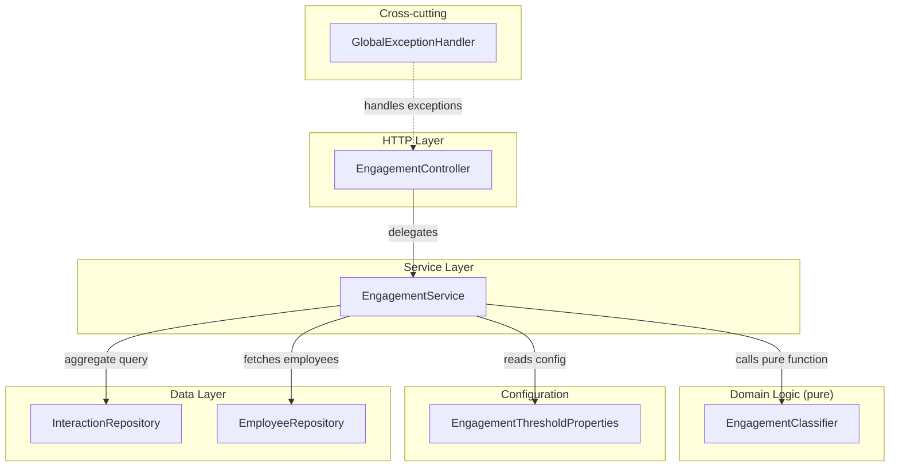
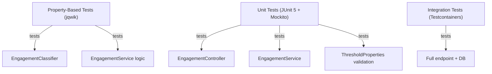

# Design Document: Interaction Matrix & Follow-Up Logic

## Overview

This feature introduces a read-only engagement analytics endpoint (`GET /api/engagement/matrix`) that computes an employee-level engagement matrix. For each employee, the system calculates recency (days since last interaction), frequency (total interaction count), an engagement status classification (OVERDUE / AT_RISK / ON_TRACK), and a follow-up flag. The classification logic is a pure function with configurable thresholds, making it highly testable with property-based techniques.

### Key Design Decisions

| Decision | Rationale |
|----------|-----------|
| New `engagement` package | Keeps the analytics/computation concern separate from the transactional `interaction` package; follows the existing package-per-feature convention |
| Pure classification function | `EngagementClassifier` takes (recency, thresholds) and returns status — no DB dependency, trivially testable with jqwik |
| `Clock`/reference-date injection | `EngagementService` accepts a `LocalDate referenceDate` parameter (defaulting to `LocalDate.now(clock)`) for deterministic testing |
| JPQL aggregation query | Single query computes MAX(occurredAt) and COUNT per employee via GROUP BY, avoiding loading all Interaction entities into memory |
| `@ConfigurationProperties` for thresholds | Standard Spring Boot mechanism with JSR-380 validation; fail-fast on invalid configuration |
| In-memory sorting and filtering | The matrix is computed for all employees (typically < 10,000); sorting/filtering the resulting list in Java avoids complex dynamic SQL |

## Architecture



### Request Flow

1. Client sends `GET /api/engagement/matrix?status=OVERDUE&sort=recency`
2. `EngagementController` parses optional query params, delegates to `EngagementService`
3. `EngagementService`:
   - Loads all employees from `EmployeeRepository`
   - Executes an aggregate JPQL query on `InteractionRepository` to get (employeeId → lastOccurredAt, count) tuples
   - For each employee, computes recency using the reference date and calls `EngagementClassifier.classify(recency, thresholds)`
   - Builds `EngagementMatrixEntry` DTOs
   - Applies optional status filter
   - Applies sort order
4. Controller returns the list as JSON with HTTP 200

## Components and Interfaces

### Package Structure

```
com.psybergate.staff_engagement/
└── engagement/
    ├── EngagementController.java
    ├── EngagementService.java
    ├── EngagementClassifier.java          # Pure static classification logic
    ├── EngagementStatus.java              # Enum: OVERDUE, AT_RISK, ON_TRACK
    ├── EngagementThresholdProperties.java # @ConfigurationProperties
    └── dto/
        └── EngagementMatrixEntry.java     # Response DTO record
```

### Existing Files to Modify

| File | Change |
|------|--------|
| `InteractionRepository.java` | Add custom JPQL aggregate query method |
| `application.properties` | Add default threshold config values |

### Component Details

#### EngagementStatus (enum)

```java
package com.psybergate.staff_engagement.engagement;

public enum EngagementStatus {
    OVERDUE,
    AT_RISK,
    ON_TRACK
}
```

#### EngagementThresholdProperties

```java
package com.psybergate.staff_engagement.engagement;

import jakarta.validation.constraints.Max;
import jakarta.validation.constraints.Min;
import lombok.Getter;
import lombok.Setter;
import org.springframework.boot.context.properties.ConfigurationProperties;
import org.springframework.validation.annotation.Validated;

@ConfigurationProperties(prefix = "engagement.thresholds")
@Validated
@Getter
@Setter
public class EngagementThresholdProperties {

    @Min(1) @Max(365)
    private int overdueDays = 30;

    @Min(1) @Max(365)
    private int atRiskDays = 14;
}
```

A `@PostConstruct` or custom `Validator` bean will enforce `atRiskDays < overdueDays` at startup.

#### EngagementClassifier (pure function)

```java
package com.psybergate.staff_engagement.engagement;

public final class EngagementClassifier {

    private EngagementClassifier() {}

    /**
     * Classifies an employee's engagement status based on recency and thresholds.
     *
     * @param recency           days since last interaction, or null if no interactions
     * @param atRiskThreshold   days threshold for AT_RISK classification
     * @param overdueThreshold  days threshold for OVERDUE classification
     * @return the computed EngagementStatus
     */
    public static EngagementStatus classify(Integer recency, int atRiskThreshold, int overdueThreshold) {
        if (recency == null || recency >= overdueThreshold) {
            return EngagementStatus.OVERDUE;
        }
        if (recency >= atRiskThreshold) {
            return EngagementStatus.AT_RISK;
        }
        return EngagementStatus.ON_TRACK;
    }

    /**
     * Derives the follow-up flag from engagement status.
     */
    public static boolean needsFollowUp(EngagementStatus status) {
        return status != EngagementStatus.ON_TRACK;
    }
}
```

#### EngagementMatrixEntry (response DTO)

```java
package com.psybergate.staff_engagement.engagement.dto;

import com.psybergate.staff_engagement.engagement.EngagementStatus;
import java.time.LocalDate;

public record EngagementMatrixEntry(
    Long employeeId,
    String employeeName,
    String employeeEmail,
    Integer recency,
    int frequency,
    LocalDate lastInteractionDate,
    EngagementStatus engagementStatus,
    boolean followUpRequired
) {}
```

#### InteractionRepository (updated — aggregate query)

```java
public interface InteractionRepository extends JpaRepository<Interaction, Long> {

    @Query("""
        SELECT i.employee.id, MAX(i.occurredAt), COUNT(i)
        FROM Interaction i
        GROUP BY i.employee.id
        """)
    List<Object[]> findInteractionAggregatesByEmployee();
}
```

#### EngagementService

```java
package com.psybergate.staff_engagement.engagement;

import com.psybergate.staff_engagement.employee.Employee;
import com.psybergate.staff_engagement.employee.EmployeeRepository;
import com.psybergate.staff_engagement.engagement.dto.EngagementMatrixEntry;
import com.psybergate.staff_engagement.interaction.InteractionRepository;
import lombok.RequiredArgsConstructor;
import org.springframework.stereotype.Service;
import org.springframework.transaction.annotation.Transactional;

import java.time.*;
import java.time.temporal.ChronoUnit;
import java.util.*;
import java.util.stream.Collectors;

@Service
@RequiredArgsConstructor
@Transactional(readOnly = true)
public class EngagementService {

    private final EmployeeRepository employeeRepository;
    private final InteractionRepository interactionRepository;
    private final EngagementThresholdProperties thresholds;
    private final Clock clock;

    public List<EngagementMatrixEntry> computeMatrix(
            LocalDate referenceDate,
            EngagementStatus statusFilter,
            String sortOrder) {

        if (referenceDate == null) {
            referenceDate = LocalDate.now(clock);
        }

        List<Employee> employees = employeeRepository.findAll();
        List<Object[]> aggregates = interactionRepository.findInteractionAggregatesByEmployee();

        // Build lookup: employeeId -> (lastOccurredAt, count)
        Map<Long, Object[]> aggregateMap = new HashMap<>();
        for (Object[] row : aggregates) {
            aggregateMap.put((Long) row[0], row);
        }

        List<EngagementMatrixEntry> entries = new ArrayList<>();
        for (Employee emp : employees) {
            Object[] agg = aggregateMap.get(emp.getId());
            Integer recency = null;
            int frequency = 0;
            LocalDate lastInteractionDate = null;

            if (agg != null) {
                Instant lastOccurredAt = (Instant) agg[1];
                long count = (Long) agg[2];
                lastInteractionDate = lastOccurredAt.atZone(ZoneId.systemDefault()).toLocalDate();
                recency = (int) ChronoUnit.DAYS.between(lastInteractionDate, referenceDate);
                frequency = (int) count;
            }

            EngagementStatus status = EngagementClassifier.classify(
                recency, thresholds.getAtRiskDays(), thresholds.getOverdueDays());
            boolean followUp = EngagementClassifier.needsFollowUp(status);

            entries.add(new EngagementMatrixEntry(
                emp.getId(), emp.getName(), emp.getEmail(),
                recency, frequency, lastInteractionDate, status, followUp));
        }

        // Filter
        if (statusFilter != null) {
            entries = entries.stream()
                .filter(e -> e.engagementStatus() == statusFilter)
                .collect(Collectors.toList());
        }

        // Sort
        if ("recency".equalsIgnoreCase(sortOrder)) {
            entries.sort(Comparator.comparing(
                EngagementMatrixEntry::recency,
                Comparator.nullsFirst(Comparator.reverseOrder())));
        } else {
            entries.sort(Comparator.comparing(
                EngagementMatrixEntry::employeeName,
                String.CASE_INSENSITIVE_ORDER));
        }

        return entries;
    }
}
```

#### EngagementController

```java
package com.psybergate.staff_engagement.engagement;

import com.psybergate.staff_engagement.engagement.dto.EngagementMatrixEntry;
import lombok.RequiredArgsConstructor;
import org.springframework.http.ResponseEntity;
import org.springframework.web.bind.annotation.GetMapping;
import org.springframework.web.bind.annotation.RequestParam;
import org.springframework.web.bind.annotation.RestController;

import java.util.List;

@RestController
@RequiredArgsConstructor
public class EngagementController {

    private final EngagementService engagementService;

    @GetMapping("/api/engagement/matrix")
    public ResponseEntity<List<EngagementMatrixEntry>> getMatrix(
            @RequestParam(required = false) String status,
            @RequestParam(required = false) String sort) {

        EngagementStatus statusFilter = parseStatus(status);
        validateSort(sort);

        List<EngagementMatrixEntry> matrix = engagementService.computeMatrix(null, statusFilter, sort);
        return ResponseEntity.ok(matrix);
    }

    private EngagementStatus parseStatus(String status) {
        if (status == null || status.isBlank()) {
            return null;
        }
        try {
            return EngagementStatus.valueOf(status.toUpperCase());
        } catch (IllegalArgumentException e) {
            throw new IllegalArgumentException(
                "Invalid status value: '" + status + "'. Valid options are: OVERDUE, AT_RISK, ON_TRACK");
        }
    }

    private void validateSort(String sort) {
        if (sort != null && !sort.isBlank() && !"recency".equalsIgnoreCase(sort)) {
            throw new IllegalArgumentException(
                "Unsupported sort value: '" + sort + "'. Supported options are: recency");
        }
    }
}
```

### API Contract

#### GET /api/engagement/matrix

**Query Parameters:**

| Parameter | Type | Required | Description |
|-----------|------|----------|-------------|
| `status` | string | No | Filter by engagement status. Case-insensitive. Valid: `OVERDUE`, `AT_RISK`, `ON_TRACK` |
| `sort` | string | No | Sort order. Only `recency` supported. Default: alphabetical by name |

**Response (200 OK):**

```json
[
  {
    "employeeId": 1,
    "employeeName": "Alice Johnson",
    "employeeEmail": "alice@example.com",
    "recency": 5,
    "frequency": 12,
    "lastInteractionDate": "2025-01-10",
    "engagementStatus": "ON_TRACK",
    "followUpRequired": false
  },
  {
    "employeeId": 2,
    "employeeName": "Bob Smith",
    "employeeEmail": "bob@example.com",
    "recency": null,
    "frequency": 0,
    "lastInteractionDate": null,
    "engagementStatus": "OVERDUE",
    "followUpRequired": true
  },
  {
    "employeeId": 3,
    "employeeName": "Carol Davis",
    "employeeEmail": "carol@example.com",
    "recency": 20,
    "frequency": 3,
    "lastInteractionDate": "2024-12-26",
    "engagementStatus": "AT_RISK",
    "followUpRequired": true
  }
]
```

**Error (400 — invalid status):**

```json
{
  "message": "Invalid status value: 'INVALID'. Valid options are: OVERDUE, AT_RISK, ON_TRACK",
  "fieldErrors": null
}
```

**Error (400 — invalid sort):**

```json
{
  "message": "Unsupported sort value: 'name'. Supported options are: recency",
  "fieldErrors": null
}
```

**Error (500 — database failure):**

```json
{
  "message": "Unable to compute engagement matrix due to a data access failure",
  "fieldErrors": null
}
```

## Data Models

No new database tables or Flyway migrations are required. The feature uses existing tables (`employees`, `interactions`) via aggregate queries.

### New DTOs

| Type | Fields | Purpose |
|------|--------|---------|
| `EngagementMatrixEntry` (record) | employeeId, employeeName, employeeEmail, recency (Integer, nullable), frequency (int), lastInteractionDate (LocalDate, nullable), engagementStatus, followUpRequired | Response DTO for each matrix entry |

### New Enums

| Type | Values | Purpose |
|------|--------|---------|
| `EngagementStatus` | OVERDUE, AT_RISK, ON_TRACK | Engagement classification result |

### Configuration Properties

```properties
# application.properties
engagement.thresholds.overdue-days=30
engagement.thresholds.at-risk-days=14
```

Validated at startup via `@Min(1) @Max(365)` on each field, plus a custom validator ensuring `atRiskDays < overdueDays`.

## Correctness Properties

*A property is a characteristic or behavior that should hold true across all valid executions of a system — essentially, a formal statement about what the system should do. Properties serve as the bridge between human-readable specifications and machine-verifiable correctness guarantees.*

### Property 1: Matrix contains exactly one entry per employee

*For any* set of employees and any set of interactions (including an empty set), the engagement matrix SHALL contain exactly one entry per employee, with `entries.size() == employees.size()` and each employee's ID appearing exactly once.

**Validates: Requirements 1.1**

### Property 2: Recency and lastInteractionDate consistency

*For any* employee with at least one interaction, the matrix entry's `recency` SHALL equal the number of whole days between `lastInteractionDate` and the reference date, AND `lastInteractionDate` SHALL equal the date of the most recent `occurredAt` value among that employee's interactions. For employees with zero interactions, both `recency` and `lastInteractionDate` SHALL be null.

**Validates: Requirements 1.2, 1.4, 6.1, 6.2, 6.3**

### Property 3: Frequency equals interaction count

*For any* employee, the matrix entry's `frequency` SHALL equal the total number of interaction records associated with that employee. For employees with zero interactions, frequency SHALL be zero.

**Validates: Requirements 1.3, 1.4**

### Property 4: Engagement classification is deterministic and correct

*For any* recency value in [0, 365] (or null) and *for any* valid threshold configuration where atRiskThreshold ∈ [1, 364] and overdueThreshold ∈ [atRiskThreshold+1, 365], the classification function SHALL produce:
- OVERDUE when recency is null OR recency >= overdueThreshold
- AT_RISK when atRiskThreshold <= recency < overdueThreshold
- ON_TRACK when recency < atRiskThreshold

And the same inputs SHALL always produce the same output.

**Validates: Requirements 2.1, 2.2, 2.3, 2.4, 2.6, 7.8**

### Property 5: Follow-up flag is derived from engagement status

*For any* engagement status, `followUpRequired` SHALL be `true` when status is OVERDUE or AT_RISK, and `false` when status is ON_TRACK. Equivalently: `followUpRequired == (status != ON_TRACK)`.

**Validates: Requirements 3.1, 3.2, 3.3**

### Property 6: Status filter returns only matching entries

*For any* valid status filter value and any set of employees, the filtered result SHALL contain only entries whose `engagementStatus` matches the filter, and SHALL contain ALL entries from the unfiltered matrix that match the filter.

**Validates: Requirements 5.1, 5.6**

### Property 7: Recency sort ordering

*For any* matrix result sorted by recency, every pair of adjacent entries (entries[i], entries[i+1]) SHALL satisfy: if entries[i].recency is null, OR entries[i].recency >= entries[i+1].recency (with null entries appearing before non-null entries).

**Validates: Requirements 5.2**

### Property 8: Default name sort ordering

*For any* matrix result with no sort parameter, every pair of adjacent entries (entries[i], entries[i+1]) SHALL satisfy: entries[i].employeeName.compareToIgnoreCase(entries[i+1].employeeName) <= 0.

**Validates: Requirements 5.3**

## Error Handling

| Scenario | Exception | HTTP Status | Response Body |
|----------|-----------|-------------|---------------|
| Invalid `status` query param | `IllegalArgumentException` | 400 | `{ "message": "Invalid status value: '...'. Valid options are: OVERDUE, AT_RISK, ON_TRACK", "fieldErrors": null }` |
| Invalid `sort` query param | `IllegalArgumentException` | 400 | `{ "message": "Unsupported sort value: '...'. Supported options are: recency", "fieldErrors": null }` |
| Database connectivity failure | `DataAccessException` | 500 | `{ "message": "Unable to compute engagement matrix due to a data access failure", "fieldErrors": null }` |
| Invalid threshold config at startup | `BeanCreationException` | N/A (app fails to start) | Log message indicating invalid property |
| atRiskDays >= overdueDays at startup | `BeanCreationException` | N/A (app fails to start) | Log message: "at-risk threshold must be strictly less than overdue threshold" |

The existing `GlobalExceptionHandler` already handles `IllegalArgumentException` → 400. A new `@ExceptionHandler` for `DataAccessException` will be added to map database failures to 500 with a generic message (avoiding leaking internal details).

## Testing Strategy

### Test Layers



### Property-Based Tests (jqwik)

The project already has jqwik 1.9.2 as a test dependency. Property tests target the **pure classification logic** and **service computation logic** (with mocked repositories).

**Configuration**: Each `@Property` annotation with `tries = 100` minimum.

**Tag format**: `// Feature: interaction-matrix-followups, Property {N}: {description}`

| Property | Test Class | What's Generated |
|----------|-----------|-----------------|
| Property 1: One entry per employee | `EngagementServicePropertyTest` | Random employee lists (0–50), random interaction lists |
| Property 2: Recency/lastInteractionDate consistency | `EngagementServicePropertyTest` | Random interaction timestamps, random reference dates |
| Property 3: Frequency equals count | `EngagementServicePropertyTest` | Random interaction counts per employee |
| Property 4: Classification correctness | `EngagementClassifierPropertyTest` | Random recency [0,365] or null, random valid thresholds |
| Property 5: Follow-up flag derivation | `EngagementClassifierPropertyTest` | All EngagementStatus values with random recency inputs |
| Property 6: Status filter correctness | `EngagementServicePropertyTest` | Random employee sets + interactions, random status filter |
| Property 7: Recency sort ordering | `EngagementServicePropertyTest` | Random matrix entries with varying recency (including nulls) |
| Property 8: Default name sort ordering | `EngagementServicePropertyTest` | Random employee names (ASCII + unicode) |

**Generator strategy for Property 4** (the core classification test):
```java
@Property(tries = 200)
void classificationIsDeterministicAndCorrect(
    @ForAll @IntRange(min = 0, max = 365) int recency,
    @ForAll @IntRange(min = 1, max = 364) int atRiskThreshold,
    @ForAll @IntRange(min = 2, max = 365) int overdueThreshold) {

    Assume.that(atRiskThreshold < overdueThreshold);
    // ... verify classification matches expected bucket
}
```

### Unit Tests (JUnit 5 + Mockito)

**EngagementClassifierTest** (boundary tests per Requirement 7):
- `classify(null, 14, 30)` → OVERDUE (zero interactions)
- `classify(30, 14, 30)` → OVERDUE (exactly at overdue threshold)
- `classify(31, 14, 30)` → OVERDUE (above overdue threshold)
- `classify(14, 14, 30)` → AT_RISK (exactly at at-risk threshold)
- `classify(15, 14, 30)` → AT_RISK (between thresholds)
- `classify(13, 14, 30)` → ON_TRACK (one day below at-risk)
- `classify(0, 14, 30)` → ON_TRACK (interaction today)

**EngagementControllerTest** (`@WebMvcTest`):
- Valid request → 200 with JSON array
- Invalid `status` param → 400 with error message listing valid options
- Invalid `sort` param → 400 with error message listing supported options
- Uses `@WithMockUser` for authenticated context

**EngagementServiceTest** (Mockito mocks for repositories):
- Verifies correct mapping from aggregate query results to DTO
- Verifies null recency/lastInteractionDate for employees with no interactions
- Verifies filter and sort logic

**EngagementThresholdPropertiesTest**:
- Default values (30, 14) load correctly
- atRiskDays >= overdueDays causes validation failure
- Out-of-range values (0, -1, 366) cause validation failure

### Integration Tests (Testcontainers + PostgreSQL)

**EngagementIntegrationTest** (`@SpringBootTest` with Testcontainers):
- Seeds employees with varying interaction histories (per Requirement 8.2)
- Invokes `GET /api/engagement/matrix` and verifies full response
- Verifies `status=OVERDUE` filter returns only overdue employees
- Verifies `sort=recency` produces correct ordering
- Verifies HTTP 200 with valid JSON array structure
- Uses fixed reference date via injected `Clock` bean override in test config

### Test Data Generators (for jqwik)

| Generator | Produces |
|-----------|----------|
| `RecencyArbitrary` | `Integer` in [0, 365] or null |
| `ThresholdPairArbitrary` | Tuple of (atRiskDays, overdueDays) where atRiskDays < overdueDays, both in [1, 365] |
| `EmployeeArbitrary` | Employee with random name (1–50 chars), unique email, random id |
| `InteractionSummaryArbitrary` | (employeeId, lastOccurredAt as Instant, count as long) tuples |
