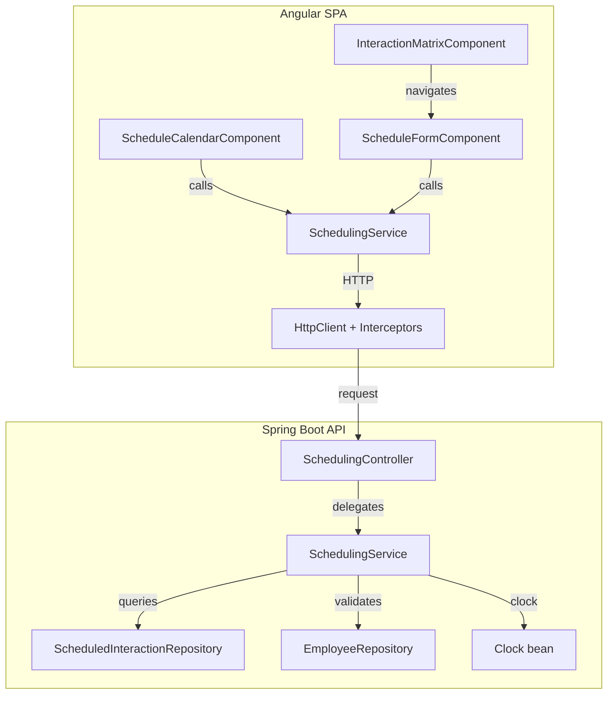
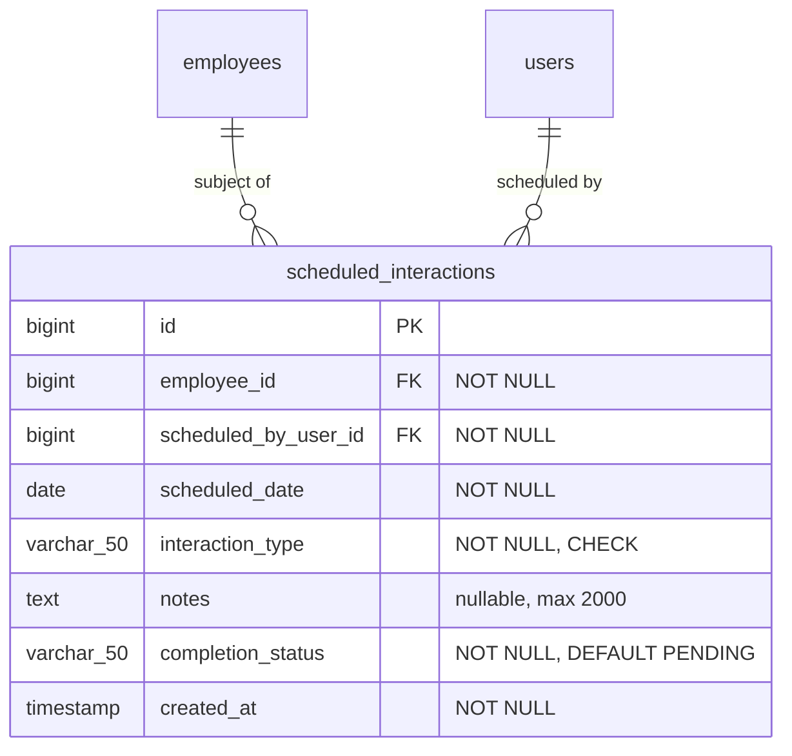

# Design Document: Interaction Scheduling

## Overview

The Interaction Scheduling feature introduces planned future check-ins into the Staff Engagement platform. It delivers a full-stack vertical slice: a new `scheduled_interactions` database table with Flyway migration, a Spring Boot REST API for CRUD operations and overdue detection, an Angular calendar/reminder view with schedule form, and a "Schedule Next" quick-action on the existing interaction matrix.

### Key Design Decisions

| Decision | Rationale |
|----------|-----------|
| New `scheduling` package in backend | Keeps scheduling logic isolated from existing `interaction` package; different lifecycle (planned vs. recorded) |
| `java.time.Clock` injection for date logic | Enables deterministic testing of overdue detection and date validation without mocking static methods |
| `LocalDate` for scheduled_date (not Instant) | Requirements specify date-only semantics — no time component needed |
| CompletionStatus enum separate from TaskStatus | Different state machine (PENDING→COMPLETED/CANCELLED); no overlap with OPEN/DONE |
| Single PATCH endpoint for status + field updates | Simplifies client logic; atomicity requirement (Req 4.7) demands single transaction |
| Frontend signals for component state | Consistent with project conventions (no zone.js, signal-based reactivity) |
| Lazy-loaded route module under shell | Consistent with existing feature routing pattern in `app.routes.ts` |
| 200-entry cap on list endpoint | Prevents unbounded result sets; sufficient for a single manager's schedule |

## Architecture



### Request Flows

**Create Scheduled Interaction:**
1. User clicks "Schedule Next" on interaction matrix → navigates to `/schedule/new?employeeId={id}`
2. `ScheduleFormComponent` reads `employeeId` query param, pre-populates employee field
3. User fills date, type, optional notes → submits
4. `SchedulingService.create(...)` issues `POST /api/scheduled-interactions`
5. Backend `SchedulingController` delegates to `SchedulingService`
6. Service validates employee exists, date ≥ today, persists entity
7. Returns 201 with created DTO
8. Frontend navigates back, shows success toast

**List/Calendar View:**
1. User navigates to `/schedule`
2. `ScheduleCalendarComponent` calls `SchedulingService.list({ status: 'PENDING' })`
3. Backend returns sorted entries with computed `overdue` boolean
4. Component groups by date, renders with overdue visual distinction

**Complete/Cancel:**
1. User expands entry in calendar → clicks Complete or Cancel
2. `SchedulingService.update(id, { status: 'COMPLETED' })` issues `PATCH /api/scheduled-interactions/{id}`
3. Backend validates transition, updates entity, returns updated DTO
4. Frontend removes/updates entry in list

## Components and Interfaces

### Backend

#### Package: `com.psybergate.staff_engagement.scheduling`

| Class | Role |
|-------|------|
| `ScheduledInteraction` | JPA entity |
| `CompletionStatus` | Enum: PENDING, COMPLETED, CANCELLED |
| `ScheduledInteractionRepository` | Spring Data JPA repository |
| `SchedulingService` | Business logic: validation, overdue detection, CRUD orchestration |
| `SchedulingController` | REST controller for `/api/scheduled-interactions` |
| `CreateScheduledInteractionRequest` | Request DTO record |
| `UpdateScheduledInteractionRequest` | Request DTO record |
| `ScheduledInteractionResponse` | Response DTO record |

#### Entity

```java
@Entity
@Table(name = "scheduled_interactions")
@Getter
@Setter
@NoArgsConstructor
public class ScheduledInteraction {

    @Id
    @GeneratedValue(strategy = GenerationType.IDENTITY)
    private Long id;

    @ManyToOne(fetch = FetchType.LAZY, optional = false)
    @JoinColumn(name = "employee_id", nullable = false)
    private Employee employee;

    @ManyToOne(fetch = FetchType.LAZY, optional = false)
    @JoinColumn(name = "scheduled_by_user_id", nullable = false)
    private User scheduledBy;

    @Column(name = "scheduled_date", nullable = false)
    private LocalDate scheduledDate;

    @Enumerated(EnumType.STRING)
    @Column(name = "interaction_type", nullable = false)
    private InteractionType interactionType;

    @Column(length = 2000)
    private String notes;

    @Enumerated(EnumType.STRING)
    @Column(name = "completion_status", nullable = false)
    private CompletionStatus completionStatus = CompletionStatus.PENDING;

    @Column(name = "created_at", nullable = false, updatable = false)
    private Instant createdAt;

    @PrePersist
    protected void onCreate() {
        if (createdAt == null) {
            createdAt = Instant.now();
        }
    }
}
```

#### CompletionStatus Enum

```java
public enum CompletionStatus {
    PENDING,
    COMPLETED,
    CANCELLED
}
```

#### Repository

```java
public interface ScheduledInteractionRepository extends JpaRepository<ScheduledInteraction, Long> {

    List<ScheduledInteraction> findByScheduledByIdOrderByScheduledDateAsc(Long userId);

    List<ScheduledInteraction> findByScheduledByIdAndCompletionStatusOrderByScheduledDateAsc(
        Long userId, CompletionStatus status);

    List<ScheduledInteraction> findByScheduledByIdAndEmployeeIdOrderByScheduledDateAsc(
        Long userId, Long employeeId);

    List<ScheduledInteraction> findByScheduledByIdAndCompletionStatusAndEmployeeIdOrderByScheduledDateAsc(
        Long userId, CompletionStatus status, Long employeeId);

    long countByScheduledByIdAndCompletionStatusAndScheduledDateBefore(
        Long userId, CompletionStatus status, LocalDate date);
}
```

#### Service

```java
@Service
@RequiredArgsConstructor
public class SchedulingService {

    private final ScheduledInteractionRepository repository;
    private final EmployeeRepository employeeRepository;
    private final Clock clock;

    @Transactional
    public ScheduledInteractionResponse create(CreateScheduledInteractionRequest request, Long userId) {
        validateScheduledDate(request.scheduledDate());
        Employee employee = employeeRepository.findById(request.employeeId())
            .orElseThrow(() -> new EmployeeNotFoundException(request.employeeId()));
        // build entity, persist, return response DTO
    }

    @Transactional(readOnly = true)
    public List<ScheduledInteractionResponse> list(Long userId, CompletionStatus status,
                                                    Long employeeId, Boolean overdue) {
        // query with filters, compute overdue flag, cap at 200, return DTOs
    }

    @Transactional
    public ScheduledInteractionResponse update(Long id, UpdateScheduledInteractionRequest request, Long userId) {
        // validate ownership, validate status transitions, apply changes atomically
    }

    public long countOverdue(Long userId) {
        return repository.countByScheduledByIdAndCompletionStatusAndScheduledDateBefore(
            userId, CompletionStatus.PENDING, LocalDate.now(clock));
    }

    public boolean isOverdue(LocalDate scheduledDate, CompletionStatus status) {
        return status == CompletionStatus.PENDING
            && scheduledDate.isBefore(LocalDate.now(clock));
    }

    private void validateScheduledDate(LocalDate date) {
        if (date.isBefore(LocalDate.now(clock))) {
            throw new IllegalArgumentException("Scheduled date must be today or in the future");
        }
    }
}
```

#### Controller

```java
@RestController
@RequestMapping("/api/scheduled-interactions")
@RequiredArgsConstructor
public class SchedulingController {

    private final SchedulingService schedulingService;

    @PostMapping
    @ResponseStatus(HttpStatus.CREATED)
    public ScheduledInteractionResponse create(
            @Valid @RequestBody CreateScheduledInteractionRequest request,
            @AuthenticationPrincipal UserDetails principal) {
        Long userId = extractUserId(principal);
        return schedulingService.create(request, userId);
    }

    @GetMapping
    public List<ScheduledInteractionResponse> list(
            @RequestParam(required = false) CompletionStatus status,
            @RequestParam(required = false) Long employeeId,
            @RequestParam(required = false) Boolean overdue,
            @AuthenticationPrincipal UserDetails principal) {
        Long userId = extractUserId(principal);
        return schedulingService.list(userId, status, employeeId, overdue);
    }

    @PatchMapping("/{id}")
    public ScheduledInteractionResponse update(
            @PathVariable Long id,
            @Valid @RequestBody UpdateScheduledInteractionRequest request,
            @AuthenticationPrincipal UserDetails principal) {
        Long userId = extractUserId(principal);
        return schedulingService.update(id, request, userId);
    }
}
```

#### Request/Response DTOs

```java
public record CreateScheduledInteractionRequest(
    @NotNull Long employeeId,
    @NotNull LocalDate scheduledDate,
    @NotNull InteractionType interactionType,
    @Size(max = 2000) String notes
) {}

public record UpdateScheduledInteractionRequest(
    CompletionStatus completionStatus,
    LocalDate scheduledDate,
    @Size(max = 2000) String notes
) {}

public record ScheduledInteractionResponse(
    Long id,
    Long employeeId,
    String employeeName,
    LocalDate scheduledDate,
    InteractionType interactionType,
    CompletionStatus completionStatus,
    String notes,
    boolean overdue,
    Instant createdAt
) {}
```

#### Clock Configuration

```java
@Configuration
public class ClockConfig {
    @Bean
    public Clock clock() {
        return Clock.systemDefaultZone();
    }
}
```

### Frontend

#### Component Tree

```
schedule/
├── schedule-calendar/
│   ├── schedule-calendar.component.ts
│   ├── schedule-calendar.component.html
│   ├── schedule-calendar.component.css
│   └── schedule-calendar.component.spec.ts
├── schedule-form/
│   ├── schedule-form.component.ts
│   ├── schedule-form.component.html
│   ├── schedule-form.component.css
│   └── schedule-form.component.spec.ts
├── models/
│   └── scheduled-interaction.model.ts
├── services/
│   └── scheduling.service.ts
│   └── scheduling.service.spec.ts
└── schedule.routes.ts
```

#### Route Registration (in `app.routes.ts`)

```typescript
{
  path: 'schedule',
  loadChildren: () => import('./schedule/schedule.routes').then((m) => m.routes),
}
```

#### Feature Routes (`schedule.routes.ts`)

```typescript
import { Routes } from '@angular/router';

export const routes: Routes = [
  {
    path: '',
    loadComponent: () =>
      import('./schedule-calendar/schedule-calendar.component')
        .then((m) => m.ScheduleCalendarComponent),
  },
  {
    path: 'new',
    loadComponent: () =>
      import('./schedule-form/schedule-form.component')
        .then((m) => m.ScheduleFormComponent),
  },
];
```

#### TypeScript Models

```typescript
export type CompletionStatus = 'PENDING' | 'COMPLETED' | 'CANCELLED';
export type InteractionType = 'CHECK_IN' | 'MENTORING' | 'CATCH_UP' | 'OTHER';

export interface ScheduledInteraction {
  id: number;
  employeeId: number;
  employeeName: string;
  scheduledDate: string; // yyyy-MM-dd
  interactionType: InteractionType;
  completionStatus: CompletionStatus;
  notes: string | null;
  overdue: boolean;
  createdAt: string;
}

export interface CreateScheduledInteractionRequest {
  employeeId: number;
  scheduledDate: string; // yyyy-MM-dd
  interactionType: InteractionType;
  notes?: string;
}
```

#### Scheduling Service

```typescript
@Injectable({ providedIn: 'root' })
export class SchedulingService {
  private readonly http = inject(HttpClient);
  private readonly baseUrl = '/api/scheduled-interactions';

  create(request: CreateScheduledInteractionRequest): Observable<ScheduledInteraction> {
    return this.http.post<ScheduledInteraction>(this.baseUrl, request);
  }

  list(params?: {
    status?: CompletionStatus;
    employeeId?: number;
    overdue?: boolean;
  }): Observable<ScheduledInteraction[]> {
    let httpParams = new HttpParams();
    if (params?.status) httpParams = httpParams.set('status', params.status);
    if (params?.employeeId) httpParams = httpParams.set('employeeId', params.employeeId.toString());
    if (params?.overdue) httpParams = httpParams.set('overdue', 'true');
    return this.http.get<ScheduledInteraction[]>(this.baseUrl, { params: httpParams });
  }

  update(id: number, body: {
    completionStatus?: CompletionStatus;
    scheduledDate?: string;
    notes?: string;
  }): Observable<ScheduledInteraction> {
    return this.http.patch<ScheduledInteraction>(`${this.baseUrl}/${id}`, body);
  }
}
```

#### Schedule Calendar Component (Signal-based)

```typescript
@Component({
  selector: 'app-schedule-calendar',
  standalone: true,
  imports: [CommonModule],
  templateUrl: './schedule-calendar.component.html',
  styleUrl: './schedule-calendar.component.css',
})
export class ScheduleCalendarComponent implements OnInit {
  private readonly schedulingService = inject(SchedulingService);

  readonly loading = signal(true);
  readonly error = signal<string | null>(null);
  readonly entries = signal<ScheduledInteraction[]>([]);
  readonly expandedId = signal<number | null>(null);

  readonly groupedEntries = computed(() => {
    return this.groupByDate(this.entries());
  });

  ngOnInit(): void {
    this.fetchEntries();
  }

  fetchEntries(): void {
    this.loading.set(true);
    this.error.set(null);
    this.schedulingService.list({ status: 'PENDING' }).subscribe({
      next: (data) => { this.entries.set(data); this.loading.set(false); },
      error: (err) => { this.error.set('Failed to load schedule'); this.loading.set(false); },
    });
  }

  toggleExpand(id: number): void {
    this.expandedId.set(this.expandedId() === id ? null : id);
  }

  complete(id: number): void {
    this.schedulingService.update(id, { completionStatus: 'COMPLETED' }).subscribe({
      next: () => this.entries.update(e => e.filter(i => i.id !== id)),
    });
  }

  cancel(id: number): void {
    this.schedulingService.update(id, { completionStatus: 'CANCELLED' }).subscribe({
      next: () => this.entries.update(e => e.filter(i => i.id !== id)),
    });
  }

  isOverdue(entry: ScheduledInteraction): boolean {
    return entry.overdue;
  }

  truncateNotes(notes: string | null, maxLength = 100): string {
    if (!notes) return '';
    if (notes.length <= maxLength) return notes;
    return notes.substring(0, maxLength) + '…';
  }

  private groupByDate(entries: ScheduledInteraction[]): Map<string, ScheduledInteraction[]> {
    const map = new Map<string, ScheduledInteraction[]>();
    for (const entry of entries) {
      const group = map.get(entry.scheduledDate) ?? [];
      group.push(entry);
      map.set(entry.scheduledDate, group);
    }
    return map;
  }
}
```

#### Schedule Form Component

```typescript
@Component({
  selector: 'app-schedule-form',
  standalone: true,
  imports: [CommonModule, ReactiveFormsModule],
  templateUrl: './schedule-form.component.html',
  styleUrl: './schedule-form.component.css',
})
export class ScheduleFormComponent implements OnInit {
  private readonly route = inject(ActivatedRoute);
  private readonly router = inject(Router);
  private readonly location = inject(Location);
  private readonly schedulingService = inject(SchedulingService);

  readonly employeeId = signal<number | null>(null);
  readonly employeeName = signal<string>('');
  readonly submitting = signal(false);
  readonly apiError = signal<string | null>(null);
  readonly employeeError = signal<string | null>(null);

  form = new FormGroup({
    scheduledDate: new FormControl<string>('', { nonNullable: true, validators: [Validators.required] }),
    interactionType: new FormControl<InteractionType>('CHECK_IN', { nonNullable: true, validators: [Validators.required] }),
    notes: new FormControl<string>('', { nonNullable: true, validators: [Validators.maxLength(2000)] }),
  });

  ngOnInit(): void {
    const id = Number(this.route.snapshot.queryParamMap.get('employeeId'));
    if (!id || isNaN(id)) {
      this.employeeError.set('Invalid or missing employee');
      return;
    }
    this.employeeId.set(id);
    // Resolve employee name via existing API or pass from navigation state
  }

  get dateValidationError(): boolean {
    const value = this.form.controls.scheduledDate.value;
    if (!value) return false;
    return value < this.todayString();
  }

  submit(): void {
    if (!this.employeeId() || this.dateValidationError) return;
    this.submitting.set(true);
    this.apiError.set(null);

    const request: CreateScheduledInteractionRequest = {
      employeeId: this.employeeId()!,
      scheduledDate: this.form.controls.scheduledDate.value,
      interactionType: this.form.controls.interactionType.value,
      notes: this.form.controls.notes.value || undefined,
    };

    this.schedulingService.create(request).subscribe({
      next: () => {
        this.submitting.set(false);
        this.location.back();
        // Show success toast via notification service
      },
      error: (err) => {
        this.submitting.set(false);
        this.apiError.set(err.error?.message ?? 'Failed to schedule interaction');
      },
    });
  }

  private todayString(): string {
    return new Date().toISOString().split('T')[0];
  }
}
```

### Acceptance Tests (Four-Layer Architecture)

#### New Artifacts

| Layer | Artifact | Path |
|-------|----------|------|
| Feature file | `interaction_scheduling.feature` | `features/scheduling/interaction_scheduling.feature` |
| Step definitions | `SchedulingStepDefinitions.java` | `steps/SchedulingStepDefinitions.java` |
| Domain actor | `SchedulingActor.java` | `domain/scheduling/SchedulingActor.java` |
| Domain assertions | `SchedulingAssertions.java` | `domain/scheduling/SchedulingAssertions.java` |
| Page object (calendar) | `ScheduleCalendarPage.java` | `drivers/ui/pages/ScheduleCalendarPage.java` |
| Page object (form) | `ScheduleFormPage.java` | `drivers/ui/pages/ScheduleFormPage.java` |

#### Page Object: ScheduleCalendarPage

```java
@Component
@ScenarioScope
public class ScheduleCalendarPage extends BasePage {

    public ScheduleCalendarPage(Page page, EnvironmentConfig env) {
        super(page, env);
    }

    public void open() {
        navigateTo("/schedule");
    }

    public boolean isEntryVisible(String employeeName) {
        return isVisible("[data-testid='schedule-entry'] :text('" + employeeName + "')");
    }

    public boolean hasOverdueIndicator(String employeeName) {
        return isVisible("[data-testid='schedule-entry'].overdue :text('" + employeeName + "')");
    }

    public boolean isEmptyStateVisible() {
        return isVisible("[data-testid='empty-schedule']");
    }

    public void expandEntry(String employeeName) {
        click("[data-testid='schedule-entry'] :text('" + employeeName + "')");
    }

    public void clickComplete() {
        click("[data-testid='complete-btn']");
    }

    public void clickCancel() {
        click("[data-testid='cancel-btn']");
    }

    public boolean isLoadingVisible() {
        return isVisible("[data-testid='loading-indicator']");
    }
}
```

#### Page Object: ScheduleFormPage

```java
@Component
@ScenarioScope
public class ScheduleFormPage extends BasePage {

    public ScheduleFormPage(Page page, EnvironmentConfig env) {
        super(page, env);
    }

    public void open(Long employeeId) {
        navigateTo("/schedule/new?employeeId=" + employeeId);
    }

    public String getEmployeeDisplay() {
        return textContent("[data-testid='employee-display']");
    }

    public void setScheduledDate(String date) {
        fill("[data-testid='scheduled-date-input']", date);
    }

    public void selectInteractionType(String type) {
        page.locator("[data-testid='interaction-type-select']").selectOption(type);
    }

    public void setNotes(String notes) {
        fill("[data-testid='notes-input']", notes);
    }

    public void submit() {
        click("[data-testid='submit-btn']");
    }

    public boolean isSubmitEnabled() {
        return !page.locator("[data-testid='submit-btn']").isDisabled();
    }

    public boolean isDateValidationErrorVisible() {
        return isVisible("[data-testid='date-validation-error']");
    }

    public boolean isApiErrorVisible() {
        return isVisible("[data-testid='api-error']");
    }

    public boolean isEmployeeErrorVisible() {
        return isVisible("[data-testid='employee-error']");
    }
}
```

#### Domain Actor: SchedulingActor

```java
@Component
@ScenarioScope
public class SchedulingActor {

    private final ScheduleCalendarPage calendarPage;
    private final ScheduleFormPage formPage;
    private final InteractionMatrixPage matrixPage;
    private final TestWorld testWorld;

    public SchedulingActor(ScheduleCalendarPage calendarPage,
                           ScheduleFormPage formPage,
                           InteractionMatrixPage matrixPage,
                           TestWorld testWorld) {
        this.calendarPage = calendarPage;
        this.formPage = formPage;
        this.matrixPage = matrixPage;
        this.testWorld = testWorld;
    }

    public void scheduleNextFromMatrix(Long employeeId) {
        matrixPage.clickScheduleNext(employeeId);
        testWorld.set("schedulingEmployeeId", employeeId);
    }

    public void fillScheduleForm(String date, String type) {
        formPage.setScheduledDate(date);
        formPage.selectInteractionType(type);
    }

    public void submitScheduleForm() {
        formPage.submit();
    }

    public void navigateToCalendar() {
        calendarPage.open();
    }

    public void completeEntry(String employeeName) {
        calendarPage.expandEntry(employeeName);
        calendarPage.clickComplete();
    }
}
```

#### Domain Assertions: SchedulingAssertions

```java
@Component
@ScenarioScope
public class SchedulingAssertions {

    private final ScheduleCalendarPage calendarPage;
    private final ScheduleFormPage formPage;

    public SchedulingAssertions(ScheduleCalendarPage calendarPage, ScheduleFormPage formPage) {
        this.calendarPage = calendarPage;
        this.formPage = formPage;
    }

    public void assertEntryVisible(String employeeName) {
        assertThat(calendarPage.isEntryVisible(employeeName)).isTrue();
    }

    public void assertEntryNotVisible(String employeeName) {
        assertThat(calendarPage.isEntryVisible(employeeName)).isFalse();
    }

    public void assertOverdueIndicator(String employeeName) {
        assertThat(calendarPage.hasOverdueIndicator(employeeName)).isTrue();
    }

    public void assertDateValidationError() {
        assertThat(formPage.isDateValidationErrorVisible()).isTrue();
    }

    public void assertSubmitDisabled() {
        assertThat(formPage.isSubmitEnabled()).isFalse();
    }
}
```

#### Feature File

```gherkin
@scheduling
Feature: Interaction Scheduling

  Background:
    Given the user navigates to the login page
    And the user logs in with email "admin@psybergate.co.za" and password "Password1"

  Scenario: Manager schedules a next check-in from the interaction matrix
    Given the user is on the interaction matrix
    When the user clicks "Schedule Next" for employee "John Doe"
    And the user sets the scheduled date to a future date
    And the user selects interaction type "Check In"
    And the user submits the schedule form
    Then the calendar view should display an entry for "John Doe" with the scheduled date

  Scenario: Manager marks a scheduled interaction as completed
    Given the user has a pending scheduled interaction for "John Doe"
    And the user navigates to the schedule calendar
    When the user expands the entry for "John Doe"
    And the user clicks complete
    Then the entry for "John Doe" should no longer appear in the pending list

  Scenario: Overdue scheduled interaction is visually distinguished
    Given the user has a past-dated pending scheduled interaction for "Jane Smith"
    And the user navigates to the schedule calendar
    Then the entry for "Jane Smith" should have an overdue indicator

  Scenario: Manager cannot schedule a check-in with a past date
    Given the user is on the schedule form for employee "John Doe"
    When the user sets the scheduled date to a past date
    Then a date validation error should be displayed
    And the submit button should be disabled
```

## Data Models

### New Table: `scheduled_interactions`



### Flyway Migration: `V5__create_scheduled_interactions_table.sql`

```sql
CREATE TABLE scheduled_interactions (
    id                      BIGSERIAL PRIMARY KEY,
    employee_id             BIGINT NOT NULL REFERENCES employees(id),
    scheduled_by_user_id    BIGINT NOT NULL REFERENCES users(id),
    scheduled_date          DATE NOT NULL,
    interaction_type        VARCHAR(50) NOT NULL,
    notes                   TEXT,
    completion_status       VARCHAR(50) NOT NULL DEFAULT 'PENDING',
    created_at              TIMESTAMP NOT NULL,
    CONSTRAINT chk_si_interaction_type CHECK (interaction_type IN ('CHECK_IN', 'MENTORING', 'CATCH_UP', 'OTHER')),
    CONSTRAINT chk_si_completion_status CHECK (completion_status IN ('PENDING', 'COMPLETED', 'CANCELLED'))
);

CREATE INDEX idx_scheduled_interactions_employee_id ON scheduled_interactions(employee_id);
CREATE INDEX idx_scheduled_interactions_scheduled_by_user_id ON scheduled_interactions(scheduled_by_user_id);
CREATE INDEX idx_scheduled_interactions_scheduled_date ON scheduled_interactions(scheduled_date);
```

### Response Shape (JSON)

```json
{
  "id": 1,
  "employeeId": 42,
  "employeeName": "John Doe",
  "scheduledDate": "2025-02-15",
  "interactionType": "CHECK_IN",
  "completionStatus": "PENDING",
  "notes": "Discuss project progress and career goals",
  "overdue": false,
  "createdAt": "2025-01-20T10:30:00Z"
}
```

### Global Cleanup Addition

The `global-cleanup.sql` file must include:
```sql
TRUNCATE TABLE scheduled_interactions CASCADE;
```
This line must appear before the `TRUNCATE TABLE interactions CASCADE;` line to respect foreign key ordering.

## Correctness Properties

*A property is a characteristic or behavior that should hold true across all valid executions of a system — essentially, a formal statement about what the system should do. Properties serve as the bridge between human-readable specifications and machine-verifiable correctness guarantees.*

### Property 1: Scheduled Interaction Persistence Round-Trip

*For any* valid ScheduledInteraction entity with a non-null employee, non-null scheduledBy user, a scheduledDate ≥ today, a valid InteractionType, and an optional notes field (null or 0–2000 characters), persisting the entity and reloading it by ID SHALL produce an entity with identical employeeId, scheduledByUserId, scheduledDate, interactionType, notes, and completionStatus equal to PENDING, with a non-null createdAt timestamp.

**Validates: Requirements 1.1, 1.2, 1.3, 1.4, 1.7**

### Property 2: Date Validation Rejects Past Dates

*For any* LocalDate that is strictly before the current reference date (today), attempting to create or update a ScheduledInteraction with that date SHALL result in an IllegalArgumentException. *For any* LocalDate that is equal to or after today, the date validation SHALL pass without exception.

**Validates: Requirements 1.8, 2.6, 4.6, 10.1, 10.2**

### Property 3: Completion Status Transition Correctness

*For any* (currentStatus, targetStatus) pair from the set {PENDING, COMPLETED, CANCELLED} × {PENDING, COMPLETED, CANCELLED}, a status transition SHALL succeed if and only if currentStatus is PENDING AND targetStatus is either COMPLETED or CANCELLED. All other transitions SHALL throw an IllegalStateException.

**Validates: Requirements 4.2, 4.3, 10.3, 10.4**

### Property 4: Overdue Classification (Backend)

*For any* triple of (scheduledDate: LocalDate, referenceDate: LocalDate, completionStatus: CompletionStatus), the `isOverdue` function SHALL return `true` if and only if scheduledDate is strictly before referenceDate AND completionStatus is PENDING. In all other cases it SHALL return `false`.

**Validates: Requirements 5.1, 5.2, 5.6, 10.6**

### Property 5: List Ordering Invariant

*For any* set of ScheduledInteraction entries returned by the list endpoint, for every consecutive pair (i, i+1), `entries[i].scheduledDate <= entries[i+1].scheduledDate` SHALL hold.

**Validates: Requirements 3.2**

### Property 6: Filter Correctness

*For any* combination of status filter and employeeId filter applied to the list endpoint, all returned entries SHALL satisfy: if status filter is set, `entry.completionStatus == status`; if employeeId filter is set, `entry.employeeId == employeeId`; if overdue filter is true, `entry.overdue == true`. Filters combine as logical AND.

**Validates: Requirements 3.3, 3.5, 5.3**

### Property 7: Frontend Overdue Classification

*For any* combination of (scheduledDate: string in yyyy-MM-dd format, today: string in yyyy-MM-dd format, completionStatus: CompletionStatus), the frontend `isOverdue` function SHALL return `true` if and only if scheduledDate is lexicographically/chronologically before today AND completionStatus is `'PENDING'`.

**Validates: Requirements 6.2, 12.7**

### Property 8: Frontend Notes Truncation

*For any* string of length ≤ 100 characters, `truncateNotes(s, 100)` SHALL return the string unchanged. *For any* string of length > 100 characters, the function SHALL return a string of exactly 101 characters where the first 100 characters match the original prefix and the last character is an ellipsis ('…').

**Validates: Requirements 6.3**

### Property 9: Frontend Date Validation

*For any* date string in yyyy-MM-dd format representing a date strictly before today, the form date validation SHALL indicate an error (dateValidationError === true). *For any* date string representing today or a future date, the validation SHALL indicate no error.

**Validates: Requirements 7.6, 12.5**

### Property 10: Frontend Service HTTP Method Correctness

*For any* valid `CreateScheduledInteractionRequest`, calling `SchedulingService.create(request)` SHALL issue an HTTP POST to `/api/scheduled-interactions` with the request as the body. *For any* valid filter combination, calling `SchedulingService.list(params)` SHALL issue an HTTP GET to `/api/scheduled-interactions` with matching query parameters. *For any* valid (id, updateBody) pair, calling `SchedulingService.update(id, body)` SHALL issue an HTTP PATCH to `/api/scheduled-interactions/{id}` with the body as payload.

**Validates: Requirements 8.2, 8.3, 8.4**

## Error Handling

### Backend

| Condition | HTTP Status | Response |
|-----------|-------------|----------|
| Employee not found (create) | 404 | `{ "message": "Employee not found with id: {id}" }` |
| Scheduled date in the past | 400 | `{ "message": "Scheduled date must be today or in the future" }` |
| Missing required field | 400 | `{ "message": "Field '{field}' is required" }` |
| Invalid InteractionType value | 400 | `{ "message": "Invalid interaction type: {value}" }` |
| Invalid CompletionStatus value | 400 | `{ "message": "Invalid status value: {value}" }` |
| Notes exceeds 2000 characters | 400 | `{ "message": "Notes must not exceed 2000 characters" }` |
| Invalid status transition | 400 | `{ "message": "Cannot transition from {current} to {target}" }` |
| Scheduled interaction not found / not owned | 404 | `{ "message": "Scheduled interaction not found" }` |
| Unauthenticated request | 401 | `{ "message": "Authentication required" }` |
| Non-existent employeeId query param | 400 | `{ "message": "Employee not found with id: {id}" }` |
| Server error | 500 | `{ "message": "Internal server error" }` |

Implementation uses `@ControllerAdvice` exception handler for `IllegalArgumentException` (→ 400), `IllegalStateException` (→ 400), and `EmployeeNotFoundException` (→ 404). Bean validation (`@Valid`) handles `@NotNull` and `@Size` constraints.

### Frontend

| Condition | Behavior |
|-----------|----------|
| Calendar API returns error | Display error message with retry button |
| Form submission returns 4xx | Display error alert adjacent to form, no navigation |
| Form submission returns 5xx | Display generic error alert adjacent to form |
| API returns 401 | Existing `errorInterceptor` redirects to `/login` |
| Missing/invalid employeeId in URL | Display error message, disable form submission |
| Date validation fails (past date) | Show validation error adjacent to date input, disable submit |

## Testing Strategy

### Backend Unit Tests (JUnit 5 + Mockito)

- **SchedulingService**: Mock repository + Clock, test date validation, status transitions, overdue computation
- **SchedulingController**: `@WebMvcTest` to verify HTTP semantics (201, 200, 400, 404, 401)
- **Edge cases**: null notes, today's date (boundary), notes exactly 2000 chars

### Backend Property Tests (jqwik)

Property-based testing is appropriate because the scheduling service contains pure business logic (date validation, state transitions, overdue classification) that varies meaningfully with inputs.

- **Library**: jqwik 1.9.2
- **Minimum iterations**: 100 per property
- **Tag format**: `@Tag("Feature: interaction-scheduling, Property N: description")`
- **Clock injection**: Tests inject a fixed `Clock` for deterministic date comparisons

Properties to implement:

| Property | Test Class | Description |
|----------|-----------|-------------|
| Property 1 | `ScheduledInteractionPersistencePropertyTest` | Round-trip persistence preserves all fields |
| Property 2 | `DateValidationPropertyTest` | Past dates rejected, today/future accepted |
| Property 3 | `StatusTransitionPropertyTest` | State machine transition correctness |
| Property 4 | `OverdueClassificationPropertyTest` | Overdue boolean formula correctness |
| Property 5 | `ListOrderingPropertyTest` | Ascending scheduledDate invariant |
| Property 6 | `FilterCorrectnessPropertyTest` | Status/employee/overdue filter conjunction |

### Backend Integration Tests (Testcontainers)

- Full HTTP lifecycle tests against real PostgreSQL
- Flyway migration verification (table structure, indexes, constraints)
- Seed data setup using `@Sql` or programmatic inserts
- Clock bean overridden for overdue detection tests

### Frontend Unit Tests (Vitest)

- **ScheduleCalendarComponent**: rendering states (loading, error, empty, grouped entries, overdue styling)
- **ScheduleFormComponent**: date validation, submit enable/disable, error display, successful submission navigation
- **SchedulingService**: HTTP method verification with `HttpClientTestingModule`

### Frontend Property Tests (fast-check)

- **Library**: fast-check
- **Minimum iterations**: 100 per property
- **Tag format**: Comment `// Feature: interaction-scheduling, Property N: description`

Properties to implement:

| Property | Test File | Description |
|----------|-----------|-------------|
| Property 7 | `scheduling.service.spec.ts` | Frontend overdue classification |
| Property 8 | `schedule-calendar.component.spec.ts` | Notes truncation invariant |
| Property 9 | `schedule-form.component.spec.ts` | Date validation correctness |
| Property 10 | `scheduling.service.spec.ts` | HTTP method/URL/body correctness |

### Acceptance Tests (Cucumber + Playwright + Spring)

Uses the four-layer architecture with existing harness:

| Scenario | Layer Artifacts Used |
|----------|---------------------|
| Schedule from matrix | `SchedulingActor`, `ScheduleFormPage`, `ScheduleCalendarPage`, `LoginActor` |
| Mark completed | `SchedulingActor`, `ScheduleCalendarPage`, `SchedulingAssertions` |
| Overdue indicator | `ScheduleCalendarPage`, `SchedulingAssertions`, seed data |
| Past date validation | `ScheduleFormPage`, `SchedulingAssertions` |

**Infrastructure used:**
- `LoginActor` for authentication in Background steps
- `TestWorld` for scenario-scoped state
- `BasePage` for page object inheritance
- `GlobalTestDataHooks` for cleanup (extended with `scheduled_interactions` truncation)
- `data-testid` attributes for stable selectors
- SQL seed data only for past-dated overdue scenarios (prerequisite requires time-travel)

**Feature file location:** `features/scheduling/interaction_scheduling.feature`

