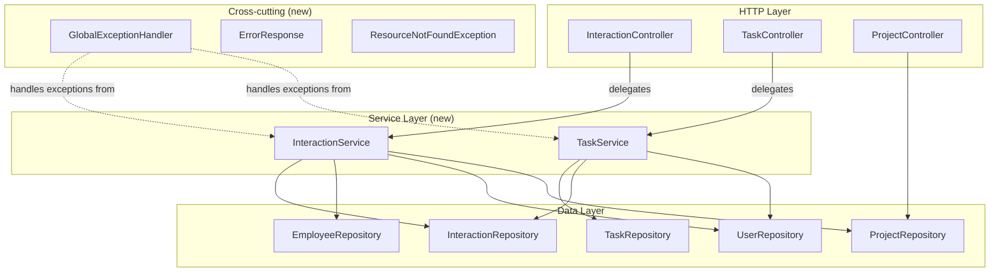

# Design Document: Interaction & Task Write API

## Overview

This design introduces a service layer, DTOs with bean validation, and global exception handling to the staff-engagement backend. The existing controllers are thin wrappers around repositories; this feature adds `POST` endpoints for interactions and tasks, a `companyId` filter on projects, and the supporting infrastructure (services, DTOs, error handling) to make them robust and testable.

No new database migrations are required — the existing schema (interactions, tasks, employees, users, projects, companies tables) already supports the entities.

## Architecture



### Request Flow

1. Client sends `POST /api/interactions` or `POST /api/tasks` with JSON body.
2. Spring deserializes the body into a DTO record (`CreateInteractionRequest` / `CreateTaskRequest`).
3. Jakarta Bean Validation fires — constraint violations are caught by `GlobalExceptionHandler` and returned as 400 with `fieldErrors`.
4. Controller delegates to service.
5. Service validates FK references (employee, user, project, interaction exist). On failure, throws `IllegalArgumentException` caught by `GlobalExceptionHandler` → 400 with `message`.
6. Service persists entity via repository, returns the saved entity.
7. Controller returns 201 with the entity JSON.

## Components and Interfaces

### New Files to Create

| File | Package / Path | Responsibility |
|------|----------------|----------------|
| `InteractionService.java` | `interaction` | FK validation + persistence for interactions |
| `TaskService.java` | `task` | FK validation + persistence for tasks |
| `CreateInteractionRequest.java` | `interaction.dto` | DTO record with bean validation |
| `CreateTaskRequest.java` | `task.dto` | DTO record with bean validation |
| `ResourceNotFoundException.java` | `common.exception` | Custom exception for missing FK references |
| `GlobalExceptionHandler.java` | `common.exception` | `@RestControllerAdvice` for consistent error mapping |
| `ErrorResponse.java` | `common.exception` | Error response body structure |

### Existing Files to Modify

| File | Change |
|------|--------|
| `InteractionController.java` | Inject `InteractionService`, add `POST` endpoint |
| `TaskController.java` | Inject `TaskService`, add `POST` endpoint |
| `ProjectController.java` | Add optional `@RequestParam companyId`, use repository method |
| `ProjectRepository.java` | Add `findByCompanyId(Long companyId)` |

### Component Details

#### CreateInteractionRequest (record)

```java
package com.psybergate.staff_engagement.interaction.dto;

import com.psybergate.staff_engagement.interaction.InteractionType;
import jakarta.validation.constraints.NotBlank;
import jakarta.validation.constraints.NotNull;
import java.time.Instant;

public record CreateInteractionRequest(
    @NotNull Long employeeId,
    @NotNull Long conductedByUserId,
    @NotNull Long loggedByUserId,
    @NotNull InteractionType type,
    @NotBlank String notes,
    @NotNull Instant occurredAt,
    Long projectId  // nullable, optional
) {}
```

#### CreateTaskRequest (record)

```java
package com.psybergate.staff_engagement.task.dto;

import jakarta.validation.constraints.NotBlank;
import jakarta.validation.constraints.Size;
import java.time.LocalDate;

public record CreateTaskRequest(
    @NotBlank @Size(max = 255) String title,
    @Size(max = 2000) String description,
    Long interactionId,   // nullable, optional
    LocalDate dueDate,    // nullable, optional
    Long assignedUserId   // nullable, optional
) {}
```

#### InteractionService

```java
@Service
@RequiredArgsConstructor
public class InteractionService {

    private final InteractionRepository interactionRepository;
    private final EmployeeRepository employeeRepository;
    private final UserRepository userRepository;
    private final ProjectRepository projectRepository;

    public Interaction create(CreateInteractionRequest request) {
        Employee employee = employeeRepository.findById(request.employeeId())
            .orElseThrow(() -> new IllegalArgumentException("Employee not found with id: " + request.employeeId()));
        User conductedBy = userRepository.findById(request.conductedByUserId())
            .orElseThrow(() -> new IllegalArgumentException("User not found with id: " + request.conductedByUserId()));
        User loggedBy = userRepository.findById(request.loggedByUserId())
            .orElseThrow(() -> new IllegalArgumentException("User not found with id: " + request.loggedByUserId()));
        Project project = null;
        if (request.projectId() != null) {
            project = projectRepository.findById(request.projectId())
                .orElseThrow(() -> new IllegalArgumentException("Project not found with id: " + request.projectId()));
        }

        Interaction interaction = new Interaction();
        interaction.setEmployee(employee);
        interaction.setConductedBy(conductedBy);
        interaction.setLoggedBy(loggedBy);
        interaction.setProject(project);
        interaction.setType(request.type());
        interaction.setNotes(request.notes());
        interaction.setOccurredAt(request.occurredAt());

        return interactionRepository.save(interaction);
    }
}
```

#### TaskService

```java
@Service
@RequiredArgsConstructor
public class TaskService {

    private final TaskRepository taskRepository;
    private final InteractionRepository interactionRepository;
    private final UserRepository userRepository;

    public Task create(CreateTaskRequest request) {
        Interaction interaction = null;
        if (request.interactionId() != null) {
            interaction = interactionRepository.findById(request.interactionId())
                .orElseThrow(() -> new IllegalArgumentException("Interaction not found with id: " + request.interactionId()));
        }
        User assignedUser = null;
        if (request.assignedUserId() != null) {
            assignedUser = userRepository.findById(request.assignedUserId())
                .orElseThrow(() -> new IllegalArgumentException("User not found with id: " + request.assignedUserId()));
        }

        Task task = new Task();
        task.setTitle(request.title());
        task.setDescription(request.description());
        task.setInteraction(interaction);
        task.setDueDate(request.dueDate());
        task.setAssignedUser(assignedUser);
        task.setStatus(TaskStatus.OPEN);

        return taskRepository.save(task);
    }
}
```

#### GlobalExceptionHandler

```java
@RestControllerAdvice
public class GlobalExceptionHandler {

    @ExceptionHandler(MethodArgumentNotValidException.class)
    @ResponseStatus(HttpStatus.BAD_REQUEST)
    public ErrorResponse handleValidation(MethodArgumentNotValidException ex) {
        Map<String, String> fieldErrors = new HashMap<>();
        ex.getBindingResult().getFieldErrors().forEach(fe ->
            fieldErrors.put(fe.getField(), fe.getDefaultMessage()));
        return new ErrorResponse("Validation failed", fieldErrors);
    }

    @ExceptionHandler(IllegalArgumentException.class)
    @ResponseStatus(HttpStatus.BAD_REQUEST)
    public ErrorResponse handleIllegalArgument(IllegalArgumentException ex) {
        return new ErrorResponse(ex.getMessage(), null);
    }
}
```

#### ErrorResponse

```java
package com.psybergate.staff_engagement.common.exception;

import java.util.Map;

public record ErrorResponse(
    String message,
    Map<String, String> fieldErrors
) {}
```

#### ProjectRepository (updated)

```java
public interface ProjectRepository extends JpaRepository<Project, Long> {
    List<Project> findByCompanyId(Long companyId);
}
```

#### ProjectController (updated)

```java
@GetMapping("/api/projects")
public List<Project> getProjects(@RequestParam(required = false) Long companyId) {
    if (companyId != null) {
        return projectRepository.findByCompanyId(companyId);
    }
    return projectRepository.findAll();
}
```

### API Contract

#### POST /api/interactions

**Request:**
```json
{
  "employeeId": 1,
  "conductedByUserId": 2,
  "loggedByUserId": 2,
  "type": "CHECK_IN",
  "notes": "Weekly check-in discussion",
  "occurredAt": "2024-12-01T10:00:00Z",
  "projectId": 3
}
```

**Response (201 Created):**
```json
{
  "id": 42,
  "employee": { "id": 1, "name": "Jane Doe", ... },
  "conductedBy": { "id": 2, "name": "Alice", ... },
  "loggedBy": { "id": 2, "name": "Alice", ... },
  "project": { "id": 3, "name": "Project X", ... },
  "type": "CHECK_IN",
  "notes": "Weekly check-in discussion",
  "occurredAt": "2024-12-01T10:00:00Z",
  "createdAt": "2024-12-15T08:30:00Z"
}
```

**Error (400 — validation):**
```json
{
  "message": "Validation failed",
  "fieldErrors": {
    "notes": "must not be blank",
    "employeeId": "must not be null"
  }
}
```

**Error (400 — FK not found):**
```json
{
  "message": "Employee not found with id: 999",
  "fieldErrors": null
}
```

#### POST /api/tasks

**Request:**
```json
{
  "title": "Follow up on career development plan",
  "description": "Schedule meeting to discuss progress",
  "interactionId": 42,
  "dueDate": "2025-01-15",
  "assignedUserId": 2
}
```

**Response (201 Created):**
```json
{
  "id": 7,
  "interaction": { "id": 42, ... },
  "title": "Follow up on career development plan",
  "description": "Schedule meeting to discuss progress",
  "status": "OPEN",
  "dueDate": "2025-01-15",
  "assignedUser": { "id": 2, "name": "Alice", ... },
  "createdAt": "2024-12-15T08:31:00Z"
}
```

#### GET /api/projects?companyId=1

**Response (200):**
```json
[
  { "id": 3, "name": "Project X", "company": { "id": 1, "name": "Acme" }, ... }
]
```

## Data Models

No new entities are introduced. The design uses the existing entities:

- `Interaction` — `interactions` table (employee_id, conducted_by_user_id, logged_by_user_id, project_id, type, notes, occurred_at, created_at)
- `Task` — `tasks` table (interaction_id, title, description, status, due_date, assigned_user_id, created_at)
- `Project` — `projects` table (name, company_id, created_at)
- `Employee` — `employees` table (name, email, manager_id, job_title, created_at)
- `User` — `users` table (name, email, password_hash, created_at)

**New DTOs** (records, not persisted):
- `CreateInteractionRequest` — input for POST /api/interactions
- `CreateTaskRequest` — input for POST /api/tasks
- `ErrorResponse` — output for all error conditions

## Correctness Properties

*A property is a characteristic or behavior that should hold true across all valid executions of a system — essentially, a formal statement about what the system should do. Properties serve as the bridge between human-readable specifications and machine-verifiable correctness guarantees.*

### Property 1: Interaction creation round-trip

*For any* valid `CreateInteractionRequest` (with existing employee, users, and optional project), submitting it to `POST /api/interactions` SHALL return HTTP 201 with a response containing a non-null `id` and field values matching the request (type, notes, occurredAt, and referenced entity IDs).

**Validates: Requirements 1.1**

### Property 2: Interaction bean validation rejects invalid requests

*For any* `CreateInteractionRequest` where one or more required fields (employeeId, conductedByUserId, loggedByUserId, type, notes, occurredAt) are null or blank, submitting it SHALL return HTTP 400 with a response body containing a `fieldErrors` map that includes the invalid field name as a key.

**Validates: Requirements 1.2, 1.8**

### Property 3: Task creation round-trip

*For any* valid `CreateTaskRequest` (with a non-blank title of at most 255 characters, and optional fields referencing existing entities), submitting it to `POST /api/tasks` SHALL return HTTP 201 with a response containing a non-null `id`, the submitted title, and status equal to `OPEN`.

**Validates: Requirements 2.1, 2.6**

### Property 4: Task bean validation rejects invalid requests

*For any* `CreateTaskRequest` where the title is blank or exceeds 255 characters, submitting it SHALL return HTTP 400 with a response body containing a `fieldErrors` map that includes `title` as a key.

**Validates: Requirements 2.2, 2.7**

### Property 5: Company filter returns only matching projects

*For any* companyId, a GET request to `/api/projects?companyId={companyId}` SHALL return only projects where `project.company.id` equals the provided companyId.

**Validates: Requirements 3.1**

### Property 6: All error responses contain a message field

*For any* request that triggers a validation failure (either bean validation or service-level FK check), the JSON response body SHALL contain a non-null `message` field of type String.

**Validates: Requirements 5.3, 6.1**

### Property 7: Bean validation errors include fieldErrors map

*For any* request that violates a Jakarta Bean Validation constraint, the JSON response body SHALL contain both a `message` field and a `fieldErrors` map where keys are the violating field names and values are descriptive error strings.

**Validates: Requirements 6.2**

## Error Handling

| Scenario | Exception | HTTP Status | Response Body |
|----------|-----------|-------------|---------------|
| Bean validation failure | `MethodArgumentNotValidException` | 400 | `{ "message": "Validation failed", "fieldErrors": { "field": "error" } }` |
| FK reference not found | `IllegalArgumentException` | 400 | `{ "message": "Entity not found with id: X", "fieldErrors": null }` |
| Unauthenticated request | Spring Security filter | 401 | Default Spring Security response |

The `GlobalExceptionHandler` centralizes error mapping so controllers and services don't handle HTTP concerns directly.

## Testing Strategy

### Unit Tests (Mock-based)

**Controller tests** (`@WebMvcTest`):
- Mock the service layer.
- Verify HTTP status codes (201 for success, 400 for validation errors).
- Verify response JSON shape.
- Verify bean validation triggers for invalid payloads.
- Use `@WithMockUser` for authenticated context.

**Service tests** (plain JUnit + Mockito):
- Mock repositories.
- Verify FK validation logic (throws `IllegalArgumentException` for missing references).
- Verify entity mapping from DTO to entity fields.
- Verify task defaults (status = OPEN).

### Integration Tests (Testcontainers)

Using the existing `BaseIntegrationTest` with `TestRestTemplate`:
- Full persistence round-trips: POST an interaction/task, then GET to verify it's persisted.
- FK validation with real database: POST with non-existent references, verify 400.
- Project filter: seed projects for multiple companies, filter by companyId, verify only matching projects returned.

### Property-Based Tests (jqwik)

The project already has jqwik 1.9.2 as a test dependency. Property tests will:
- Use `@Property` with minimum 100 tries.
- Generate random valid/invalid DTOs using jqwik's `@ForAll` and custom `Arbitrary` providers.
- Each test tagged with a comment referencing the design property.

**Tag format:** `Feature: interaction-task-write-api, Property {number}: {property_text}`

| Property | Test Approach |
|----------|--------------|
| 1: Interaction round-trip | Generate random valid requests (varying type, notes length, timestamps), verify 201 + ID (integration-level PBT) |
| 2: Interaction validation | Generate requests with random null/blank required fields, verify 400 + fieldErrors |
| 3: Task round-trip | Generate random titles (1-255 chars), verify 201 + status=OPEN |
| 4: Task validation | Generate blank/oversized titles, verify 400 + fieldErrors with "title" |
| 5: Company filter | Seed random companies+projects, filter by companyId, verify all results match |
| 6: Error message field | Generate any invalid request (random field nullification), verify "message" in response |
| 7: fieldErrors map | Generate bean-validation-failing requests, verify "fieldErrors" contains field key |

Properties 6 and 7 are structurally validated by properties 2 and 4 (which already check the error response shape), so they can be consolidated into the validation property tests as additional assertions rather than standalone tests.
