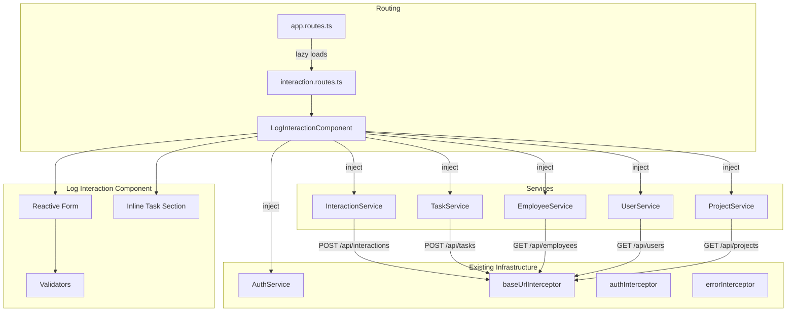
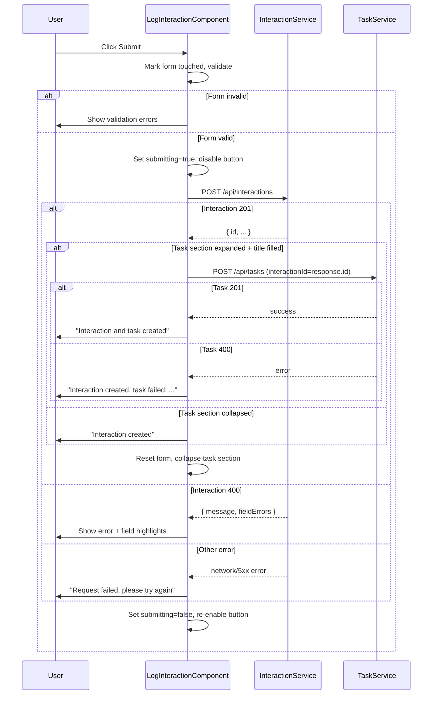

# Design Document: Log Interaction Frontend

## Overview

This design implements the "Log Interaction" page as an Angular 21 standalone component that replaces the existing placeholder in `src/app/interaction/`. The page provides a reactive form for recording staff engagement interactions (check-ins, mentoring sessions, catch-ups) and optionally creating an inline follow-up task — all submitted to the already-built backend write API.

The component uses Angular signals for state management (loading states, picker data, error state), reactive forms with synchronous validators, and sequential HTTP submission (interaction first, then task if the inline section is expanded).

## Architecture



### Submission Flow



## Components and Interfaces

### File Structure

```
src/app/interaction/
├── log-interaction.component.ts       # Main component (replaces placeholder)
├── log-interaction.component.html     # Template
├── log-interaction.component.css      # Styles
├── log-interaction.component.spec.ts  # Vitest unit tests
├── interaction.routes.ts              # Updated route pointing to new component
├── services/
│   └── interaction.service.ts         # HTTP service for interactions
├── models/
│   ├── interaction.model.ts           # TypeScript interfaces
│   └── interaction-type.enum.ts       # InteractionType enum + label util
└── validators/
    └── not-blank.validator.ts         # Custom "not blank" validator

src/app/task/
├── services/
│   └── task.service.ts                # HTTP service for tasks
└── models/
    └── task.model.ts                  # TypeScript interfaces

src/app/shared/
├── services/
│   ├── employee.service.ts            # HTTP service for employees
│   ├── user.service.ts                # HTTP service for users
│   └── project.service.ts            # HTTP service for projects
└── models/
    ├── employee.model.ts              # Employee interface
    └── project.model.ts               # Project interface

e2e/
└── log-interaction.spec.ts            # Playwright e2e test
```

### Files to Delete

| File | Reason |
|------|--------|
| `interaction.ts` | Replaced by `log-interaction.component.ts` |
| `interaction.html` | Replaced by `log-interaction.component.html` |
| `interaction.css` | Replaced by `log-interaction.component.css` |

### Files to Modify

| File | Change |
|------|--------|
| `interaction.routes.ts` | Point default route to `LogInteractionComponent` |

### LogInteractionComponent

Standalone component. Uses `ReactiveFormsModule` for form handling, signals for async state.

```typescript
@Component({
  selector: 'app-log-interaction',
  standalone: true,
  imports: [ReactiveFormsModule, CommonModule],
  templateUrl: './log-interaction.component.html',
  styleUrl: './log-interaction.component.css',
})
export class LogInteractionComponent implements OnInit {
  // Injected services
  private authService = inject(AuthService);
  private interactionService = inject(InteractionService);
  private taskService = inject(TaskService);
  private employeeService = inject(EmployeeService);
  private userService = inject(UserService);
  private projectService = inject(ProjectService);

  // Picker data signals
  employees = signal<Employee[]>([]);
  users = signal<User[]>([]);
  projects = signal<Project[]>([]);

  // Loading/error signals per picker
  employeesLoading = signal(false);
  usersLoading = signal(false);
  projectsLoading = signal(false);
  employeesError = signal<string | null>(null);
  usersError = signal<string | null>(null);
  projectsError = signal<string | null>(null);

  // Submission state
  submitting = signal(false);
  successMessage = signal<string | null>(null);
  errorMessage = signal<string | null>(null);
  serverFieldErrors = signal<Record<string, string>>({});
  taskErrorMessage = signal<string | null>(null);

  // Task section visibility
  taskSectionExpanded = signal(false);

  // Interaction types
  interactionTypes = INTERACTION_TYPES;

  // Reactive form
  form!: FormGroup;

  currentUser = this.authService.currentUser;
}
```

### InteractionService

```typescript
@Injectable({ providedIn: 'root' })
export class InteractionService {
  private http = inject(HttpClient);

  create(request: CreateInteractionRequest): Observable<InteractionResponse> {
    return this.http.post<InteractionResponse>('/api/interactions', request);
  }
}
```

### TaskService

```typescript
@Injectable({ providedIn: 'root' })
export class TaskService {
  private http = inject(HttpClient);

  create(request: CreateTaskRequest): Observable<TaskResponse> {
    return this.http.post<TaskResponse>('/api/tasks', request);
  }
}
```

### EmployeeService

```typescript
@Injectable({ providedIn: 'root' })
export class EmployeeService {
  private http = inject(HttpClient);

  getAll(): Observable<Employee[]> {
    return this.http.get<Employee[]>('/api/employees');
  }
}
```

### UserService

```typescript
@Injectable({ providedIn: 'root' })
export class UserService {
  private http = inject(HttpClient);

  getAll(): Observable<User[]> {
    return this.http.get<User[]>('/api/users');
  }
}
```

### ProjectService

```typescript
@Injectable({ providedIn: 'root' })
export class ProjectService {
  private http = inject(HttpClient);

  getAll(): Observable<Project[]> {
    return this.http.get<Project[]>('/api/projects');
  }
}
```

### Reactive Form Structure

```typescript
// Built in ngOnInit
this.form = new FormGroup({
  employeeId: new FormControl<number | null>(null, [Validators.required]),
  conductedByUserId: new FormControl<number | null>(
    this.currentUser()?.id ?? null,
    [Validators.required]
  ),
  type: new FormControl<InteractionType | null>(null, [Validators.required]),
  notes: new FormControl<string>('', [Validators.required, notBlankValidator]),
  occurredAt: new FormControl<string>(
    formatDateTimeLocal(new Date()),
    [Validators.required]
  ),
  projectId: new FormControl<number | null>(null),
  // Task sub-form (conditionally validated)
  taskTitle: new FormControl<string>('', []),
  taskDescription: new FormControl<string>('', []),
  taskDueDate: new FormControl<string | null>(null, []),
  taskAssignedUserId: new FormControl<number | null>(null, []),
});
```

When `taskSectionExpanded` changes to `true`, add validators to `taskTitle`:
- `Validators.required`
- `Validators.maxLength(255)`
- `notBlankValidator`

And add `futureDateValidator` to `taskDueDate`.

When collapsed, clear validators on task fields and reset them.

### Custom Validators

**notBlankValidator**: Rejects strings that are empty or whitespace-only.

```typescript
export function notBlankValidator(control: AbstractControl): ValidationErrors | null {
  const value = control.value;
  if (typeof value === 'string' && value.trim().length === 0) {
    return { notBlank: true };
  }
  return null;
}
```

**futureDateValidator**: Rejects dates before today.

```typescript
export function futureDateValidator(control: AbstractControl): ValidationErrors | null {
  if (!control.value) return null;
  const selected = new Date(control.value);
  const today = new Date();
  today.setHours(0, 0, 0, 0);
  if (selected < today) {
    return { futureDate: true };
  }
  return null;
}
```

### InteractionType Enum and Label Utility

```typescript
export enum InteractionType {
  CHECK_IN = 'CHECK_IN',
  MENTORING = 'MENTORING',
  CATCH_UP = 'CATCH_UP',
  OTHER = 'OTHER',
}

export const INTERACTION_TYPES: { value: InteractionType; label: string }[] = [
  { value: InteractionType.CHECK_IN, label: 'Check In' },
  { value: InteractionType.MENTORING, label: 'Mentoring' },
  { value: InteractionType.CATCH_UP, label: 'Catch Up' },
  { value: InteractionType.OTHER, label: 'Other' },
];

export function formatInteractionTypeLabel(type: InteractionType): string {
  return type
    .split('_')
    .map((word) => word.charAt(0).toUpperCase() + word.slice(1).toLowerCase())
    .join(' ');
}
```

## Data Models

### Frontend TypeScript Interfaces

```typescript
// src/app/interaction/models/interaction.model.ts
export interface CreateInteractionRequest {
  employeeId: number;
  conductedByUserId: number;
  loggedByUserId: number;
  type: InteractionType;
  notes: string;
  occurredAt: string; // ISO 8601 instant
  projectId?: number | null;
}

export interface InteractionResponse {
  id: number;
  employee: { id: number; name: string };
  conductedBy: { id: number; name: string };
  loggedBy: { id: number; name: string };
  project: { id: number; name: string } | null;
  type: InteractionType;
  notes: string;
  occurredAt: string;
  createdAt: string;
}
```

```typescript
// src/app/task/models/task.model.ts
export interface CreateTaskRequest {
  title: string;
  description?: string | null;
  interactionId?: number | null;
  dueDate?: string | null; // ISO date (YYYY-MM-DD)
  assignedUserId?: number | null;
}

export interface TaskResponse {
  id: number;
  title: string;
  description: string | null;
  status: string;
  dueDate: string | null;
  assignedUser: { id: number; name: string } | null;
  interaction: { id: number } | null;
  createdAt: string;
}
```

```typescript
// src/app/shared/models/employee.model.ts
export interface Employee {
  id: number;
  name: string;
  email: string;
  jobTitle: string;
}
```

```typescript
// src/app/shared/models/project.model.ts
export interface Project {
  id: number;
  name: string;
}
```

```typescript
// Backend error response (mapped in component)
export interface ApiErrorResponse {
  message: string;
  fieldErrors: Record<string, string> | null;
}
```

## Correctness Properties

*A property is a characteristic or behavior that should hold true across all valid executions of a system — essentially, a formal statement about what the system should do. Properties serve as the bridge between human-readable specifications and machine-verifiable correctness guarantees.*

### Property 1: Form defaults match current user

*For any* authenticated user provided by AuthService.currentUser, when the LogInteractionComponent initializes, the `conductedByUserId` form control SHALL have its value equal to that user's `id`, and the `occurredAt` form control SHALL contain a datetime value within 2 seconds of the current time.

**Validates: Requirements 1.2**

### Property 2: Whitespace-only notes are rejected

*For any* string composed entirely of whitespace characters (spaces, tabs, newlines, of any length including empty string), setting it as the notes field value SHALL cause the form to be invalid with a `notBlank` validation error.

**Validates: Requirements 2.3**

### Property 3: Valid required fields enable submission

*For any* combination of valid values (non-null employeeId, non-null conductedByUserId, non-null type from InteractionType enum, non-whitespace notes string, non-empty occurredAt), the form SHALL be valid and the submit button SHALL be enabled.

**Validates: Requirements 2.6**

### Property 4: Submission payload correctness

*For any* valid form state with a given currentUser, the payload sent to `POST /api/interactions` SHALL contain `employeeId` matching the form's employeeId value, `conductedByUserId` matching the form's conductedByUserId value, `loggedByUserId` always equal to `currentUser.id` (regardless of the conductedByUserId selection), `type` matching the form's type value, `notes` matching the form's trimmed notes value, `occurredAt` matching the form's occurredAt value as an ISO string, and `projectId` matching the form's projectId value (or absent if null).

**Validates: Requirements 3.1, 5.2, 5.3, 5.4**

### Property 5: Server field errors are displayed

*For any* HTTP 400 response containing a `fieldErrors` map with one or more entries, the component SHALL display each field's error message adjacent to the corresponding form control, and the top-level `message` SHALL be displayed as a notification.

**Validates: Requirements 3.3**

### Property 6: Task title required when section expanded

*For any* string that is empty or composed entirely of whitespace characters, when the Inline_Task_Section is expanded and that string is set as the task title, the form SHALL be invalid and submission SHALL be prevented with a validation error on the task title field.

**Validates: Requirements 4.2**

### Property 7: Task POST uses interaction response ID

*For any* successful interaction creation (HTTP 201 returning a response with an `id` field), when the Inline_Task_Section is expanded with a valid title, the subsequent `POST /api/tasks` payload SHALL contain `interactionId` equal to the `id` from the interaction response.

**Validates: Requirements 4.3**

### Property 8: Collapsed task section produces no task request

*For any* valid form submission where the Inline_Task_Section is collapsed (regardless of task field values), the TaskService SHALL NOT be called and no `POST /api/tasks` request SHALL be sent.

**Validates: Requirements 4.6**

### Property 9: Past due dates are rejected

*For any* date value that represents a calendar day before today, setting it as the task `dueDate` value when the Inline_Task_Section is expanded SHALL cause the form to be invalid with a `futureDate` validation error on the dueDate control.

**Validates: Requirements 4.8**

### Property 10: Interaction type label formatting

*For any* InteractionType enum value, the `formatInteractionTypeLabel` function SHALL produce a string where underscores are replaced by spaces and each word is capitalized (Title Case). Specifically, `formatInteractionTypeLabel(type) === type.split('_').map(w => w[0] + w.slice(1).toLowerCase()).join(' ')`.

**Validates: Requirements 8.2**

### Property 11: User picker displays full names

*For any* list of users returned by `GET /api/users`, the Conducted_By_Picker SHALL render each option with a label matching the user's `name` field exactly.

**Validates: Requirements 5.1**

## Error Handling

| Scenario | Source | Handling |
|----------|--------|----------|
| Picker data fetch failure | GET /api/employees, /api/users, /api/projects | Set picker-specific error signal, show error message with retry button, disable that picker |
| All required pickers fail | GET /api/employees + /api/users both fail | Prevent form submission, show global data-load error |
| Interaction validation error (400) | POST /api/interactions | Parse `ApiErrorResponse`, display `message` as notification, map `fieldErrors` to form controls |
| Interaction server/network error | POST /api/interactions (5xx, timeout, network) | Display generic "Request failed" error, re-enable submit |
| Task validation error (400) | POST /api/tasks | Display task-specific error, still show interaction success message, reset form |
| Task server error | POST /api/tasks (5xx, timeout) | Same as task 400 — show error, indicate interaction was still created |

### Error Response Parsing

The component parses error responses using an `HttpErrorResponse` handler:

```typescript
private handleInteractionError(error: HttpErrorResponse): void {
  if (error.status === 400 && error.error) {
    const apiError = error.error as ApiErrorResponse;
    this.errorMessage.set(apiError.message);
    if (apiError.fieldErrors) {
      this.serverFieldErrors.set(apiError.fieldErrors);
    }
  } else {
    this.errorMessage.set('Request failed. Please try again.');
  }
  this.submitting.set(false);
}
```

## Testing Strategy

### Unit Tests (Vitest + fast-check)

The project uses **Vitest 4** with `jsdom` environment and **fast-check 4** (already in devDependencies) for property-based testing.

**Dual approach:**
- **Example-based unit tests** cover specific scenarios (form renders, button states, loading indicators, error displays, submission flows)
- **Property-based tests** verify universal invariants across randomly generated inputs

#### Example-Based Tests (log-interaction.component.spec.ts)

Minimum test cases per Requirement 9:
1. Employee_Picker empty → validation error
2. Type selector empty → validation error
3. Notes empty → validation error
4. Occurred_at empty → validation error
5. Conducted_By_Picker empty → validation error
6. All required fields valid → submit button enabled
7. Toggle task section → renders/hides sub-form
8. Task section expanded + empty title → validation error
9. Task section collapsed → no task validation errors

Additional example-based tests:
- Submit button disabled on initial render
- Loading indicators shown while fetching picker data
- Retry button appears on picker data failure
- Success notification on 201 response
- Form reset on successful submission
- Task section collapses on successful submission
- Generic error on 5xx/network error
- Interaction error prevents task submission
- Partial failure: interaction succeeds, task fails

#### Property-Based Tests (log-interaction.property.spec.ts)

Using `fast-check` with minimum 100 iterations per property:

| Property | Test Description | Generator Strategy |
|----------|-----------------|-------------------|
| 1: Form defaults | Generate random User objects, verify defaults | `fc.record({ id: fc.nat(), name: fc.string(), email: fc.emailAddress() })` |
| 2: Whitespace rejection | Generate whitespace strings | `fc.stringOf(fc.constantFrom(' ', '\t', '\n', '\r'))` |
| 3: Valid form enables submit | Generate valid field combinations | `fc.record(...)` with valid constraints |
| 4: Payload correctness | Generate valid forms + currentUser, verify payload | Full form value + user generators |
| 5: Server errors displayed | Generate random fieldErrors maps | `fc.dictionary(fc.string(), fc.string())` |
| 6: Task title validation | Generate whitespace strings when expanded | Same as property 2 |
| 7: Task uses interaction ID | Generate random interaction response IDs | `fc.nat()` |
| 8: Collapsed = no task POST | Generate valid forms with collapsed state | Any valid form + collapsed flag |
| 9: Past dates rejected | Generate past dates | `fc.date({ max: yesterday })` |
| 10: Type label formatting | Use all enum values (exhaustive, not random) | `fc.constantFrom(...Object.values(InteractionType))` |
| 11: User names in picker | Generate random user lists | `fc.array(fc.record({ id: fc.nat(), name: fc.string() }))` |

**Tag format:** `Feature: log-interaction-frontend, Property {N}: {title}`

Each property test runs with `{ numRuns: 100 }` minimum.

### End-to-End Tests (Playwright)

One Playwright test (per Requirement 9.3) against a running backend with seeded data:

1. Navigate to `/interaction` (authenticated)
2. Select an employee from the picker
3. Keep conducted-by as default (current user)
4. Select interaction type "Check In"
5. Enter notes text
6. Leave occurred_at as default (now)
7. Expand inline task section
8. Enter task title
9. Submit the form
10. Assert: success notification visible
11. Assert: form reset (conducted_by = current user, others cleared)
12. Assert: task section collapsed

The test uses seeded reference data (employees, users) created via the backend API or database fixtures before the test suite runs.
