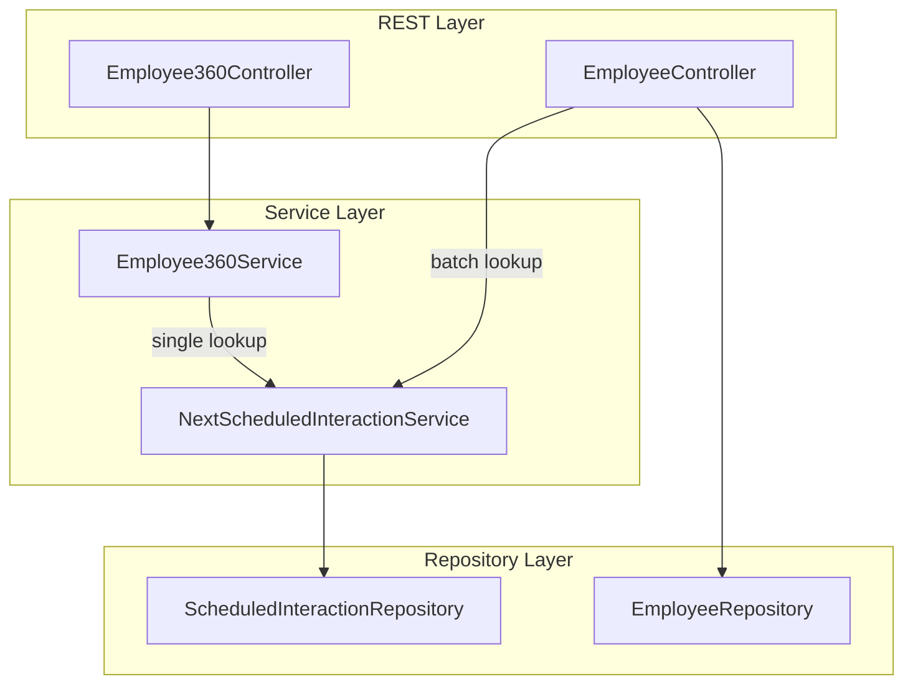
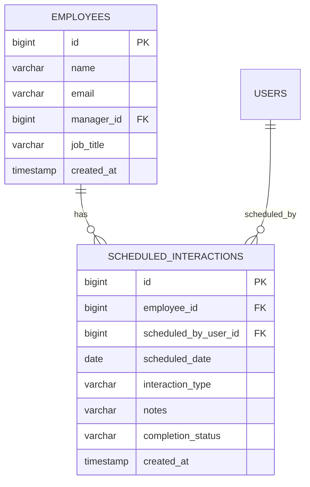

# Design Document: Next Scheduled Interaction

## Overview

This feature enriches the Employee 360 and Employees List API responses with each employee's next upcoming scheduled interaction. The design adds a repository query method, a dedicated service layer, a DTO record, and modifications to the existing `Employee360Service` and `EmployeeController`.

The approach prioritises:
- **Efficiency**: A single batch query resolves next-scheduled data for the entire employee list, avoiding N+1 queries.
- **Separation of concerns**: A new `NextScheduledInteractionService` owns the resolution logic, keeping the existing `Employee360Service` and `EmployeeController` thin.
- **Testability**: The service uses a `Clock` abstraction so "today" can be controlled in tests without date gymnastics.

## Architecture



**Request flow — Employee 360:**
1. `Employee360Controller` calls `Employee360Service.getEmployee360(id)`
2. `Employee360Service` fetches employee, interactions, and tasks as before
3. `Employee360Service` calls `NextScheduledInteractionService.getNextScheduled(employeeId)` to resolve the `nextScheduled` field
4. The enriched `Employee360Response` (now including `nextScheduled`) is serialized to JSON

**Request flow — Employees List:**
1. `EmployeeController` fetches all employees from `EmployeeRepository`
2. `EmployeeController` extracts employee IDs and calls `NextScheduledInteractionService.getNextScheduledBatch(ids)`
3. The controller maps each `Employee` + its resolved `NextScheduledDto` into an `EmployeeListDto`
4. The controller returns `List<EmployeeListDto>`

## Components and Interfaces

### 1. Repository Method Extension

Add a JPQL query to `ScheduledInteractionRepository`:

```java
@Query("""
    SELECT si FROM ScheduledInteraction si
    WHERE si.employee.id = :employeeId
      AND si.scheduledDate >= :referenceDate
      AND si.completionStatus = com.psybergate.staff_engagement.scheduling.CompletionStatus.PENDING
    ORDER BY si.scheduledDate ASC, si.id ASC
    LIMIT 1
    """)
Optional<ScheduledInteraction> findNextPendingByEmployeeId(
    @Param("employeeId") Long employeeId,
    @Param("referenceDate") LocalDate referenceDate);
```

For the batch case, a second query avoids N+1:

```java
@Query("""
    SELECT si FROM ScheduledInteraction si
    WHERE si.employee.id IN :employeeIds
      AND si.scheduledDate >= :referenceDate
      AND si.completionStatus = com.psybergate.staff_engagement.scheduling.CompletionStatus.PENDING
      AND si.scheduledDate = (
          SELECT MIN(si2.scheduledDate)
          FROM ScheduledInteraction si2
          WHERE si2.employee.id = si.employee.id
            AND si2.scheduledDate >= :referenceDate
            AND si2.completionStatus = com.psybergate.staff_engagement.scheduling.CompletionStatus.PENDING
      )
    ORDER BY si.employee.id ASC, si.id ASC
    """)
List<ScheduledInteraction> findNextPendingByEmployeeIds(
    @Param("employeeIds") List<Long> employeeIds,
    @Param("referenceDate") LocalDate referenceDate);
```

**Null-parameter validation**: The service layer validates parameters before calling the repository. A `@PreAuthorize`-style guard isn't needed — `IllegalArgumentException` is thrown in the service when `employeeId` or `referenceDate` is null.

### 2. NextScheduledDto

```java
package com.psybergate.staff_engagement.scheduling;

public record NextScheduledDto(
    String scheduledAt,  // ISO-8601 date string, e.g. "2025-02-15"
    String type          // InteractionType name, e.g. "CHECK_IN"
) {}
```

This is a simple, immutable record with no Jackson annotations needed — the default serialization produces the required JSON shape.

### 3. NextScheduledInteractionService

```java
package com.psybergate.staff_engagement.scheduling;

import lombok.RequiredArgsConstructor;
import org.springframework.stereotype.Service;
import org.springframework.transaction.annotation.Transactional;

import java.time.Clock;
import java.time.LocalDate;
import java.util.*;

@Service
@RequiredArgsConstructor
public class NextScheduledInteractionService {

    private final ScheduledInteractionRepository repository;
    private final Clock clock;

    @Transactional(readOnly = true)
    public NextScheduledDto getNextScheduled(Long employeeId) {
        if (employeeId == null) {
            throw new IllegalArgumentException("employeeId must not be null");
        }
        LocalDate today = LocalDate.now(clock);
        return repository.findNextPendingByEmployeeId(employeeId, today)
            .map(this::toDto)
            .orElse(null);
    }

    @Transactional(readOnly = true)
    public Map<Long, NextScheduledDto> getNextScheduledBatch(List<Long> employeeIds) {
        if (employeeIds == null) {
            throw new IllegalArgumentException("employeeIds must not be null");
        }
        if (employeeIds.isEmpty()) {
            return Map.of();
        }
        if (employeeIds.size() > 200) {
            throw new IllegalArgumentException("batch size must not exceed 200");
        }

        LocalDate today = LocalDate.now(clock);
        List<ScheduledInteraction> results =
            repository.findNextPendingByEmployeeIds(employeeIds, today);

        // Group by employee, take lowest ID per employee for tiebreaker
        Map<Long, NextScheduledDto> map = new HashMap<>();
        for (ScheduledInteraction si : results) {
            Long empId = si.getEmployee().getId();
            if (!map.containsKey(empId)) {
                map.put(empId, toDto(si));
            }
            // Already ordered by employee.id ASC, id ASC — first wins
        }
        return map;
    }

    private NextScheduledDto toDto(ScheduledInteraction si) {
        return new NextScheduledDto(
            si.getScheduledDate().toString(),  // ISO-8601
            si.getInteractionType().name()
        );
    }
}
```

**Clock injection**: A `Clock` bean (defaulting to `Clock.systemDefaultZone()`) is declared in a `@Configuration` class. This enables tests to fix the date without modifying production code.

```java
@Configuration
public class ClockConfig {
    @Bean
    public Clock clock() {
        return Clock.systemDefaultZone();
    }
}
```

### 4. Employee360Response Enrichment

Modify the `Employee360Response` record to include the `nextScheduled` field:

```java
public record Employee360Response(
    ProfileDto profile,
    List<InteractionDto> interactions,
    List<TaskDto> openTasks,
    NextScheduledDto nextScheduled  // nullable
) {}
```

Update `Employee360Service.buildResponse()`:

```java
private Employee360Response buildResponse(Employee employee,
                                          List<Interaction> interactions,
                                          List<Task> openTasks,
                                          NextScheduledDto nextScheduled) {
    // ... existing mapping code ...
    return new Employee360Response(profile, interactionDtos, taskDtos, nextScheduled);
}
```

In `getEmployee360()`:

```java
NextScheduledDto nextScheduled = nextScheduledInteractionService.getNextScheduled(employeeId);
return buildResponse(employee, interactions, openTasks, nextScheduled);
```

### 5. EmployeeListDto and Controller Refactoring

New DTO:

```java
package com.psybergate.staff_engagement.employee;

import com.psybergate.staff_engagement.scheduling.NextScheduledDto;

public record EmployeeListDto(
    Long id,
    String name,
    String email,
    String jobTitle,
    String managerName,       // null if no manager
    NextScheduledDto nextScheduled  // null if no upcoming interaction
) {}
```

Refactored controller:

```java
@RestController
@RequiredArgsConstructor
public class EmployeeController {

    private final EmployeeRepository employeeRepository;
    private final NextScheduledInteractionService nextScheduledService;

    @GetMapping("/api/employees")
    public List<EmployeeListDto> getAllEmployees() {
        List<Employee> employees = employeeRepository.findAll();

        List<Long> ids = employees.stream().map(Employee::getId).toList();
        Map<Long, NextScheduledDto> nextMap = nextScheduledService.getNextScheduledBatch(ids);

        return employees.stream()
            .map(e -> new EmployeeListDto(
                e.getId(),
                e.getName(),
                e.getEmail(),
                e.getJobTitle(),
                e.getManager() != null ? e.getManager().getName() : null,
                nextMap.get(e.getId())
            ))
            .toList();
    }
}
```

## Data Models

### Entity Relationships (existing)



### New DTOs

| DTO | Fields | Notes |
|-----|--------|-------|
| `NextScheduledDto` | `scheduledAt: String`, `type: String` | Nullable in parent responses |
| `EmployeeListDto` | `id`, `name`, `email`, `jobTitle`, `managerName`, `nextScheduled` | Replaces raw `Employee` entity in list endpoint |

### JSON Response Shapes

**Employee 360 (enriched):**
```json
{
  "profile": { "id": 1, "name": "...", "email": "...", "jobTitle": "...", "managerName": "..." },
  "interactions": [...],
  "openTasks": [...],
  "nextScheduled": { "scheduledAt": "2025-03-15", "type": "CHECK_IN" }
}
```

**Employees List (new shape):**
```json
[
  {
    "id": 1,
    "name": "John Developer",
    "email": "john@psybergate.co.za",
    "jobTitle": "Senior Engineer",
    "managerName": "Jane Manager",
    "nextScheduled": { "scheduledAt": "2025-03-15", "type": "CHECK_IN" }
  },
  {
    "id": 2,
    "name": "Alice Intern",
    "email": "alice@psybergate.co.za",
    "jobTitle": "Intern",
    "managerName": "Jane Manager",
    "nextScheduled": null
  }
]
```

## Correctness Properties

*A property is a characteristic or behavior that should hold true across all valid executions of a system — essentially, a formal statement about what the system should do. Properties serve as the bridge between human-readable specifications and machine-verifiable correctness guarantees.*

### Property 1: Repository returns the earliest qualifying interaction

*For any* employee and set of scheduled interactions with varying `scheduledDate` values, `completionStatus` values, and entity IDs, the repository query `findNextPendingByEmployeeId(employeeId, referenceDate)` SHALL return the single interaction whose `scheduledDate` is the minimum among all PENDING interactions with `scheduledDate >= referenceDate`, using the lowest `id` as tiebreaker when dates are equal, or return empty if no qualifying interaction exists.

**Validates: Requirements 1.1, 1.2, 1.3, 1.4**

### Property 2: Service DTO mapping round-trip

*For any* `ScheduledInteraction` entity with a valid `scheduledDate` and `interactionType`, the `NextScheduledInteractionService.toDto()` mapping SHALL produce a `NextScheduledDto` where `scheduledAt` equals `scheduledDate.toString()` (ISO-8601 format) and `type` equals `interactionType.name()`. When the repository returns empty, the service SHALL return null.

**Validates: Requirements 2.1, 2.4, 2.5**

### Property 3: Batch method consistency with single method

*For any* list of employee IDs (size 1–200), the result of `getNextScheduledBatch(ids)` for each employee ID SHALL be identical to calling `getNextScheduled(id)` individually — i.e. the map entry for each employee matches the DTO that the single-employee method would produce given the same underlying data and reference date.

**Validates: Requirements 2.6, 2.7**

## Error Handling

| Scenario | Handler | Response |
|----------|---------|----------|
| `employeeId` is null in service methods | `NextScheduledInteractionService` | Throws `IllegalArgumentException` |
| `employeeIds` list exceeds 200 | `NextScheduledInteractionService` | Throws `IllegalArgumentException` |
| Employee not found in 360 endpoint | Existing `Employee360NotFoundException` | HTTP 404 (unchanged) |
| Database connectivity failure | Spring default | HTTP 500 |
| Employee list empty (no employees in DB) | Normal flow | Returns `[]` with no batch call |

The `NextScheduledInteractionService` does **not** validate that the employee ID actually corresponds to an existing employee — it returns null (same as "no qualifying interactions"). This is intentional: the 360 endpoint already validates employee existence before calling the service, and the list endpoint only passes IDs fetched from the database.

## Testing Strategy

### Unit Tests (MockMvc / Mockito)

| Test Class | What it covers |
|------------|----------------|
| `NextScheduledInteractionServiceTest` | Service logic: null-param guards, DTO mapping, batch empty-list, batch size limit |
| `Employee360ControllerTest` (updated) | Verifies 360 response shape includes `nextScheduled` with mocked service |
| `EmployeeControllerTest` (new) | Verifies list response returns `EmployeeListDto` shape with mocked dependencies |

### Integration Tests (Testcontainers + `@SpringBootTest`)

| Test Class | What it covers |
|------------|----------------|
| `NextScheduledInteractionIntegrationTest` | End-to-end verification with real PostgreSQL: soonest-future selection, null cases, past-only interactions, newly-created interaction updating the result |

These extend `BaseIntegrationTest`, inheriting the Testcontainers PostgreSQL + Flyway setup. Tests seed data via direct repository calls within `@BeforeEach`, authenticate, and hit the live endpoints.

### Property-Based Tests (jqwik)

The project will use **jqwik** (JUnit 5 property-based testing library for Java) for the correctness properties above.

Configuration:
- Minimum **100 iterations** per property (configured via `@Property(tries = 100)`)
- Each test tagged with a comment referencing the design property

| Property Test Class | Properties Covered |
|--------------------|--------------------|
| `NextScheduledQueryPropertyTest` | Property 1: generates random interaction sets, verifies query selects correctly |
| `NextScheduledDtoMappingPropertyTest` | Property 2: generates random entities, verifies DTO mapping correctness |
| `NextScheduledBatchConsistencyPropertyTest` | Property 3: generates random employee lists, verifies batch matches single |

**Tag format**: `Feature: next-scheduled-interaction, Property {N}: {description}`

### Cucumber Acceptance Tests (four-layer architecture)

| Layer | New Artefacts |
|-------|--------------|
| **Feature files** | `next_scheduled_interaction.feature` (tagged `@next-scheduled`) |
| **Step definitions** | `NextScheduledStepDefinitions.java` |
| **Domain actors/assertions** | `NextScheduledActor.java`, `NextScheduledAssertions.java` |
| **API drivers** | `NextScheduledApiDriver.java` (extends `BaseApiDriver`) |

**Scenarios** (from Requirement 6):
1. **Scenario Outline**: For each interaction type (CHECK_IN, MENTORING, CATCH_UP, OTHER), schedule a future pending interaction and verify the 360 response returns correct `nextScheduled`.
2. **Scenario**: Employee with no pending interactions → `nextScheduled` is null.
3. **Scenario**: Employee with only past-dated pending interactions → `nextScheduled` is null.
4. **Scenario**: Employees list includes correct `nextScheduled` per employee.
5. **Scenario**: Scheduling a nearer future interaction updates the `nextScheduled` on subsequent GET.

Prerequisite data is established via API calls through `NextScheduledApiDriver` (POST to `/api/scheduled-interactions`), consistent with the existing patterns in `SeedDataApiDriver` and the scheduling acceptance tests.
