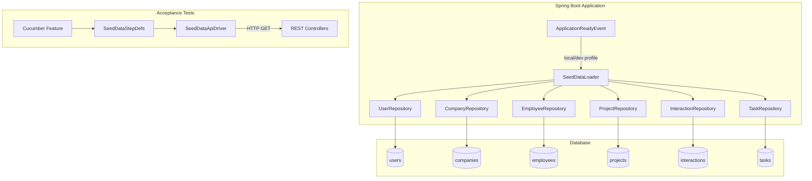
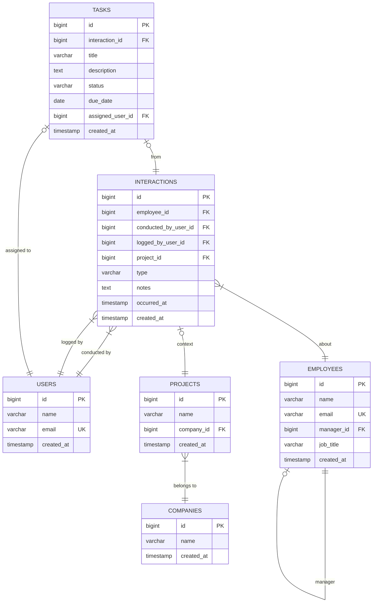

# Design Document

## Overview

This design defines a profile-scoped seed data loader for the Staff Engagement backend, along with verification mechanisms (build integrity, migration integrity, and acceptance tests) that collectively sign off the data layer.

The solution introduces a single Spring component — `SeedDataLoader` — that runs on startup when the `local` or `dev` profile is active. It inserts sample records across all five domain modules in dependency order within a single transaction. An idempotency check (existing user by email) prevents re-insertion. The component fails the application context if any error occurs.

REST controllers (one per domain entity) expose `GET` list endpoints so the acceptance test suite can verify seed data presence through the API layer.

## Architecture



### Design Decisions

| Decision | Rationale |
|----------|-----------|
| `@Profile({"local", "dev"})` on the loader class | Ensures the bean is not even created in prod/staging, providing compile-time safety beyond a runtime check. |
| `ApplicationRunner` interface | Runs after the full context is ready (including Flyway migrations) but before the health endpoint reports UP. |
| Single `@Transactional` method | If any insert fails, all seed data rolls back — no partial state. |
| Idempotency via email lookup | Checking for a known seed user email is cheap, deterministic, and avoids counting queries that could be confused by manually-added data. |
| JPA repositories for insertion | Leverages existing repositories, gets `@PrePersist` timestamp handling for free, and validates entity mappings at seed time. |

## Components and Interfaces

### 1. SeedDataLoader

**Package:** `com.psybergate.staff_engagement.seed`

```java
@Component
@Profile({"local", "dev"})
@RequiredArgsConstructor
@Slf4j
public class SeedDataLoader implements ApplicationRunner {

    private final UserRepository userRepository;
    private final EmployeeRepository employeeRepository;
    private final CompanyRepository companyRepository;
    private final ProjectRepository projectRepository;
    private final InteractionRepository interactionRepository;
    private final TaskRepository taskRepository;

    @Override
    @Transactional
    public void run(ApplicationArguments args) {
        if (seedDataAlreadyPresent()) {
            log.info("Seed data already present — skipping insertion.");
            return;
        }
        insertSeedData();
        log.info("Seed data loaded successfully.");
    }

    private boolean seedDataAlreadyPresent() { /* check by email */ }
    private void insertSeedData() { /* ordered inserts */ }
}
```

**Key behaviours:**
- Activated only under `local` or `dev` profiles (Spring `@Profile` annotation)
- Implements `ApplicationRunner` so it executes after context refresh but before readiness probe
- `@Transactional` wraps all inserts in a single DB transaction
- If an unchecked exception propagates, Spring Boot fails startup (the `ApplicationRunner` contract)
- Logs INFO on skip, INFO on success; any exception logs ERROR via Spring's default failure reporting

### 2. REST Controllers (one per entity)

Each controller follows the same thin pattern:

| Controller | Package | Endpoint | Returns |
|-----------|---------|----------|---------|
| `UserController` | `user` | `GET /api/users` | `List<User>` |
| `EmployeeController` | `employee` | `GET /api/employees` | `List<Employee>` |
| `CompanyController` | `client` | `GET /api/companies` | `List<Company>` |
| `ProjectController` | `client` | `GET /api/projects` | `List<Project>` |
| `InteractionController` | `interaction` | `GET /api/interactions` | `List<Interaction>` |
| `TaskController` | `task` | `GET /api/tasks` | `List<Task>` |

Each is a `@RestController` with a single `@GetMapping` that delegates to `repository.findAll()`. No service layer is needed for these read-all endpoints at this stage.

### 3. Acceptance Test Components

| Class | Layer | Responsibility |
|-------|-------|---------------|
| `SeedDataApiDriver` | Driver (API) | Extends `BaseApiDriver`; provides typed methods like `getEmployees()`, `getCompanies()`, etc. |
| `SeedDataStepDefinitions` | Step Definitions | Glues Gherkin steps to driver calls and assertions |
| `seed_data.feature` | Feature file | Cucumber scenarios verifying entity counts and data invariants |

## Data Models

The existing JPA entities remain unchanged. The seed data loader creates instances of:

### Entity Relationship Diagram



### Seed Data Insertion Order

The loader inserts in strict FK-dependency order:

1. **Users** (no FK dependencies)
2. **Companies** (no FK dependencies)
3. **Employees without managers** (no FK besides self-ref)
4. **Employees with managers** (self-referential FK satisfied by step 3)
5. **Projects** (FK → Companies)
6. **Interactions** (FK → Employees, Users, optionally Projects)
7. **Tasks** (FK → Interactions, optionally Users)

### Sample Data Summary

| Entity | Count | Notable Attributes |
|--------|-------|--------------------|
| Users | 3 | Distinct names and emails |
| Companies | 2 | "Acme Corp", "Globex Inc" |
| Employees | 5 | 3 without manager, 2 with manager reference |
| Projects | 3 | 2 under Acme, 1 under Globex |
| Interactions | 4 | Types: CHECK_IN, MENTORING, CATCH_UP, OTHER; 1 linked to a Project |
| Tasks | 3 | 1 OPEN, 1 DONE, 1 OPEN with due_date; at least 1 linked to Interaction + assigned user |

## Correctness Properties

*A property is a characteristic or behavior that should hold true across all valid executions of a system — essentially, a formal statement about what the system should do. Properties serve as the bridge between human-readable specifications and machine-verifiable correctness guarantees.*

PBT is **not applicable** to this feature. The seed data loader is a side-effect-only startup component that inserts a fixed, predetermined set of records into a database. There are no pure functions with variable input spaces, no serialization/parsing logic, and no algorithms where universal "for all" statements hold across generated inputs. REST controllers return `findAll()` results without transformation. The feature's correctness is fully captured by example-based integration tests and acceptance tests.

The following invariants are verified via integration and acceptance tests:

### Property 1: Transactional Atomicity

*For any* execution of the seed data loader, if any single insert fails, then zero seed records shall persist in the database — the entire insertion is atomic.

**Validates: Requirements 8.3, 8.4**

### Property 2: Idempotent Re-execution

*For any* number of successive executions of the seed data loader against the same database, the total row counts shall remain identical to a single execution — no duplicate records are created.

**Validates: Requirements 1.4, 2.4**

### Property 3: Foreign Key Insertion Order

*For any* successful execution of the seed data loader, all parent records (Users, Companies) shall exist before their dependants (Employees, Projects, Interactions, Tasks), satisfying all foreign key constraints without violations.

**Validates: Requirements 8.1, 8.2**

### Property 4: Profile Scoping

*For any* application startup where the active profile is not `local` or `dev`, the seed data loader shall not execute and zero seed records shall be inserted.

**Validates: Requirements 1.3**

### Property 5: Schema-Entity Alignment

*For any* fresh database, all Flyway migrations shall apply successfully and Hibernate `ddl-auto=validate` shall pass without exceptions, confirming JPA entity mappings align with the physical schema.

**Validates: Requirements 6.1, 6.2, 6.3**

### Property 6: Seeded Data API Accessibility

*For any* application started with the `local` profile, the REST list endpoints shall return at least the minimum expected record counts (5 employees, 2 companies, 3 projects, 3 users, 3 interactions, 3 tasks) with correct data invariants.

**Validates: Requirements 9.1, 9.2, 9.3, 9.4, 9.5, 9.6**

## Error Handling

| Scenario | Behaviour |
|----------|-----------|
| Seed data already present (email match) | Skip all inserts, log INFO, proceed with startup |
| `DataIntegrityViolationException` (FK or unique constraint) | Transaction rolls back, exception propagates, application fails to start, Spring logs ERROR with root cause |
| Any other runtime exception during insertion | Same as above — single transaction guarantees atomicity |
| Database unreachable at startup | Spring context fails before `SeedDataLoader` runs (datasource initialization fails first) |
| Profile not `local`/`dev` | `SeedDataLoader` bean is never instantiated — zero runtime cost |

## Testing Strategy

### Unit Tests

| What | How |
|------|-----|
| `SeedDataLoader` skip logic | Mock repositories, verify no `save()` calls when seed user exists |
| `SeedDataLoader` insertion order | Mock repositories, verify `save()` call order using Mockito `InOrder` |
| Controller endpoints | `@WebMvcTest` slices returning mocked repository data |

### Integration Tests (Testcontainers)

| What | How |
|------|-----|
| Flyway migrations on fresh DB | `@SpringBootTest` with Testcontainers PostgreSQL — confirms all migrations apply and Hibernate `validate` passes |
| Seed data loader end-to-end | Full context start with `local` profile on Testcontainers DB — asserts row counts after startup |
| Idempotency | Run loader twice on same DB, assert no duplicate rows |
| Rollback on failure | Corrupt a FK reference in test, confirm zero rows inserted |

### Acceptance Tests (Cucumber)

A single feature file `seed_data.feature` with scenarios:

1. Verify `GET /api/employees` returns ≥ 5 records
2. Verify `GET /api/companies` returns ≥ 2 records
3. Verify `GET /api/projects` returns ≥ 3 records
4. Verify `GET /api/users` returns ≥ 3 records
5. Verify `GET /api/interactions` returns ≥ 3 records with ≥ 2 distinct types
6. Verify `GET /api/tasks` returns ≥ 3 records with at least one OPEN and one DONE

These use the existing four-layer harness: `SeedDataApiDriver` extends `BaseApiDriver`, step definitions call driver methods, assertions use AssertJ.

### Why Property-Based Testing Is Not Applied

This feature consists of:
- A side-effect-only startup component (inserts fixed data into a database)
- Infrastructure verification (Flyway migrations, Maven build)
- Read-all REST endpoints with no transformation logic

There are no pure functions with variable input spaces, no serialization/parsing logic, and no algorithms where universal properties would hold across generated inputs. Example-based integration tests and acceptance tests provide comprehensive coverage for this feature.

### Build Verification

`./mvnw verify` in `staff-engagement-backend/` confirms:
- All five domain packages compile (including Lombok annotation processing)
- All unit and integration tests pass
- JaCoCo report generates (existing plugin)
- Flyway migrations apply cleanly on Testcontainers PostgreSQL
- Hibernate `ddl-auto=validate` confirms entity-schema alignment
