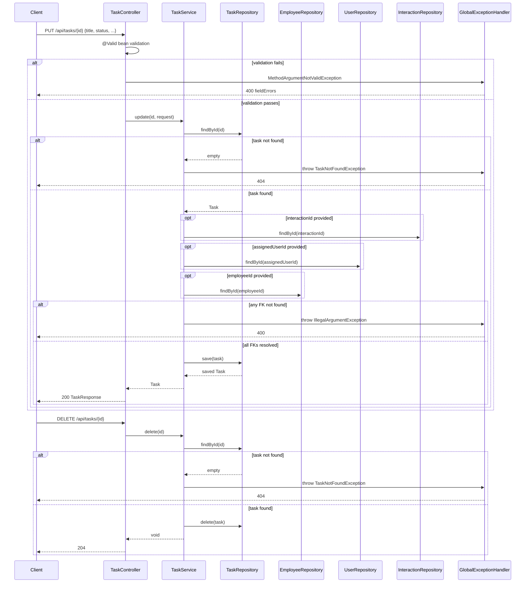

# Design Document: Task Edit & Delete API

## Overview

This feature completes the CRUD surface for tasks by adding `PUT /api/tasks/{id}` (update) and `DELETE /api/tasks/{id}` endpoints to the existing `Task_Controller`. It introduces an `UpdateTaskRequest` DTO that mirrors `CreateTaskRequest`'s validation rules plus a `status` field, extends `Task_Service` with `update()` and `delete()` methods, and introduces a `TaskNotFoundException` mapped to HTTP 404 by `GlobalExceptionHandler`. Task completion/reopening is handled entirely through the update endpoint's `status` field — there is no separate completion endpoint.

### Key Design Decisions

1. **New exception type for 404, not a repurposed `IllegalArgumentException`**: The existing FK-validation errors (missing employee/user/interaction) already map `IllegalArgumentException` → 400. Reusing it for "task not found" would collapse two distinct failure modes into the same status code. A new `TaskNotFoundException` (unchecked) is introduced and mapped to 404, leaving the existing `IllegalArgumentException` → 400 mapping untouched.
2. **`UpdateTaskRequest` is a separate DTO from `CreateTaskRequest`**: Even though the field sets almost fully overlap, update additionally accepts `status`, and semantically an update PUT is a distinct contract from a create POST. Duplicating the `@NotBlank`/`@Size` constraints on `title`/`description` keeps `CreateTaskRequest` unaffected and matches Requirement 5's "same constraints" wording literally (same constraints, not shared code).
3. **Full replacement semantics, not partial/PATCH semantics**: Per Requirement 1.7, a null `assignedUserId`/`employeeId`/`interactionId` in the request clears the association (it does not mean "leave unchanged"). This matches PUT semantics: the request body represents the full desired state of the mutable fields.
4. **Status defaults to "retain current" only when the field is entirely absent from JSON, not when explicitly null**: `status` is typed as the `TaskStatus` enum (not a wrapper interpreted as "clear"). Jackson will bind a missing `status` key to `null` on deserialization, and an explicit JSON `null` also binds to `null` — the two are indistinguishable without a "present" marker (e.g., `JsonNullable`). Requirement 2.4 only requires that *omitting* the field retains the current status; since the frontend/consumers are not expected to send an explicit `"status": null`, and the existing repo has no precedent for tri-state fields, the design treats "field is null" uniformly as "retain current status" and does not add wrapper-type infrastructure. This is called out explicitly in Error Handling below.
5. **Reusing `TaskResponse` for the update response**: Requirement 6 asks for the same fields already produced by `TaskResponse.from(Task)`. No new response DTO is needed — `TaskController.updateTask` returns `TaskResponse.from(updatedTask)`, exactly like `createTask`.
6. **`delete()` returns `204 No Content`**: Requirement 3.2 only mandates a 2xx status; `204` is the conventional REST choice for a delete with no response body and is consistent with Spring's `ResponseEntity.noContent()`.

## Architecture

```mermaid
flowchart LR
    Client -->|PUT /api/tasks/id| TaskController
    Client -->|DELETE /api/tasks/id| TaskController
    TaskController --> TaskService
    TaskService --> TaskRepository
    TaskService --> EmployeeRepository
    TaskService --> InteractionRepository
    TaskService --> UserRepository
    TaskService -.->|task not found| TaskNotFoundException
    TaskNotFoundException -.->|@ExceptionHandler| GlobalExceptionHandler
    GlobalExceptionHandler -->|404| Client
    TaskRepository -->|JPA| PostgreSQL[(tasks table)]
```

The layering is unchanged from the existing create/list flow:
- **Controller** binds HTTP input (`@PathVariable`, `@RequestBody @Valid`), delegates to the service, and maps the result to a response entity.
- **Service** resolves FK references, applies the request to the entity, and persists it. It throws `TaskNotFoundException` when the path id doesn't resolve, and `IllegalArgumentException` when a referenced FK id doesn't resolve (unchanged existing behavior).
- **`GlobalExceptionHandler`** gains one new `@ExceptionHandler` for `TaskNotFoundException` → 404. The existing `MethodArgumentNotValidException` → 400 and `IllegalArgumentException` → 400 handlers are untouched, and Spring's validation pipeline still runs before the controller method body executes, so bean validation failures are surfaced before the service method (and thus before `TaskNotFoundException` or FK `IllegalArgumentException`) can be thrown — satisfying Requirement 5.4's ordering rule without extra code.

## Components and Interfaces

### 1. `UpdateTaskRequest` DTO (New)

```java
package com.psybergate.staff_engagement.task.dto;

import com.psybergate.staff_engagement.task.TaskStatus;
import jakarta.validation.constraints.NotBlank;
import jakarta.validation.constraints.Size;
import java.time.LocalDate;

public record UpdateTaskRequest(
	@NotBlank @Size(max = 255) String title,
	@Size(max = 2000) String description,
	Long interactionId,
	Long employeeId,
	LocalDate dueDate,
	Long assignedUserId,
	TaskStatus status
) {}
```

- `title`/`description` constraints are identical to `CreateTaskRequest`, satisfying Requirement 5.1.
- `status` is typed as the existing `TaskStatus` enum. An invalid string value (e.g., `"CANCELLED"`) fails Jackson enum deserialization before validation even runs, producing Spring's standard `HttpMessageNotReadableException`, which is *not currently mapped* in `GlobalExceptionHandler`. A new handler is added for this (see Error Handling) so the response is a descriptive 400 rather than Spring's default plain-text 400, satisfying Requirement 2.5.

### 2. `TaskNotFoundException` (New)

```java
package com.psybergate.staff_engagement.task;

public class TaskNotFoundException extends RuntimeException {
	public TaskNotFoundException(Long id) {
		super("Task not found with id: " + id);
	}
}
```

Placed alongside `Task` in the `task` package (there is no existing shared `common` exception used for "not found" elsewhere in the codebase to mirror, so this follows the same per-feature exception placement precedent as reusing `IllegalArgumentException` for FK checks — a dedicated, minimal exception type local to the owning package).

### 3. `TaskService` Update

```java
@Service
@RequiredArgsConstructor
public class TaskService {

	private final TaskRepository taskRepository;
	private final InteractionRepository interactionRepository;
	private final UserRepository userRepository;
	private final EmployeeRepository employeeRepository;

	public Task create(CreateTaskRequest request) { /* unchanged */ }

	public Task update(Long id, UpdateTaskRequest request) {
		Task task = taskRepository.findById(id)
			.orElseThrow(() -> new TaskNotFoundException(id));

		Interaction interaction = null;
		if (request.interactionId() != null) {
			interaction = interactionRepository.findById(request.interactionId())
				.orElseThrow(() -> new IllegalArgumentException("Interaction not found with id: " + request.interactionId()));
		}

		User assignedUser = null;
		if (request.assignedUserId() != null) {
			assignedUser = userRepository.findById(request.assignedUserId())
				.orElseThrow(() -> new IllegalArgumentException("User not found with id: " + request.assignedUserId()));
		}

		Employee employee = null;
		if (request.employeeId() != null) {
			employee = employeeRepository.findById(request.employeeId())
				.orElseThrow(() -> new IllegalArgumentException("Employee not found with id: " + request.employeeId()));
		}

		task.setTitle(request.title());
		task.setDescription(request.description());
		task.setDueDate(request.dueDate());
		task.setInteraction(interaction);
		task.setAssignedUser(assignedUser);
		task.setEmployee(employee);
		task.setStatus(request.status() != null ? request.status() : task.getStatus());

		return taskRepository.save(task);
	}

	public void delete(Long id) {
		Task task = taskRepository.findById(id)
			.orElseThrow(() -> new TaskNotFoundException(id));
		taskRepository.delete(task);
	}
}
```

Notes:
- FK resolution happens **before** any mutation of `task`, matching the existing `create()` pattern (fail fast, no partial mutation of a managed entity before validation succeeds).
- `task` is fetched first so that a missing task id surfaces as `TaskNotFoundException` before any FK lookups run — this only matters for ordering within the service and has no externally observable effect on which error wins between "task not found" and "FK not found", since a request always targets exactly one task id.
- Association fields (`interaction`, `assignedUser`, `employee`) are unconditionally reassigned to the resolved value (or `null`), implementing the "clear when null" replacement semantics from Requirement 1.7.
- `status` uses `request.status() != null ? request.status() : task.getStatus()` to satisfy "omitted → retain current" (Requirement 2.4) while still allowing explicit `OPEN`/`DONE` to overwrite (Requirements 2.2, 2.3).

### 4. `TaskController` Update

```java
@RestController
@RequiredArgsConstructor
public class TaskController {

	private final TaskRepository taskRepository;
	private final TaskService taskService;

	@GetMapping("/api/tasks")
	public List<TaskResponse> getAllTasks() { /* unchanged */ }

	@PostMapping("/api/tasks")
	public ResponseEntity<TaskResponse> createTask(@RequestBody @Valid CreateTaskRequest request) { /* unchanged */ }

	@PutMapping("/api/tasks/{id}")
	public ResponseEntity<TaskResponse> updateTask(@PathVariable Long id, @RequestBody @Valid UpdateTaskRequest request) {
		Task updatedTask = taskService.update(id, request);
		return ResponseEntity.ok(TaskResponse.from(updatedTask));
	}

	@DeleteMapping("/api/tasks/{id}")
	public ResponseEntity<Void> deleteTask(@PathVariable Long id) {
		taskService.delete(id);
		return ResponseEntity.noContent().build();
	}
}
```

### 5. `GlobalExceptionHandler` Update

```java
@ExceptionHandler(TaskNotFoundException.class)
@ResponseStatus(HttpStatus.NOT_FOUND)
public ErrorResponse handleTaskNotFound(TaskNotFoundException ex) {
	return new ErrorResponse(ex.getMessage(), null);
}

@ExceptionHandler(HttpMessageNotReadableException.class)
@ResponseStatus(HttpStatus.BAD_REQUEST)
public ErrorResponse handleMessageNotReadable(HttpMessageNotReadableException ex) {
	return new ErrorResponse("Malformed request body", null);
}
```

`HttpMessageNotReadableException` is Spring's exception for JSON deserialization failures (malformed JSON, invalid enum value for `status`, wrong type for a field, etc.). Adding this handler is scoped tightly to this feature's needs (Requirement 2.5) but is a general-purpose improvement with no impact on existing endpoints, since no prior test relies on the default Spring error body for malformed JSON.

### `TaskResponse` and `CreateTaskRequest`

No changes. `TaskResponse.from(Task)` is reused as-is for the update response (Requirement 6). `CreateTaskRequest` is untouched (Requirement 7).

### Component Interaction Sequence



## Data Models

No schema or entity changes. `Task`, `TaskStatus`, `TaskRepository` are unchanged — `TaskRepository` already provides `findById` and gains no new methods (`delete(Task)` is inherited from `JpaRepository`).

**New DTO** (not persisted): `UpdateTaskRequest` (see above).

**New exception type**: `TaskNotFoundException` (unchecked, not persisted).

## Correctness Properties

*A property is a characteristic or behavior that should hold true across all valid executions of a system — essentially, a formal statement about what the system should do. Properties serve as the bridge between human-readable specifications and machine-verifiable correctness guarantees.*

### Property 1: Update round-trip persists submitted fields

*For any* existing Task and any valid `UpdateTaskRequest` (non-blank title ≤255 chars, description ≤2000 chars, and FK ids that resolve to existing entities where non-null), calling `TaskService.update` SHALL return a Task whose `title`, `description`, and `dueDate` equal the request's values, and mapping that Task through `TaskResponse.from` SHALL produce a response whose fields (id, title, description, status, dueDate, assignedUserId, assignedUserName, interactionId, employeeId, employeeName, createdAt) match the updated entity's state.

**Validates: Requirements 1.1, 1.8, 6.1**

### Property 2: Association fields are set or cleared based on request nullability

*For any* existing Task with an arbitrary prior association state (assignedUser/employee/interaction each independently present or absent) and any `UpdateTaskRequest`, after calling `TaskService.update`, each of `assignedUser`, `employee`, and `interaction` on the resulting Task SHALL be non-null and equal to the resolved entity when the corresponding request id is non-null, and SHALL be null when the corresponding request id is null — regardless of the task's prior association state.

**Validates: Requirements 1.4, 1.5, 1.6, 1.7, 6.2, 6.3**

### Property 3: Status is set from the request or retained when omitted

*For any* existing Task with an arbitrary current status (OPEN or DONE) and any `UpdateTaskRequest`, calling `TaskService.update` SHALL result in a Task whose status equals the request's status when non-null, and equals the Task's prior status when the request's status is null.

**Validates: Requirements 2.2, 2.3, 2.4**

### Property 4: Invalid foreign key references are rejected without persisting

*For any* existing Task and any `UpdateTaskRequest` where exactly one of `assignedUserId`, `employeeId`, or `interactionId` is a value that does not resolve to an existing record, calling `TaskService.update` SHALL throw `IllegalArgumentException` with a message identifying the missing entity type and id, and SHALL NOT call `taskRepository.save`.

**Validates: Requirements 5.3**

### Property 5: Update and delete of a non-existent task return 404

*For any* task id that does not exist in the repository, calling `TaskService.update` with that id SHALL throw `TaskNotFoundException`, and calling `TaskService.delete` with that id SHALL throw `TaskNotFoundException` — and in both cases the exception, once thrown to the controller layer, SHALL be mapped by `GlobalExceptionHandler` to an HTTP 404 response containing a non-null `message`.

**Validates: Requirements 4.1, 4.2**

### Property 6: Delete removes the task from the repository

*For any* existing Task, calling `TaskService.delete` with its id SHALL result in `taskRepository.findById` returning empty for that id afterward.

**Validates: Requirements 3.1**

### Property 7: Bean validation failures take precedence over foreign-key resolution failures

*For any* `UpdateTaskRequest` that is simultaneously invalid under Jakarta Bean Validation (blank or oversized title, or oversized description) and references at least one foreign key id that does not resolve to an existing record, submitting the request to `PUT /api/tasks/{id}` SHALL return HTTP 400 with a response body containing a `fieldErrors` map (the bean-validation error shape), and `TaskService.update` SHALL NOT be invoked.

**Validates: Requirements 5.4**

### Property Reflection

Requirements 1.1 and 1.8 both describe "submitted values are persisted and returned," and 6.1 describes the response shape for a successful update — these three collapse into Property 1 since a round-trip check on the returned entity/response already proves persistence and mapping correctness together. Requirements 1.4–1.7 (set on non-null, clear on null, for each of three FK slots) and 6.2/6.3 (null association ⇒ null response fields) are all instances of one general rule about the relationship between request nullability and resulting association state, consolidated into Property 2 — testing it generically across all three FK slots and arbitrary prior states is strictly more thorough than three separate single-slot properties. Requirements 2.2–2.4 (DONE→OPEN, OPEN→DONE, omitted-retains) are the three cases of one function (`status = request.status ?? previous.status`), consolidated into Property 3 rather than tested as three separate scenarios. Requirements 4.1 and 4.2 both describe the same not-found behavior applied to two different service methods, consolidated into Property 5.

## Error Handling

| Scenario | Exception | HTTP Status | Response Body |
|----------|-----------|-------------|---------------|
| `PUT`/`DELETE` with an id that has no matching Task | `TaskNotFoundException` (new) | 404 | `{"message": "Task not found with id: X", "fieldErrors": null}` |
| `UpdateTaskRequest` fails Jakarta validation (blank/oversized title, oversized description) | `MethodArgumentNotValidException` | 400 | `{"message": "Validation failed", "fieldErrors": {...}}` |
| `status` in the request body is not a valid `TaskStatus` enum value, or the body is otherwise malformed JSON | `HttpMessageNotReadableException` (new handler) | 400 | `{"message": "Malformed request body", "fieldErrors": null}` |
| `assignedUserId`/`employeeId`/`interactionId` references a non-existent record | `IllegalArgumentException` (existing) | 400 | `{"message": "User/Employee/Interaction not found with id: X", "fieldErrors": null}` |
| Both a bean-validation failure and an FK resolution failure are present | `MethodArgumentNotValidException` | 400 | Bean validation wins — Spring evaluates `@Valid` before invoking the controller method body, so the service (and its FK checks) never runs |
| Database constraint violation during update/delete | `DataAccessException` (existing) | 500 | Generic error response (unchanged) |

Design note on the null-vs-explicit-null ambiguity for `status` (see Key Design Decision 4): if a future requirement needs to distinguish "field omitted" from "field explicitly set to null" for any field, the standard approach is `com.fasterxml.jackson.databind.JsonNode` inspection or `JsonNullable<T>` wrapper types. This is intentionally out of scope here since no requirement asks for an explicit-null-clears-status behavior distinct from omitted-retains-status.

## Testing Strategy

### Unit Tests (Mockito-based, `TaskServiceTest`)

- `update()` — task not found throws `TaskNotFoundException`, no repository interactions beyond `findById`.
- `update()` — invalid `assignedUserId`/`employeeId`/`interactionId` each throw `IllegalArgumentException` with the correct message and entity type.
- `delete()` — task not found throws `TaskNotFoundException`.
- `delete()` — existing task calls `taskRepository.delete(task)`.

### Unit Tests (`@WebMvcTest`, `TaskControllerTest` additions)

- `PUT /api/tasks/{id}` valid request → 200 with `TaskResponse` body (example, mirroring the existing `createTask_validRequest` test).
- `PUT /api/tasks/{id}` blank title → 400 with `fieldErrors.title` (Requirement 5.2, example-based per prework).
- `PUT /api/tasks/{id}` service throws `TaskNotFoundException` → 404 with message (Requirement 4.1, example-based wiring check backing Property 5).
- `PUT /api/tasks/{id}` with an invalid `status` JSON value (e.g., `"CANCELLED"`) → 400 (Requirement 2.5, edge case per prework).
- `DELETE /api/tasks/{id}` existing task → 204 no body (Requirement 3.2, example-based per prework).
- `DELETE /api/tasks/{id}` service throws `TaskNotFoundException` → 404 with message (Requirement 4.2, example-based wiring check backing Property 5).
- `Task` with an employee that has only `id`/`name` set (no email) maps to `TaskResponse` without throwing (Requirement 6.4, example per prework).

### Integration Tests (Testcontainers + `@SpringBootTest`)

- Update happy path: `POST` to create a task, `PUT` to update title/description/dueDate/status, `GET` to verify persisted state.
- Update reassigns and clears associations: create a task with an employee, `PUT` with `employeeId: null`, verify the response and a subsequent `GET` show `employeeId: null`.
- Delete happy path: create a task, `DELETE` it, verify a subsequent `GET /api/tasks` no longer includes it.
- 404s: `PUT`/`DELETE` on a non-existent id against the real database return 404.
- Existing task integration tests (list, create) continue to pass unmodified (Requirement 7).

### Property-Based Tests (jqwik, already a test dependency at version 1.9.2)

- Minimum 100 iterations per property test (`@Property(tries = 100)`).
- Each test tagged with a comment referencing its design property.
- Tag format: **Feature: task-edit-delete-api, Property {number}: {property_text}**

| Property | Test Approach |
|----------|--------------|
| 1: Update round-trip | `@Provide` random existing `Task` (mocked `taskRepository.findById`) + random valid `UpdateTaskRequest` (title 1-255 chars, description 0-2000 chars, null dueDate or random date) → call `TaskService.update` → assert returned Task fields match request, and `TaskResponse.from(result)` fields match |
| 2: Association set/clear | `@Provide` random Task with each of assignedUser/employee/interaction independently null or present, random `UpdateTaskRequest` with each FK id independently null or a valid resolvable id (mocked repositories) → assert post-update association state matches the null/non-null pattern of the request |
| 3: Status set/retain | `@Provide` random Task with random current `TaskStatus`, random `UpdateTaskRequest.status` in `{OPEN, DONE, null}` → assert resulting status equals request status when non-null else prior status |
| 4: Invalid FK rejection | `@Provide` random existing Task + random `UpdateTaskRequest` where exactly one FK id is not present in the mocked repository → assert `IllegalArgumentException` thrown and `taskRepository.save` never called |
| 5: Not-found → 404 | `@Provide` random `Long` ids not present in a mocked repository → assert both `update` and `delete` throw `TaskNotFoundException`; a separate `@WebMvcTest`-level check confirms the mapped response is 404 with a message |
| 6: Delete removes | `@Provide` random existing Task id → call `delete` against an in-memory/mocked repository → assert `findById` returns empty afterward |
| 7: Validation precedence | `@Provide` random `UpdateTaskRequest` JSON bodies that are simultaneously bean-invalid (blank/256+ char title, or 2001+ char description) and FK-invalid (random unresolvable id for at least one of the three FK fields) → `PUT` via MockMvc against `@WebMvcTest` with a mocked service → assert 400 with `fieldErrors` present and `taskService.update` never invoked |

Generator infrastructure (new `@Provide` methods, following the existing pattern from `task-employee-link`'s property tests):
- Random valid title strings (1-255 chars, non-blank).
- Random invalid title strings (blank, whitespace-only, 256+ chars).
- Random valid/invalid description strings (0-2000 vs 2001+ chars).
- Random `Task` entities with independently-randomized `assignedUser`/`employee`/`interaction` (each null or a generated entity) and random `TaskStatus`.
- Random `Long` ids for the "not present in mock repository" case (e.g., ids sampled from a range disjoint from the mocked repository's known ids).
