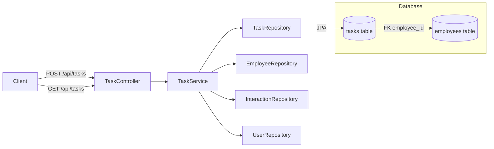
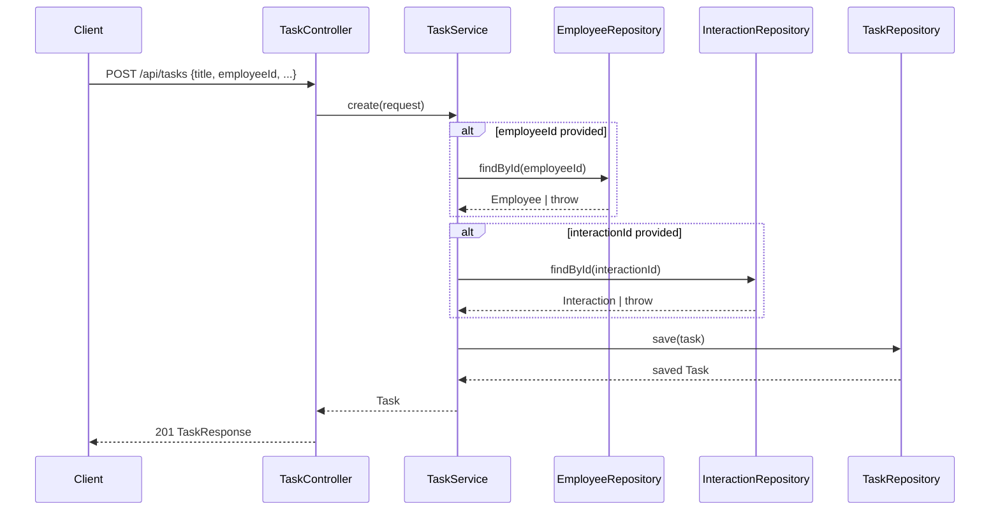
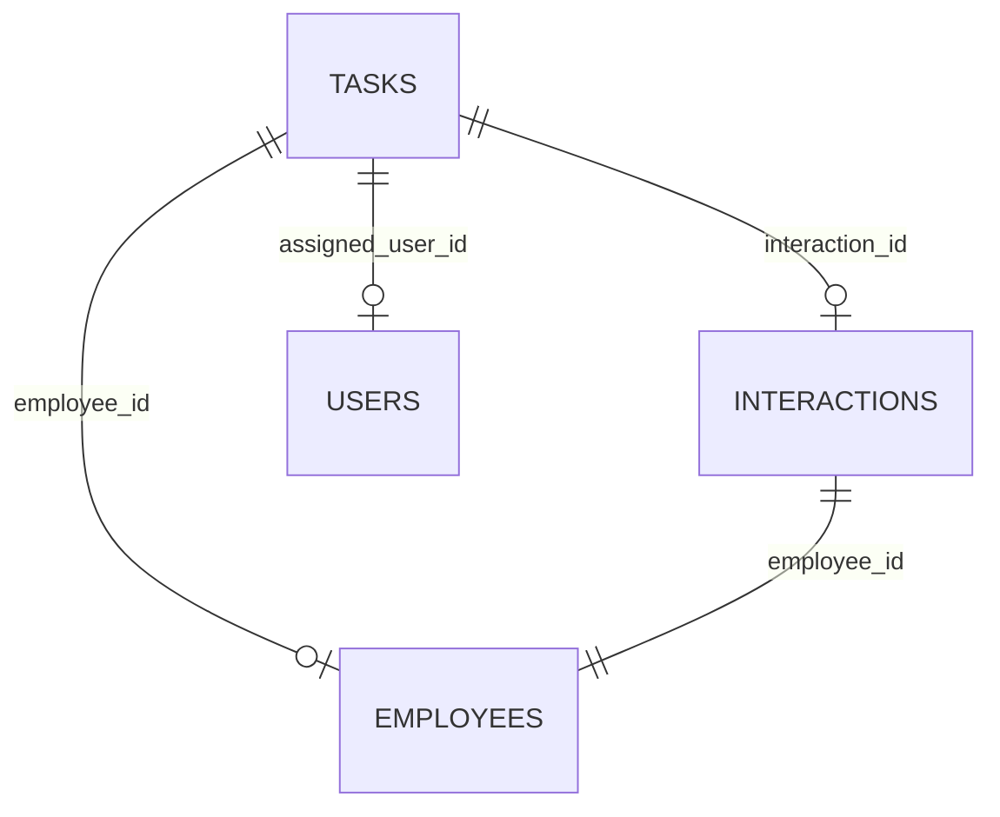

# Design Document: Task-Employee Link

## Overview

This feature adds a direct `employee_id` foreign key to the `tasks` table, establishing a first-class relationship between a Task and an Employee without requiring an Interaction as an intermediary. The implementation spans a database migration, entity mapping changes, request/response DTO updates, and service-layer logic — all while maintaining backward compatibility with existing interaction-linked tasks.

### Key Design Decisions

1. **Nullable FK over mandatory**: The `employee_id` column is nullable to preserve backward compatibility with existing tasks that have no direct employee link.
2. **New response DTO instead of entity serialization**: The GET endpoint currently returns `Task` entities directly. We introduce a `TaskResponse` record to flatten employee details (`employeeId`, `employeeName`) into the response without exposing lazy-loaded entity graphs or requiring eager fetches.
3. **Additive change only**: No existing API contracts break — the new `employeeId` field on `CreateTaskRequest` is optional, and the response DTO is a superset of the current entity fields.

## Architecture



The architecture remains a standard Spring layered approach:
- **Controller** handles HTTP binding, validation, and response mapping.
- **Service** contains business logic (entity resolution, association).
- **Repository** provides Spring Data JPA CRUD access.
- **Migration** (Flyway) evolves the schema.

## Components and Interfaces

### 1. Flyway Migration — `V5__add_task_employee.sql`

Adds the `employee_id` column and foreign key constraint to the existing `tasks` table.

```sql
ALTER TABLE tasks ADD COLUMN employee_id BIGINT;
ALTER TABLE tasks ADD CONSTRAINT fk_tasks_employee FOREIGN KEY (employee_id) REFERENCES employees(id);
CREATE INDEX idx_tasks_employee_id ON tasks(employee_id);
```

### 2. Task Entity Update

```java
// Addition to Task.java
@ManyToOne(fetch = FetchType.LAZY)
@JoinColumn(name = "employee_id")
@JsonIgnoreProperties({"hibernateLazyInitializer", "handler"})
private Employee employee;
```

The field is nullable — no `optional = false` or `@Column(nullable = false)` annotation.

### 3. CreateTaskRequest Update

```java
public record CreateTaskRequest(
    @NotBlank @Size(max = 255) String title,
    @Size(max = 2000) String description,
    Long interactionId,
    Long employeeId,   // NEW — optional
    LocalDate dueDate,
    Long assignedUserId
) {}
```

### 4. TaskResponse DTO (New)

```java
public record TaskResponse(
    Long id,
    String title,
    String description,
    String status,
    LocalDate dueDate,
    Long assignedUserId,
    String assignedUserName,
    Long interactionId,
    Long employeeId,
    String employeeName,
    Instant createdAt
) {}
```

A static factory method on `TaskResponse` (or a mapper utility) converts `Task` entity to response:

```java
public static TaskResponse from(Task task) {
    return new TaskResponse(
        task.getId(),
        task.getTitle(),
        task.getDescription(),
        task.getStatus().name(),
        task.getDueDate(),
        task.getAssignedUser() != null ? task.getAssignedUser().getId() : null,
        task.getAssignedUser() != null ? task.getAssignedUser().getName() : null,
        task.getInteraction() != null ? task.getInteraction().getId() : null,
        task.getEmployee() != null ? task.getEmployee().getId() : null,
        task.getEmployee() != null ? task.getEmployee().getName() : null,
        task.getCreatedAt()
    );
}
```

### 5. TaskService Update

The `create` method gains employee resolution logic:

```java
Employee employee = null;
if (request.employeeId() != null) {
    employee = employeeRepository.findById(request.employeeId())
        .orElseThrow(() -> new IllegalArgumentException(
            "Employee not found with id: " + request.employeeId()));
}
task.setEmployee(employee);
```

This follows the existing pattern used for `Interaction` and `User` resolution.

### 6. TaskController Update

```java
@GetMapping("/api/tasks")
public List<TaskResponse> getAllTasks() {
    return taskRepository.findAll().stream()
        .map(TaskResponse::from)
        .toList();
}

@PostMapping("/api/tasks")
public ResponseEntity<TaskResponse> createTask(@RequestBody @Valid CreateTaskRequest request) {
    Task savedTask = taskService.create(request);
    return ResponseEntity.status(HttpStatus.CREATED).body(TaskResponse.from(savedTask));
}
```

### Component Interaction Sequence



## Data Models

### Tasks Table (after migration)

| Column | Type | Nullable | Constraint |
|--------|------|----------|------------|
| id | BIGSERIAL | NO | PRIMARY KEY |
| interaction_id | BIGINT | YES | FK → interactions(id) |
| **employee_id** | **BIGINT** | **YES** | **FK → employees(id)** |
| title | VARCHAR(255) | NO | |
| description | TEXT | YES | |
| status | VARCHAR(50) | NO | CHECK IN ('OPEN','DONE') |
| due_date | DATE | YES | |
| assigned_user_id | BIGINT | YES | FK → users(id) |
| created_at | TIMESTAMP | NO | |

### Entity Relationship



A Task can optionally reference an Employee directly (new) and/or through an Interaction (existing). Both links are independent.

## Correctness Properties

*A property is a characteristic or behavior that should hold true across all valid executions of a system — essentially, a formal statement about what the system should do. Properties serve as the bridge between human-readable specifications and machine-verifiable correctness guarantees.*

### Property 1: Employee resolution round-trip

*For any* valid employee that exists in the repository, creating a task with that employee's ID and then mapping the result to a TaskResponse SHALL yield a response where `employeeId` equals the provided ID and `employeeName` equals the employee's name.

**Validates: Requirements 2.3, 3.2, 4.1**

### Property 2: Invalid employeeId rejection

*For any* employeeId that does not reference an existing Employee in the repository, calling the task creation service with that employeeId SHALL throw an `IllegalArgumentException` and SHALL NOT persist any task.

**Validates: Requirements 3.3**

### Property 3: TaskResponse mapping correctness

*For any* persisted Task (with or without an associated employee), mapping it to a TaskResponse SHALL produce a response where: (a) employeeId and employeeName are non-null and correct when an employee is associated, (b) employeeId and employeeName are both null when no employee is associated, and (c) all other fields (id, title, description, status, dueDate, assignedUserId, assignedUserName, interactionId, createdAt) are correctly mapped from the entity.

**Validates: Requirements 4.1, 4.2, 4.3**

### Property 4: Backward compatibility — interaction-only tasks

*For any* valid CreateTaskRequest containing an interactionId but no employeeId, the service SHALL create a task where the interaction is linked, the employee field is null, and the task status is OPEN.

**Validates: Requirements 5.1**

### Property 5: Standalone task creation

*For any* valid title string (non-blank, max 255 chars), creating a task with only that title (null interactionId, null employeeId) SHALL produce a task with status OPEN, null employee, and null interaction.

**Validates: Requirements 3.4, 5.2**

### Property 6: Dual association

*For any* valid employeeId and valid interactionId that both exist in the repository, creating a task with both SHALL produce a task where both the employee and the interaction are associated, and neither is null.

**Validates: Requirements 3.5**

## Error Handling

| Scenario | Exception | HTTP Status | Response Body |
|----------|-----------|-------------|---------------|
| `employeeId` references non-existent employee | `IllegalArgumentException` | 400 | `{"message": "Employee not found with id: X", "fieldErrors": null}` |
| `interactionId` references non-existent interaction | `IllegalArgumentException` | 400 | `{"message": "Interaction not found with id: X", "fieldErrors": null}` |
| `assignedUserId` references non-existent user | `IllegalArgumentException` | 400 | `{"message": "User not found with id: X", "fieldErrors": null}` |
| Request body fails Jakarta validation (blank title, etc.) | `MethodArgumentNotValidException` | 400 | `{"message": "Validation failed", "fieldErrors": {...}}` |
| Database constraint violation | `DataAccessException` | 500 | Generic error response |

All error responses are handled by the existing `GlobalExceptionHandler` — no new exception handling infrastructure is needed. The `IllegalArgumentException` thrown by the service is already mapped to HTTP 400.

## Testing Strategy

### Unit Tests (Mockito-based)

**TaskService tests:**
- Employee resolution — valid employeeId sets employee on task
- Employee resolution — invalid employeeId throws `IllegalArgumentException`
- Both employeeId and interactionId provided — both are resolved
- Neither employeeId nor interactionId — standalone task created
- Null employeeId with valid interactionId — existing behavior preserved

**TaskController tests (WebMvcTest):**
- POST with employeeId returns 201 with `TaskResponse` containing employee details
- POST with invalid employeeId returns 400
- GET returns list of `TaskResponse` with employee fields populated/null appropriately
- Validation errors (blank title) return 400

### Integration Tests (Testcontainers + SpringBootTest)

- Full round-trip: create task with employeeId, GET tasks, verify employee fields in response
- Migration verification: existing tasks (from seed data) have null employee_id after migration
- Backward compatibility: existing interaction-linked task creation still works

### Property-Based Tests (jqwik)

The project uses Java 21 with JUnit 5. **jqwik** is the standard PBT library for JUnit 5 on the JVM.

- Minimum 100 iterations per property test
- Each property test references its design document property via tag comment
- Tag format: **Feature: task-employee-link, Property {number}: {property_text}**

Property tests focus on the service-layer logic and response mapping:
- **Property 1**: Generate random valid Employee entities → create tasks referencing them → verify round-trip (employeeId + employeeName in response match)
- **Property 2**: Generate random Long values not in the mock repository → verify IllegalArgumentException and no persistence call
- **Property 3**: Generate random Task entities (some with employee, some without) → map to TaskResponse → verify all fields mapped correctly including null handling
- **Property 4**: Generate random valid Interaction entities without employee → create tasks → verify interaction linked, employee null
- **Property 5**: Generate random valid title strings (1-255 chars, non-blank) → create minimal tasks → verify OPEN status, null associations
- **Property 6**: Generate random valid Employee + Interaction pairs → create tasks with both → verify both associations present

Generator infrastructure:
- `@Provide` for random Employee (random name, email, id)
- `@Provide` for random Interaction (random id, linked employee)
- `@Provide` for random valid title strings (non-blank, 1-255 chars)
- `@Provide` for random Long values outside a known set (for invalid IDs)
