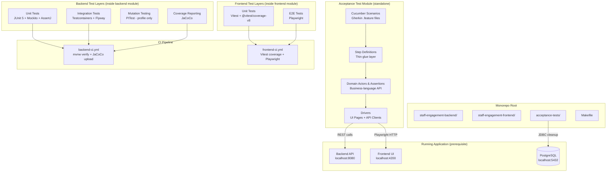
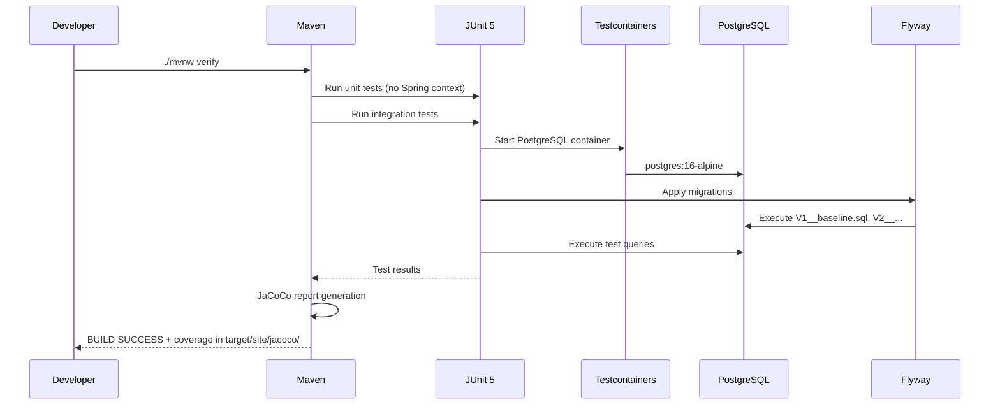
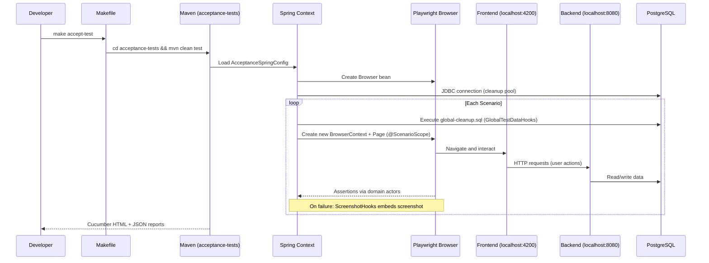

# Design Document: Test Harness Setup

## Overview

This design covers the full test harness setup for the Staff Engagement monorepo. The harness establishes backend unit testing (JUnit 5 + Mockito + AssertJ), integration testing (Testcontainers + Flyway), a standalone four-layer Cucumber acceptance-test module driven by Java Playwright, mutation testing (PITest), and code coverage (JaCoCo) layers. On the frontend, it confirms the existing Vitest unit testing and adds Playwright end-to-end testing. Each layer includes a sample test proving it runs. CI pipelines are updated to exercise the full harness.

The design builds on existing infrastructure:
- `TestcontainersConfiguration.java` already provides a `@ServiceConnection` PostgreSQL container
- `spring-boot-starter-test` already pulls in JUnit 5, Mockito, and AssertJ
- Vitest with `@vitest/coverage-v8` is already configured via `@angular/build:unit-test`
- CI workflows already exist for both backend and frontend

### Design Decisions

| Decision | Rationale |
|----------|-----------|
| Reuse existing `TestcontainersConfiguration` | Avoids duplicate container definitions; single shared container per JVM for speed |
| PITest behind a `pitest` Maven profile | Mutation testing is slow; must not impact normal builds or CI gate |
| JaCoCo bound to `verify` phase, no thresholds | Enables coverage reports in CI without blocking merges on a greenfield project |
| `BaseIntegrationTest` abstract class | DRY pattern for integration tests; standardizes annotations across all integration test classes |
| Separate `acceptance-tests/` module (not `@SpringBootTest`) | Acceptance tests run against the deployed application, exercising the full stack as a user would. Decouples test lifecycle from backend build. |
| Java Playwright over TestRestTemplate | Exercises the real UI through a browser — catches rendering bugs, JavaScript errors, and routing issues that API-only tests miss |
| Four-layer acceptance architecture | Keeps Gherkin readable, step defs thin, domain logic reusable, and driver details isolated — each layer changes independently |
| Backend CI changes from `package` to `verify` | `verify` phase triggers JaCoCo `report` goal which runs after `test` phase |
| Playwright `webServer` config (frontend e2e) | Auto-starts Angular dev server before e2e tests; no manual server start needed |
| Makefile targets for acceptance tests | Provides consistent, discoverable commands that abstract Maven invocations for the team |

## Architecture



### Test Execution Flow (Backend Unit + Integration)



### Test Execution Flow (Acceptance Tests)



## Components and Interfaces

### Backend Components

#### 1. Base Integration Test Class

**File:** `src/test/java/com/psybergate/staff_engagement/BaseIntegrationTest.java`

```java
@SpringBootTest(webEnvironment = SpringBootTest.WebEnvironment.RANDOM_PORT)
@Import(TestcontainersConfiguration.class)
@ActiveProfiles("local")
public abstract class BaseIntegrationTest {
    // Shared configuration inherited by all integration tests
}
```

**Purpose:** Provides a single superclass for all integration tests that need a Spring context with Testcontainers PostgreSQL.

#### 2. Sample Service (for unit test demonstration)

**File:** `src/main/java/com/psybergate/staff_engagement/greeting/GreetingService.java`

A minimal service with a dependency (e.g., a clock or a repository) that can be mocked in unit tests.

#### 3. Sample Unit Test

**File:** `src/test/java/com/psybergate/staff_engagement/greeting/GreetingServiceTest.java`

Uses `@ExtendWith(MockitoExtension.class)`, `@Mock`, `@InjectMocks`, `verify()`, and `assertThat()`.

#### 4. Sample Entity, Repository, and Integration Test

**Files:**
- `src/main/java/com/psybergate/staff_engagement/greeting/Greeting.java` (JPA entity)
- `src/main/java/com/psybergate/staff_engagement/greeting/GreetingRepository.java` (Spring Data JPA)
- `src/main/resources/db/migration/V2__create_greeting_table.sql`
- `src/test/java/com/psybergate/staff_engagement/greeting/GreetingRepositoryIntegrationTest.java`

The integration test extends `BaseIntegrationTest` and verifies `save()` + `findById()`.

#### 5. Acceptance Test Module (Four-Layer Architecture)

**Module root:** `acceptance-tests/` at monorepo root

**`acceptance-tests/pom.xml`** — Standalone Maven module (no parent reactor POM required). Key dependencies:

| Dependency | Purpose |
|-----------|---------|
| `io.cucumber:cucumber-java:7.x` | Cucumber step definition annotations |
| `io.cucumber:cucumber-spring:7.x` | Spring integration for DI in step defs |
| `io.cucumber:cucumber-junit-platform-engine:7.x` | JUnit Platform discovery |
| `org.junit.platform:junit-platform-suite:1.x` | Suite runner |
| `com.microsoft.playwright:playwright:1.x` | Java Playwright browser automation |
| `org.springframework:spring-context` | DI container for test infrastructure |
| `org.springframework:spring-jdbc` | JDBC for SQL script execution |
| `org.postgresql:postgresql` | JDBC driver |

**Package structure:**

```
acceptance-tests/src/test/
  java/com/psybergate/acceptance/
    config/
      AcceptanceSpringConfig.java      # @Configuration — Playwright beans, component scan
      EnvironmentConfig.java           # Base URLs, timeouts from properties
      DatabaseConfig.java              # DataSource bean for JDBC cleanup
      PropertiesConfig.java            # @PropertySource for application.properties
    run/
      RunAcceptanceTests.java          # @Suite @SelectClasspathResource("features")
    support/
      SqlScriptRunner.java             # Executes classpath SQL via JDBC with deadlock retry
      ResponseUtil.java                # HTTP response helpers (if needed)
    hooks/
      GlobalTestDataHooks.java         # @Before(order=MIN_VALUE) — runs global-cleanup.sql
      ScreenshotHooks.java             # @After — embeds screenshot on failure
    world/
      TestWorld.java                   # @ScenarioScope bean for cross-step state
    drivers/
      ui/pages/
        BasePage.java                  # Common Playwright page helpers
        HomePage.java                  # Example page object (smoke test)
      api/
        BaseApiDriver.java             # Common HTTP client helpers
    domain/
      # Domain actors and assertion classes (per feature, added later)
    stepdefs/
      SmokeStepDefinitions.java        # Steps for smoke.feature
  resources/
    features/
      smoke/
        smoke.feature                  # @pre-push tagged smoke scenario
    fixtures/sql/
      global-cleanup.sql               # TRUNCATE tables for test isolation
      global-sequence-init.sql         # Reset sequences (if needed)
    application.properties             # JDBC URL, app base URLs, timeouts
    cucumber.properties                # cucumber.publish.quiet=true
    junit-platform.properties          # cucumber discovery config
```

**Key classes:**

**AcceptanceSpringConfig.java:**
```java
@Configuration
@ComponentScan(basePackages = "com.psybergate.acceptance")
public class AcceptanceSpringConfig {

    @Bean
    @ScenarioScope
    public Browser browser() {
        return Playwright.create().chromium().launch(
            new BrowserType.LaunchOptions().setHeadless(true)
        );
    }

    @Bean
    @ScenarioScope
    public BrowserContext browserContext(Browser browser) {
        return browser.newContext();
    }

    @Bean
    @ScenarioScope
    public Page page(BrowserContext context) {
        return context.newPage();
    }
}
```

**TestWorld.java:**
```java
@Component
@ScenarioScope
public class TestWorld {
    private final Map<String, Object> state = new HashMap<>();

    public <T> void set(String key, T value) { state.put(key, value); }
    @SuppressWarnings("unchecked")
    public <T> T get(String key) { return (T) state.get(key); }
    public void clear() { state.clear(); }
}
```

**GlobalTestDataHooks.java:**
```java
@Component
public class GlobalTestDataHooks {
    private final SqlScriptRunner sqlScriptRunner;

    @Before(order = Integer.MIN_VALUE)
    public void cleanupTestData() {
        sqlScriptRunner.execute("fixtures/sql/global-cleanup.sql");
    }
}
```

**SqlScriptRunner.java:**
```java
@Component
public class SqlScriptRunner {
    private final DataSource dataSource;
    private static final int MAX_RETRIES = 3;

    public void execute(String classpathResource) {
        // Read SQL from classpath
        // Execute via JDBC with deadlock retry (up to MAX_RETRIES)
    }
}
```

**ScreenshotHooks.java:**
```java
@Component
public class ScreenshotHooks {
    private final Page page;

    @After
    public void screenshotOnFailure(Scenario scenario) {
        if (scenario.isFailed()) {
            byte[] screenshot = page.screenshot(
                new Page.ScreenshotOptions().setFullPage(true)
            );
            scenario.attach(screenshot, "image/png", "failure-screenshot");
        }
    }
}
```

**RunAcceptanceTests.java:**
```java
@Suite
@IncludeEngines("cucumber")
@SelectClasspathResource("features")
@ConfigurationParameter(key = GLUE_PROPERTY_NAME, value = "com.psybergate.acceptance")
@ConfigurationParameter(key = PLUGIN_PROPERTY_NAME,
    value = "pretty, html:target/cucumber-reports/report.html, json:target/cucumber-reports/report.json")
public class RunAcceptanceTests {
}
```

**Smoke scenario (`smoke.feature`):**
```gherkin
@pre-push
Feature: Smoke Test

  Scenario: Application is accessible
    Given the application is running
    When I open the home page
    Then the page loads successfully
```

**`application.properties` (acceptance-tests):**
```properties
app.base-url.ui=http://localhost:4200
app.base-url.api=http://localhost:8080
spring.datasource.url=jdbc:postgresql://localhost:5432/staff_engagement
spring.datasource.username=postgres
spring.datasource.password=postgres
```

#### 6. PITest Configuration

**Location:** `staff-engagement-backend/pom.xml` under `<profiles>` section

```xml
<profile>
    <id>pitest</id>
    <build>
        <plugins>
            <plugin>
                <groupId>org.pitest</groupId>
                <artifactId>pitest-maven</artifactId>
                <version>1.19.6</version>
                <dependencies>
                    <dependency>
                        <groupId>org.pitest</groupId>
                        <artifactId>pitest-junit5-plugin</artifactId>
                        <version>1.2.2</version>
                    </dependency>
                </dependencies>
                <configuration>
                    <targetClasses>
                        <param>com.psybergate.staff_engagement.*</param>
                    </targetClasses>
                    <failWhenNoMutations>false</failWhenNoMutations>
                    <mutationThreshold>0</mutationThreshold>
                </configuration>
                <executions>
                    <execution>
                        <goals><goal>mutationCoverage</goal></goals>
                        <phase>verify</phase>
                    </execution>
                </executions>
            </plugin>
        </plugins>
    </build>
</profile>
```

#### 7. JaCoCo Configuration

**Location:** `staff-engagement-backend/pom.xml` under `<build><plugins>`

```xml
<plugin>
    <groupId>org.jacoco</groupId>
    <artifactId>jacoco-maven-plugin</artifactId>
    <version>0.8.13</version>
    <executions>
        <execution>
            <id>prepare-agent</id>
            <phase>initialize</phase>
            <goals><goal>prepare-agent</goal></goals>
        </execution>
        <execution>
            <id>report</id>
            <phase>verify</phase>
            <goals><goal>report</goal></goals>
        </execution>
    </executions>
</plugin>
```

No `check` goal, no thresholds. Report-only.

### Frontend Components

#### 8. Playwright Setup

**Files:**
- `package.json` — add `@playwright/test` dev dependency
- `playwright.config.ts` — baseURL, Chromium project, webServer config
- `e2e/smoke.spec.ts` — navigates to `/`, asserts visible text
- `e2e/README.md` — conventions document

#### 9. Sample Component Test

**File:** `src/app/app.spec.ts` (already exists, may need enhancement)

Uses `TestBed.configureTestingModule` to mount `App` component and assert rendering.

#### 10. Sample Service Test

**File:** `src/app/greeting/greeting.service.spec.ts`

Registers service in `TestBed` with a mocked dependency, calls a method, asserts result.

### CI Pipeline Changes

#### Backend (`backend-ci.yml`)

- Change `./mvnw package -B` to `./mvnw verify -B`
- This triggers JaCoCo report generation (bound to `verify` phase)
- JaCoCo upload step already conditionally checks for the plugin
- Acceptance tests are **not** run in CI by default (they require the full app running); they are a local/pre-push gate via `make accept-smoke`

#### Frontend (`frontend-ci.yml`)

- No structural changes needed — the `e2e` job already checks for `@playwright/test` in `package.json` and conditionally runs Playwright
- Once `@playwright/test` is added to `package.json`, the existing e2e job will activate automatically

### Makefile Targets

**File:** `Makefile` at monorepo root

```makefile
# Acceptance test targets
accept-test:
	cd acceptance-tests && mvn clean test

accept-smoke:
	cd acceptance-tests && mvn clean test -Dcucumber.filter.tags="@pre-push"

accept-compile:
	cd acceptance-tests && mvn compile test-compile

accept-build:
	cd acceptance-tests && mvn clean package -DskipTests

accept-install:
	cd acceptance-tests && mvn exec:java -Dexec.mainClass="com.microsoft.playwright.CLI" -Dexec.args="install --with-deps chromium"
```

## Data Models

### Greeting Entity (Sample)

| Field | Type | Constraints |
|-------|------|-------------|
| id | Long | `@Id @GeneratedValue(strategy = IDENTITY)` |
| message | String | `@Column(nullable = false)` |
| createdAt | LocalDateTime | `@Column(nullable = false)` |

**Migration (V2):**
```sql
CREATE TABLE greeting (
    id BIGSERIAL PRIMARY KEY,
    message VARCHAR(255) NOT NULL,
    created_at TIMESTAMP NOT NULL DEFAULT NOW()
);
```

This entity exists solely to prove the integration test harness works. It will be replaced or removed when real domain entities are implemented.

## Error Handling

This feature is infrastructure setup — there is no runtime error handling to design. The key failure modes and their handling:

| Failure Mode | Handling |
|--------------|----------|
| Testcontainers cannot start Docker | Test fails with clear error; developer must have Docker running |
| Flyway migration fails | Spring context fails to start; test reports application context error |
| PITest finds no mutants | Build succeeds (`failWhenNoMutations=false`) |
| JaCoCo produces 0% coverage | Build succeeds (no thresholds enforced) |
| Playwright cannot find browser (frontend e2e) | `npx playwright install --with-deps` in CI installs browsers |
| Playwright cannot find browser (acceptance) | `make accept-install` installs Chromium via Java Playwright CLI |
| Dev server fails to start for frontend e2e | Playwright `webServer` config has timeout; test fails with clear message |
| Application not running for acceptance tests | Cucumber scenarios fail on first navigation; error message indicates connection refused |
| Database deadlock during cleanup SQL | `SqlScriptRunner` retries up to 3 times with backoff |
| Acceptance scenario failure | `ScreenshotHooks` embeds full-page screenshot in Cucumber report for diagnosis |

## Correctness Properties

### Property 1: Backend Test Harness Idempotence

Running the full backend test suite (`./mvnw verify`) multiple times in succession without code changes SHALL always produce the same pass/fail result. No test shall be order-dependent or flaky due to shared mutable state between test classes.

**Validates: Requirements 1.2, 2.4**

### Property 2: Acceptance Test Scenario Isolation

Running the acceptance test suite (`make accept-test`) multiple times in succession against a stable running application SHALL always produce the same pass/fail result. Each scenario starts with a clean database state (via `global-cleanup.sql`) and an isolated browser context (`@ScenarioScope`), ensuring no scenario's outcome depends on the execution order or side-effects of other scenarios.

**Validates: Requirements 3.7, 3.4, 3.6**

### Property 3: Coverage Report Completeness

For any set of production classes under `com.psybergate.staff_engagement`, the JaCoCo report SHALL list every class that contains at least one executable instruction. The union of classes in `jacoco.csv` SHALL equal the set of non-test `.class` files produced by compilation.

**Validates: Requirements 5.2, 5.3, 5.5**

## Testing Strategy

**PBT is not applicable** to this feature. This is infrastructure and configuration setup — there are no pure functions, data transformations, or algorithmic logic that would benefit from property-based testing. The feature's acceptance criteria are all about "can X run successfully" (smoke tests) and "is Y configured correctly" (configuration checks).

### Testing Approach

Each requirement is validated by its own **sample test** that proves the harness layer functions:

| Layer | Validation Method |
|-------|------------------|
| Backend unit tests | Sample `GreetingServiceTest` passes with `./mvnw test` |
| Backend integration tests | Sample `GreetingRepositoryIntegrationTest` passes with `./mvnw test` |
| Acceptance tests (BDD) | Smoke scenario passes with `make accept-smoke` against running app |
| PITest | `./mvnw verify -Ppitest` generates HTML report in `target/pit-reports/` |
| JaCoCo | `./mvnw verify` generates HTML + CSV reports in `target/site/jacoco/` |
| Frontend unit tests | `npx ng test --no-watch --coverage` passes with coverage output |
| Frontend e2e | `npx playwright test` passes the smoke test |
| CI pipeline | Both workflows pass on a PR touching relevant paths |

### Test Commands Summary

```bash
# Backend - all tests (unit + integration)
cd staff-engagement-backend && ./mvnw verify

# Backend - unit tests only
cd staff-engagement-backend && ./mvnw test

# Backend - with mutation report
cd staff-engagement-backend && ./mvnw verify -Ppitest

# Acceptance tests - all scenarios (requires running app)
make accept-test

# Acceptance tests - smoke only (requires running app)
make accept-smoke

# Acceptance tests - compile check
make accept-compile

# Acceptance tests - build without running
make accept-build

# Acceptance tests - install Playwright browsers
make accept-install

# Frontend - unit tests with coverage
cd staff-engagement-frontend && npx ng test --no-watch --coverage

# Frontend - e2e tests
cd staff-engagement-frontend && npx playwright test
```

### Why PBT Does Not Apply

1. **Configuration/setup** — Requirements 1–5 and 8 are about Maven plugin configuration, CI pipeline wiring, and verifying build tools produce output. These are smoke/integration checks.
2. **Acceptance test module** — Requirement 3 is about scaffolding infrastructure (Spring config, Playwright beans, SQL runners, hooks). The acceptance tests themselves are example-based BDD scenarios, not property-based.
3. **UI rendering** — Requirements 6–7 involve component mounting and browser-based tests. These use example-based assertions.
4. **No transformational logic** — There are no functions that take variable input and produce variable output. The "inputs" are fixed configurations; the "outputs" are pass/fail build results.

Unit tests, integration tests, and BDD acceptance scenarios (all example-based) are the correct testing strategy for infrastructure setup.
